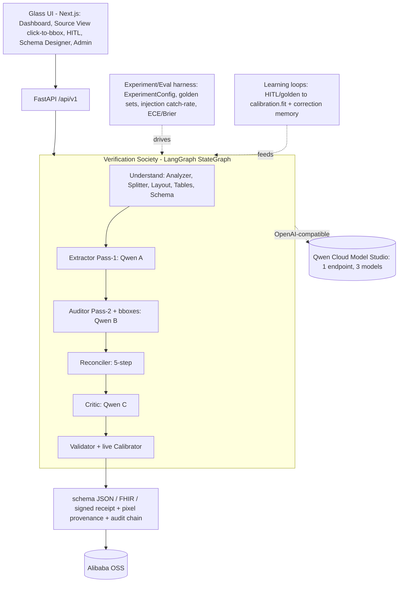

# Veridoc — Architecture (Design of Record)

> **The verification layer for document AI** — a society of models that cross-examine every field, ground each value to the pixel, and ship calibrated confidence. Python 3.11 · LangGraph · FastAPI · Next.js 14. Covers the whole platform plus the two active investments woven into the existing foundation: the **Qwen Cloud model layer** (a heterogeneous society via one endpoint) and the **experiment / learning spine** (eval harness + live calibration and correction loops). Every seam cites a real `file:line` so the design is directly actionable. The existing codebase is the foundation; enhancements are designed *on top of it*, not as a carve-out.

---

## 1. Executive Summary & Product Vision

### 1.1 What the platform is

An agentic, vision-first document-intelligence platform that turns unstructured documents (PDF, DOCX, XLSX, images, DICOM, EDI/X12) into validated, provenance-tracked structured data. It targets high-stakes document work of every kind — invoices, contracts, forms, financial statements, papers — where *accuracy, traceability, and compliance* matter more than raw throughput. Domain knowledge is carried in swappable **profiles**; medical revenue-cycle documents (CMS-1500, UB-04, EOB, superbills) and finance documents (W-2, 1099, bank statements, invoices) are simply two of the shipped profiles alongside a generic fallback.

The processing core is a LangGraph `StateGraph` (`src/agents/orchestrator.py:396`) that streams a single `ExtractionState` TypedDict (`src/pipeline/state.py:380`) through up to 14 named nodes across two parallel tracks (adaptive VLM-first and legacy). The differentiating capability is a **heterogeneous dual-VLM** extraction pattern: a primary vision model extracts (Pass-1), an independent auditor model re-reads with mandatory bounding boxes (Pass-2), a deterministic reconciler fuses the two with a 5-step tiebreaker (`src/agents/reconciler.py:260`), and an optional independent critic scores trust (`src/agents/critic.py:180`). Every field carries provenance (`src/pipeline/provenance.py:66`) surfaced in the UI's Source View.

### 1.2 Product vision — the verification-layer spine and five pillars

Veridoc is not "one more extractor." It is the **verification layer for document AI**: a society of heterogeneous models that cross-examine every field, ground each value to the pixel it came from, and ship a calibrated confidence you can act on. Five pillars carry that promise:

1. **Heterogeneous society.** Extractor ‖ Auditor → Reconciler → Critic, each backed by a *different* model, so errors are uncorrelated and disagreement is a signal.
2. **Pixel-grounded provenance.** Every value carries a bounding box back to the source page (`src/pipeline/provenance.py:66`), surfaced in the UI's Source View.
3. **Calibrated confidence.** Raw model confidence is post-hoc calibrated (Platt / isotonic) against outcomes so the number means what it says (`src/validation/calibration.py`).
4. **Verifiable & certifiable.** Schema-validated output, a tamper-evident SHA-256 audit chain, and HMAC-signed receipts make each run independently checkable.
5. **Open & deployment-flexible.** Model-agnostic backend that runs on **Qwen Cloud** or fully **on-prem**; no vendor lock-in.

Two active investments realize this spine on top of the existing codebase:

1. **Qwen Cloud model layer (the society's models).** The heterogeneous society is served by **Qwen Cloud / Alibaba Model Studio** through one OpenAI-compatible endpoint, with a *distinct Qwen model per society role* (Extractor / Auditor / Critic) mapped by a `role_models` table. A `QwenCloudBackend` slots in behind the existing `VLMBackend` factory (`qwen_cloud | lm_studio | vllm | gemma`) with zero agent rewrites, giving real cross-model heterogeneity and per-call token/latency attribution from the standard `usage` block.

2. **Experiment & learning spine.** The eval harness (`src/evaluation/`: `BenchmarkRunner`, `ABTestRunner`, golden datasets, `RegressionDetector`) measures accuracy, calibration (ECE / Brier via `src/validation/calibration.py`), and regressions on every change; the live learning loops feed HITL/golden outcomes back into `calibrator.fit()` and the correction memory (`src/memory/correction_tracker.py`) so the society sharpens over time.

### 1.3 Impact

| Dimension | Before | After (target) |
| --- | --- | --- |
| Model operations | Self-hosted GPUs (LM Studio / vLLM / Gemma), manual scaling | Model-agnostic backend: **Qwen Cloud** (managed, one endpoint) *or* on-prem; scaling limit is per-model TPM/RPM quota |
| Model heterogeneity | Dual-VLM exists but opt-in (`LEGACY` default), same family | Distinct Qwen model per society role via `role_models`; real cross-model, uncorrelated error |
| Cost & usage visibility | None per call | Per-call token + latency attribution from the OpenAI-compatible `usage` block, tagged by tenant/model/profile |
| Accuracy mechanism | Dual-VLM opt-in, no closed loop | Extractor ‖ Auditor → Reconciler → Critic with confidence-gating, live calibration, and correction memory |
| Experiment & learning | Ad-hoc, no harness in the loop | Eval harness (golden sets, A/B, regression, ECE/Brier) + HITL/golden → `calibrator.fit()` learning loops |
| Observability | Phoenix + PostHog only; canonical helper is dead code | Phoenix (OTel/OpenInference) + PostHog + a promoted canonical span contract as source-of-truth |
| Licensing | AGPL `fitz` vs. contradictory repo declaration | Root **Apache LICENSE** left as-is; `pypdfium2` (Apache/BSD) rasterization removes the AGPL dependency |

---

## 2. System Context & C4-Style Container View

### 2.1 System context (L1)

```
                        ┌──────────────────────────────────────────────┐
   Document Submitter   │                                              │
   (API client / UI) ──▶│   Veridoc — Verification Layer for Doc AI    │◀── Reviewer (human-in-loop)
                        │                                              │
   Webhook Subscriber ◀─│   PDF/DOCX/XLSX/IMG/DICOM/EDI  ▶  structured │
                        │   JSON / Excel / Markdown / FHIR / receipt   │
                        └───────┬───────────────┬───────────────┬──────┘
                                │               │               │
                  ┌─────────────▼──┐   ┌────────▼────────┐  ┌───▼──────────┐
                  │ Qwen Cloud     │   │ Alibaba OSS     │  │ Phoenix +    │
                  │ (Model Studio) │   │ artifact store  │  │ OTel         │
                  │ 1 endpoint,    │   │ results,        │  │ traces +     │
                  │ N Qwen models  │   │ receipts, pages │  │ PostHog      │
                  └────────────────┘   └─────────────────┘  └──────────────┘
```

### 2.2 Container view (L2) — current + target

```
┌───────────────────────────────────────────────────────────────────────────────────────┐
│                                  PLATFORM (single repo, Veridoc)                          │
│                                                                                          │
│  ┌────────────────────┐        ┌──────────────────────────────────────────────────────┐ │
│  │  Next.js 14 SPA     │  HTTP  │  FastAPI app  (src/api/app.py:156)                    │ │
│  │  frontend/          │◀──────▶│  CORS▶SecHdr▶Metrics▶Audit▶RateLimit▶Auth▶Tenant      │ │
│  │  dashboard, source  │ Bearer │  routers: documents, health, dashboard, tasks, queue, │ │
│  │  view, provenance   │        │  schemas, auth, webhooks  (/api/v1)                   │ │
│  └────────────────────┘        └───────────────┬──────────────────────────────────────┘ │
│                                                 │ run_extraction_pipeline (graph.py:14)   │
│  ┌──────────────────────────────────────────────▼─────────────────────────────────────┐ │
│  │  PipelineRunner (runner.py:40)  ──▶  OrchestratorAgent / LangGraph StateGraph        │ │
│  │  PREPROCESS▶SPLIT▶ANALYZE|LAYOUT▶COMPONENTS▶TABLE▶SCHEMA▶EXTRACT                      │ │
│  │     ▶[PASS1▶PASS2▶RECONCILE]▶VALIDATE▶[CRITIC▶COMBINER]▶ROUTE▶COMPLETE|RETRY|REVIEW   │ │
│  └───────┬───────────────────────────────────────────────────────┬─────────────────────┘ │
│          │ send_vision_request (base.py:237)                      │ emit_event/start_span  │
│  ┌───────▼───────────────────────────┐               ┌───────────▼───────────────────────┐│
│  │  Model Client + Backend Layer      │               │  ObservabilityDispatcher           ││
│  │  BaseAgent▶self._client (base.py)  │               │  (observability.py:271)            ││
│  │  ModelRouter (model_router.py)     │               │  sinks: Phoenix (OTel), PostHog    ││
│  │  VLMBackend protocol (protocol.py) │               │  build_pass_span_attrs (canonical) ││
│  │  factory.get_backend (factory.py)  │               └───────────┬───────────────────────┘│
│  │  LMStudio | vLLM | Gemma           │                           │ trace_id correlation    │
│  │  + [QwenCloud, role_models] ◀ NEW  │                           │ (audit.py:1434)         │
│  └───────┬───────────────────────────┘                            │                         │
│          │ OpenAI-compatible /chat/completions (1 endpoint)        │                         │
│  ┌───────▼──────────┐  ┌──────────────┐  ┌──────────────┐  ┌──────▼────────────────────┐  │
│  │ Mem0/FAISS memory │  │ Result store  │  │ Webhook DLQ  │  │ Experiment / Eval harness │  │
│  │ memories.json     │  │ data/results/ │  │ dlq.db SQLite│  │ Benchmark/ABTest, golden, │  │
│  │ corrections.json  │  │  (→ OSS)      │  │ (ticket sink)│  │ RegressionDetector, ECE   │  │
│  └──────────────────┘  └──────────────┘  └──────────────┘  └───────────────────────────┘  │
│  Checkpoints: MemorySaver | SqliteSaver (.extraction_checkpoints) | Postgres               │
│  Async: Celery + Redis (graceful sync fallback when Redis absent)                          │
└───────────────────────────────────────────────────────────────────────────────────────┘
```

Legend: `◀── NEW` = active investment; everything else exists today. The canonical container view is the diagram below.



---

## 3. Current-State Architecture by Layer

### 3.1 Orchestration & Agent Layer

**Responsibilities.** Compile and execute the LangGraph `StateGraph`; route across legacy / VLM-first / dual-VLM / critic topologies; own checkpointing, retry, and human-review interrupt/resume; emit run-boundary telemetry.

**Key interfaces.**
- `OrchestratorAgent.build_workflow(...)` → `StateGraph` — `src/agents/orchestrator.py:396`
- `OrchestratorAgent.run_extraction(initial_state, thread_id)` — `src/agents/orchestrator.py:679`
- `OrchestratorAgent.resume_extraction(thread_id, updated_state, *, human_corrections, ...)` — `src/agents/orchestrator.py:842`
- Conditional edges: `_determine_pipeline` (`:1387`), `_determine_route` (`:1270`), `_determine_retry_target` (`:1362`)
- Factory `create_extraction_workflow(...)` — `src/agents/orchestrator.py:1608`
- Node constants (`NODE_PREPROCESS`, `NODE_EXTRACT_PASS1/2`, `NODE_RECONCILE`, `NODE_CRITIC`, `NODE_CRITIC_COMBINER`, `NODE_ROUTE`) — `src/agents/orchestrator.py:66-99`

**Data flow.** `PipelineRunner.extract_from_pdf` → `create_initial_state` → `run_extraction` → `compiled_workflow.invoke`. `_determine_pipeline` branches on `state.use_adaptive_extraction`; dual-VLM chain `NODE_EXTRACT→PASS1→PASS2→RECONCILE→VALIDATE` is wired at `:576-605`; critic splice `VALIDATE→CRITIC→CRITIC_COMBINER→ROUTE`; route conditional edges at `:608-634`. `_reconcile_state` closure runs the per-page reconciler and dual-writes `merged_extraction` + `merged_extraction_v2` (`:1838-2000`).

**Notable debt.** `CriticAgent` audits only the first page of multi-page docs (`src/agents/critic.py:26-27`); reconciler tiebreaker step 3 (bbox round-trip) silently skips when `backend=None`, the current default (`orchestrator.py:1845`); `MemorySaver` silently substitutes for SQLite when the checkpoint package is absent (`:218-229`).

### 3.2 Model Client + Backend Layer

**Responsibilities.** A three-tier stack: (1) `LMStudioClient` — low-level OpenAI-compat HTTP with tenacity retries and JSON repair; (2) `VLMBackend` protocol — role routing (`PRIMARY/SECONDARY/CRITIC/LITE`); (3) `factory.get_backend()` — process-wide singleton dispatch on `settings.vlm.backend`. `ModelRouter` adds an orthogonal `ModelTask`/`VLMRole` routing axis.

**Key interfaces.**
- `VLMBackend` protocol (`resolve(role)`, `send_vision_request(..., role, schema)`) — `src/client/backends/protocol.py:150`
- `VLMRole` enum — `src/client/backends/protocol.py:39`
- `get_backend(settings)` with if/elif dispatch (`lm_studio|vllm|gemma|raise`) — `src/client/backends/factory.py:35,55-65`
- `BaseAgent.send_vision_request(...)` — `src/agents/base.py:237`; `send_vision_request_with_schema(...)` — `:416`
- `ModelRouter.route_for_agent` / `role_for_agent` / `route_for_role` — `src/client/model_router.py:354,386,401`
- `VisionRequest` (`:72`) / `VisionResponse` (`:186`) — `src/client/lm_client.py`

**Critical seam reality (current) → design-of-record target.** Today `BaseAgent.__init__` hard-codes `self._client = client or LMStudioClient()` (`src/agents/base.py:181`), and `send_vision_request` calls `self._client.send_vision_request(...)` **directly, bypassing the `VLMBackend` protocol** (`base.py:351,356`); the `role` kwarg flows only into observability spans, and `send_vision_request_with_schema` still hard-codes `backend_name='lm_studio'` in its `DecodingTrace` (`base.py:552`). Only `constrained_decode()` (`src/client/constrained.py:118`) routes cleanly through the protocol today.

The design of record closes this seam by making the protocol the live path: `BaseAgent` builds its shared client from `get_backend().resolve(VLMRole.PRIMARY)` (`protocol.py:169` returns `(endpoint, model_id)`), and the model for each call is chosen per agent-role through a **`role_models` map** — role-based rotation over the single Qwen Cloud endpoint (`PRIMARY→`Extractor model, `SECONDARY→`Auditor model, `CRITIC→`Critic model). It is important to be precise about the mechanism: this is *role-based model rotation across one endpoint*, which is exactly what yields real heterogeneity (a genuinely different Qwen model per society role) while keeping one integration surface. The `DecodingTrace.backend_name` then reflects the resolved backend rather than a literal.

### 3.3 Pipeline + Preprocessing

**Responsibilities.** PDF/file → base64 page images; image enhancement; non-PDF routing; multi-record extraction.

**Key interfaces.**
- `PipelineRunner.extract_from_pdf(...)` — `src/pipeline/runner.py:112`; `extract_from_bytes` — `:186`; `extract_multi_record` — `:785`
- `_load_and_convert_pdf` (`fitz.open`, `get_pixmap`, `tobytes("png")`, `get_text`) — `src/pipeline/runner.py:393-464`; bytes path `:519-592`
- `PDFProcessor.render_page` — `src/preprocessing/pdf_processor.py:466`; unconditional `import fitz` — `:21`
- `ImageEnhancer.enhance` (deskew/denoise/CLAHE/fax-binarize) — `src/preprocessing/image_enhancer.py:195`
- `FileProcessorFactory.process` — `src/preprocessing/file_factory.py:72`

**License blocker.** PyMuPDF (`fitz`) is AGPL-3.0 (`pyproject.toml:60`) while the repo declares Proprietary (`pyproject.toml:10`). Three call sites: `pdf_processor.py:21`, `runner.py:404`, `runner.py:533`. Resolution: swap to `pypdfium2` (Apache-2.0/BSD), and `opencv-python` → `opencv-python-headless` (`pyproject.toml:63`).

### 3.4 Observability + Metrics

**Responsibilities.** Fan out spans/events/LLM-call records to opt-in sinks; serve Prometheus; evaluate alert rules.

**Key interfaces.**
- `ObservabilityDispatcher` (slots dataclass, `sinks: list[_Sink]`) — `src/monitoring/observability.py:271`; `from_settings()` — `:277`
- `emit_event` (`:318`), `start_span` (`:334`), `record_llm_call` (`:372`)
- `build_pass_span_attrs(...)` canonical helper — `src/monitoring/observability.py:436`
- `_Sink` protocol — `:66`; `PhoenixSink` (`:95`), `PostHogSink` (`:206`)
- `MetricsRegistry.get_instance` / `get_metrics` — `src/monitoring/metrics.py:113,518`; `/metrics` — `src/api/routes/health.py:451`
- `AlertManager.fire_alert` / `check_rules` — `src/monitoring/alerts.py:1460,1733`

**Notable debt.** `build_pass_span_attrs` is **dead code** — defined, exported, tested, but no production call-site uses it; each emit builds ad-hoc dicts with inconsistent keys (`model` vs `model_id`). `SPAN_*` constants (`:430-433`) are unreferenced. `AlertManager.check_rules` has no scheduled caller. `PhoenixSink.record_llm_call` is a no-op relying on OpenInference auto-instrumentation that will not fire for the raw-HTTP backend client used against an OpenAI-compatible endpoint. Promoting `build_pass_span_attrs` to the single canonical span contract is the fix (§5).

### 3.5 Security + Compliance

**Responsibilities.** Eight-layer HIPAA-oriented stack: JWT HS256 auth, file-persisted revocation, multi-tenant isolation, two-layer PHI redaction, tamper-evident audit hash chain, SSRF-guarded webhooks with SQLite DLQ, route-level RBAC.

**Key interfaces.**
- `RBACManager.validate_access(token, perms, roles)` — `src/security/rbac.py:1194`; tenant_id embedded in claims (`:195-201,265-314`)
- `TenantResolverMiddleware.dispatch` (JWT claim > admin header > default) — `src/api/tenant_middleware.py:76`
- `bind_trace_id` / `trace_scope` (structlog contextvars) — `src/security/audit.py:1434,1497`
- `check_public_url` (IPv4-mapped/6to4/Teredo unwrap) — `src/queue/_url_safety.py:148`
- `WebhookDLQ.enqueue_failed` / `detect_poison_subscription` — `src/queue/webhook_dlq.py:269,437`
- `enforce_mask_phi` (`src/security/phi_mask.py:176`); `PHIRedactor.redact_record` (`src/security/phi_redactor.py:211`)

**Cross-plane hook.** `trace_id` minted in `bind_trace_id` (`audit.py:1434`) is the correlation key that stitches every per-agent span, telemetry event, and audit record for a single run together — the join key the observability spine relies on (§5).

### 3.6 API + Frontend

**Responsibilities.** FastAPI factory `create_app()` (`src/api/app.py:156`) with strict middleware ordering (`:204-317`) and eight routers under `/api/v1`. Next.js SPA with React-Query polling and a Source View provenance UI.

**Key interfaces.**
- `process_document(...)` — `src/api/routes/documents.py:186`; `get_document_provenance` — `:1103`; `get_document_page_image` — `:1017`
- `_check_vlm_health()` (probes LM Studio) — `src/api/routes/health.py:110`; `/metrics` — `:451`
- `require_permission(permission)` dependency factory — `src/api/middleware.py:832`
- Frontend `fetchProvenance` — `frontend/src/lib/api/provenance.ts:100`; `SourceViewTab` — `frontend/src/components/document/SourceViewTab.tsx`

**Notable debt.** Dashboard metrics are stubbed zeros (`dashboard.py:67-88`); `GET /documents/{id}` always 404 (`documents.py:878`); `_check_vlm_health` is LM-Studio-specific (generalize to probe the configured backend, incl. Qwen Cloud).

### 3.7 Config + Data Models

**Responsibilities.** Single Pydantic `Settings` root (`src/config/settings.py:1305`) composing 21 nested groups; provenance model; schema/profile/export type systems.

**Key interfaces.**
- `VLMSettings` (`env_prefix=VLM_`) — `src/config/settings.py:267`; `VLMBackendName` (LM_STUDIO/VLLM/GEMMA) — `:65`
- `ObservabilitySettings` (Phoenix+PostHog only) — `:1120`; `ExtractionEngine` (LEGACY/DUAL_VLM) — `:502`
- `Provenance` / `FieldValue[T]` — `src/pipeline/provenance.py:66,263`
- `DocumentType` (16) — `src/schemas/base.py:16`; `ProfileDescriptor` — `src/profiles/descriptor.py:78`

### 3.8 Memory + Stores

**Responsibilities.** Mem0 JSON-backed memory + FAISS/Qdrant vectors; LangGraph checkpoints; Celery/Redis; result store; webhook DLQ.

**Key interfaces.**
- `Mem0Client.add/search` — `src/memory/mem0_client.py:277,330`; `ContextManager.retrieve_context` — `src/memory/context_manager.py:92`
- `OrchestratorAgent._create_checkpointer` — `src/agents/orchestrator.py:186`
- `is_redis_available` — `src/queue/__init__.py:39`; `ResultStore.save` — `src/storage/result_store.py:56`

---

## 4. Qwen Cloud Model Layer (Target State, Full)

### 4.1 Design intent

Serve the heterogeneous society from **one** OpenAI-compatible surface — **Qwen Cloud / Alibaba Model Studio** — while keeping every existing abstraction intact. The `VLMBackend` protocol and `factory.get_backend()` are open/closed extension points, so a `QwenCloudBackend` slots in as a fourth backend (`qwen_cloud | lm_studio | vllm | gemma`) with **zero core rewrites** to agents. Heterogeneity is real, not cosmetic: a **distinct Qwen model per society role** is chosen through a `role_models` map, so Extractor, Auditor, and Critic are genuinely different models reached over the same endpoint. A `FakeQwenClient` returning deterministic OpenAI-shaped responses keeps CI fully offline, and the identical protocol lets vLLM / LM Studio serve the same society on-prem (Pillar ⑤).

### 4.2 Backend abstraction & insertion seams

| Concern | Existing seam (`file:line`) | Change |
| --- | --- | --- |
| Enum value | `VLMBackendName` — `src/config/settings.py:65,79-81` | Add `QWEN_CLOUD = "qwen_cloud"` |
| Settings group | `VLMSettings` — `src/config/settings.py:267` | Add `qwen_cloud: QwenCloudBackendSettings` (`env_prefix=QWEN_`): `base_url` (Model Studio OpenAI-compatible), `api_key: SecretStr`, `role_models` map (role → model ID), timeout/retry knobs |
| Factory branch | `factory.get_backend` — `src/client/backends/factory.py:55-65` | Add `elif backend_name == "qwen_cloud": backend = _build_qwen_cloud_backend(settings)` + builder alongside the existing ones |
| New backend file | (new) `src/client/backends/qwen_cloud_backend.py` | `QwenCloudBackend(VLMBackend)` over the OpenAI-compatible `/chat/completions` surface |
| Export | `src/client/backends/__init__.py` | Add `QwenCloudBackend` to `__all__` |
| Agent client injection | `BaseAgent.__init__` — `src/agents/base.py:181` | Build the shared client from `get_backend().resolve(VLMRole.PRIMARY)`; route `send_vision_request` through `backend.send_vision_request(..., role=role, schema=...)` instead of `self._client` directly — closes the protocol-bypass debt (`base.py:351,356`) |
| Trace correctness | `send_vision_request_with_schema` — `src/agents/base.py:552` | Replace hard-coded `backend_name='lm_studio'` with `backend.name` |
| Capabilities | `BackendCapabilities` — `src/client/backends/protocol.py:69` | Qwen Cloud: `supports_constrained_decoding=True` (`json_schema`), `supports_dual_vlm=True`, `supports_multi_image=True` |

### 4.3 Role → model resolution (the society)

`QwenCloudBackend.resolve(role)` (`protocol.py:169`) returns `(endpoint, model_id)`: the **endpoint is constant**, the **model varies by role** via the `role_models` map. This is role-based rotation over one endpoint — the mechanism that makes the society heterogeneous.

| `VLMRole` | Society role | Agent | Example model ID (configurable) |
| --- | --- | --- | --- |
| `PRIMARY` | **Extractor** (Pass-1) | `extractor_pass1` | `qwen3-vl-max` (strong multimodal) |
| `SECONDARY` | **Auditor** (Pass-2, bbox-mandated re-read) | `extractor_pass2` | `qwen-vl-plus` (a *different* vision model) |
| `CRITIC` | **Critic** (trust score + recommendation) | `critic` | `qwen-max` (text-strong reasoner) |

The reconciler's bbox round-trip reuses `resolve(SECONDARY)` so tiebreaker step 3 stops silently skipping when `backend=None` (`orchestrator.py:1845`). `ModelRouter.role_for_agent` (`model_router.py:386`) already maps `extractor_pass2→SECONDARY` and `critic→CRITIC`, so the backend absorbs role dispatch transparently and agents are unchanged. Model IDs are examples — the exact three are set in `role_models`, not hard-coded.

### 4.4 Usage attribution

The OpenAI-compatible response carries a standard `usage` block that maps straight into the existing `VisionResponse` (`src/client/lm_client.py:186`) inside `QwenCloudBackend.send_vision_request`:

```
resp  = client.chat.completions.create(model=model_id, messages=[...],
                                        response_format=fmt,            # json_schema (see §4.5)
                                        max_tokens=req.max_tokens,
                                        temperature=req.temperature)
usage = resp.usage             # {prompt_tokens, completion_tokens, total_tokens}

VisionResponse.usage      = {"prompt_tokens": usage.prompt_tokens,
                             "completion_tokens": usage.completion_tokens,
                             "total_tokens": usage.total_tokens}
VisionResponse.latency_ms = measured_client_side
```

Per-call attribution (`tenant_id`, `processing_id`, `trace_id` from `bind_trace_id`, `audit.py:1434`) is attached to the observability span, not the vendor request, since the endpoint has no request-metadata channel. `Provenance.vlm_model_id` is set to the resolved model ID per pass, so every field records exactly which society member produced it.

### 4.5 Structured output (`json_schema` + `json_object` fallback)

The Qwen Cloud OpenAI-compatible endpoint supports constrained decoding via `response_format`:

1. Preferred: `response_format={"type": "json_schema", "json_schema": {...}}` derived from the Pydantic model (`Pass2AuditorEnvelope`, `CriticReport`, etc.) — the model is constrained to the schema at decode time.
2. Fallback: when a given model/endpoint does not accept `json_schema`, degrade to the DashScope-style `response_format={"type": "json_object"}` and rely on prompt-embedded schema instructions.
3. Either way, validate the returned JSON against the Pydantic model; on failure, one bounded repair retry.
4. `constrained_decode` (`src/client/constrained.py:118`) records `DecodingTrace.schema_enforced` (True for `json_schema`, False for the `json_object` fallback) and `backend_name="qwen_cloud"`.

The Extractor (Pass-1) may keep a permissive `JSONObjectEnvelope`; the Auditor and Critic use the schema-constrained path for bbox-mandated, well-typed output.

### 4.6 Auth, resilience & quotas

- **Auth.** `api_key` (Bearer) from `QWEN_API_KEY` (`SecretStr`) against the single Model Studio `base_url`. No cloud IAM roles, no per-region ARNs — one endpoint, one key.
- **Retries.** Reuse the existing `LMStudioClient` tenacity retry/timeout/JSON-repair machinery; treat HTTP 429 / throttling as retryable with exponential backoff.
- **Scaling limit.** Per-model TPM/RPM quota is the true ceiling. The application-level `vlm_queue_slot` semaphore (`src/client/backends/queue_depth.py:44`) must be set to a non-zero cap — the current default 0 (unbounded) is a production risk.
- **Cost lever (optional, design).** The Auditor pass can be *confidence-gated*: skip Pass-2 when the Extractor's per-page confidence clears a threshold for low-risk profiles, while compliance-sensitive profiles always dual-pass. When skipped, the reconciler records the single-pass path (`reconciler.py:84-105`) and the saved tokens are emitted as a telemetry counter.

### 4.7 Multimodal & image limits

| Concern | Approach | Enforcement point |
| --- | --- | --- |
| Multi-image request | Batch page images into one call where the model allows | `QwenCloudBackend` |
| Per-image size / resolution | Bound to the model's limits before send | `runner._resize_image` (`runner.py:606`) tuned to Qwen-VL limits |
| Large-document payload | Inline base64 for small docs; OSS-reference for large artifacts | Backend + Alibaba OSS |
| Offline CI | Deterministic OpenAI-shaped responses | `FakeQwenClient` injected via the factory builder |

---

## 5. Observability & the Experiment / Eval Harness (Target State, Full)

This pillar has two jobs: make every society call *observable* on the existing telemetry spine, and make every change *measurable* through the experiment/eval harness that feeds the live learning loops.

### 5.1 Canonical per-agent span contract

Promote `build_pass_span_attrs` (`observability.py:436`) from dead code to the **single source of truth**, replacing the ad-hoc dicts each agent builds today. Keep the fields generic and model-agnostic (they map cleanly onto OTel `gen_ai.*` conventions for the Phoenix/OTLP exporter, with no vendor-specific attributes):

| Canonical attr | OTel GenAI convention | Source |
| --- | --- | --- |
| `pass` | `gen_ai.operation.name` | pass label (`pass1` / `pass2` / `reconciler` / `critic` / `validator`) |
| `model_id` | `gen_ai.request.model` / `gen_ai.response.model` | `resolve(role)` (`protocol.py:169`) |
| `tokens_in` | `gen_ai.usage.input_tokens` | `usage.prompt_tokens` |
| `tokens_out` | `gen_ai.usage.output_tokens` | `usage.completion_tokens` |
| `latency_ms` | `gen_ai.server.request.duration` | measured client-side |
| `confidence` | `veridoc.confidence` | validator / calibrator |
| `disagreement` | `veridoc.tiebreaker` | reconciler path (`reconciler.py:84-105`) |
| `trace_id` | `trace_id` | `bind_trace_id` contextvar (`audit.py:1434`) |
| `tenant_id` | `tenant.id` | `request.state.tenant_id` |
| `profile` | `veridoc.profile` | detected profile |
| `document_type` | `veridoc.document_type` | analyzer |
| `cost_usd` | `veridoc.cost_usd` | computed from tokens × price |

### 5.2 Sinks (existing) + an OTel path

The dispatcher (`ObservabilityDispatcher`, `observability.py:271`; `from_settings()` `:277`) already fans spans/events out to two opt-in `_Sink`s (`:66`):

- **`PhoenixSink`** (`observability.py:95`) — Arize Phoenix over **OpenTelemetry / OpenInference**; this is the live OTel path today. Once the raw-HTTP backend replaces the auto-instrumented client, the promoted canonical attrs (§5.1) are attached explicitly so spans carry `gen_ai.*` regardless of auto-instrumentation.
- **`PostHogSink`** (`observability.py:206`) — high-level pipeline product analytics ("how often does the splitter fire?").

No new vendor sink is required for the current design; a dedicated OTLP span exporter reusing the canonical attrs is the only optional addition. Splunk HEC ingestion is a Roadmap item (§11), not part of this design.

### 5.3 The experiment / eval spine

Every change to prompts, schemas, or the `role_models` map is measured before it ships. The harness lives in `src/evaluation/` and drives the society over curated golden sets:

- **Golden datasets** — `GoldenDataset` / `GoldenSample` (`src/evaluation/golden_dataset.py`) hold labelled documents and expected fields.
- **Benchmark runs** — `BenchmarkRunner.run` (`src/evaluation/benchmark.py:120,193`) over a `BenchmarkConfig` (`:47`) scores extraction against golden truth via `evaluate_document` / `AggregateMetrics` (`src/evaluation/metrics.py`).
- **A/B experiments** — `ABTestRunner.run` (`src/evaluation/ab_testing.py:104,118`) over an `ABTestConfig` (`:40`) compares two configurations (e.g. two candidate Auditor models) head-to-head. *(Config is per-runner — `BenchmarkConfig` / `ABTestConfig`; there is no single `ExperimentConfig` class today.)*
- **Regression gate** — `RegressionDetector` (`src/evaluation/regression.py`) flags field-level regressions against a saved baseline.
- **Calibration metrics** — `CalibrationMetrics` (`src/validation/calibration.py:77`) reports **ECE** (`:80`), **MCE** (`:81`), and **Brier** (`:82`) so the confidence numbers are held honest, not just accuracy.
- **Adversarial prompt-injection catch-rate** — *Roadmap:* a planned harness metric (fraction of seeded injection attempts the society rejects); not yet built.

### 5.4 Live learning loops

Human-in-the-loop corrections and golden outcomes feed two mechanisms that make the society sharper over time:

1. **Calibration.** Verified outcomes become `CalibrationPoint`s; `calibrator.fit()` (`BaseCalibrator.fit`, `calibration.py:117`; Platt `:155` / isotonic `:227`) refits the mapping so raw model confidence is corrected before it reaches the confidence gate or the UI.
2. **Correction memory.** Reviewer edits are recorded by `CorrectionTracker` (`src/memory/correction_tracker.py:84`, backing `corrections.json`) and replayed into future extractions via the dynamic-prompt path (`src/memory/dynamic_prompt.py`), so a mistake corrected once is less likely to recur.

Both loops emit their transitions through the dispatcher, so calibration refits and correction hits are themselves observable.

### 5.5 What to watch (dashboards)

1. **Cost & usage** — tokens in/out and `cost_usd` by tenant / model / profile.
2. **Latency & reliability** — p50/p95/p99 latency, error and throttle rate per society role.
3. **Accuracy** — Extractor↔Auditor agreement, reconciler tiebreaker distribution, critic recommendations, human-review rate.
4. **Calibration** — ECE / Brier trend from the eval harness.
5. **Experiment** — benchmark score deltas, A/B outcomes, and regression alerts per change.

**Roadmap (not this design):** Splunk HEC ingestion, an LLM RCA copilot that drafts guarded queries over telemetry, and a self-healing policy engine (failover / quarantine / raise-review-threshold / open-ticket, human-approved in prod) are deferred; see §11.

---

## 6. End-to-End Sequence Flows

### 6.1 Extraction with confidence-gating

```
Client ─▶ POST /documents/process (documents.py:186)
  └─▶ run_extraction_pipeline (graph.py:14) ─▶ PipelineRunner.extract_from_pdf (runner.py:112)
        1. PREPROCESS: pypdfium2 rasterize ─▶ base64 page_images
        2. ANALYZE/LAYOUT: detect_profile, document_type, modalities
        3. PASS1 (Extractor / Qwen A, PRIMARY): per-page extract  ─▶ pass1_result, usage span
        4. GATE: if conf ≥ threshold AND not compliance-sensitive ─▶ skip PASS2 (emit cost-saved)
                 else PASS2 (Auditor / Qwen B, SECONDARY, json_schema, bbox) ─▶ pass2_result
        5. RECONCILE: 5-step tiebreaker; Auditor-model arbitration on bbox round-trip
        6. VALIDATE: hallucination/codes/cross-field ─▶ overall_confidence (live calibrator)
        7. CRITIC (Critic / Qwen C): trust_score + recommendation ─▶ COMBINER reweights
        8. ROUTE (_determine_route): complete | retry | human_review
  ◀─ ProcessResponse (merged_extraction + provenance + signed receipt)
```

### 6.2 Telemetry span emission

```
Every society slot (base.py):
  build_pass_span_attrs(... gen_ai.*) ─▶ dispatcher.start_span / record_llm_call / emit_event
     ├─ PhoenixSink  ─▶ OTel / OpenInference (traces, gen_ai.* attrs)
     └─ PostHogSink  ─▶ pipeline product analytics
Qwen Cloud call ─▶ usage {prompt_tokens, completion_tokens} folded into VisionResponse
     └─ span tagged with trace_id + tenant_id + model_id (per society role)
Correlation: every span, event, and audit record for a run shares trace_id (audit.py:1434).
```

### 6.3 Experiment → learn

```
Change (prompt / schema / role_models):
  BenchmarkRunner.run over GoldenDataset ─▶ AggregateMetrics + CalibrationMetrics (ECE/Brier)
     ▼
  RegressionDetector vs baseline ─▶ pass/fail gate (ABTestRunner for head-to-head)
     ▼
Live outcomes (HITL edits / golden):
  CorrectionTracker.record ─▶ corrections.json ─▶ dynamic-prompt replay
  CalibrationPoint ─▶ calibrator.fit() ─▶ corrected confidence on next run
     ▼
  every refit / correction hit emitted as telemetry
```

---

## 7. Cross-Cutting Concerns

- **Security.** JWT HS256, tenant-bound claims (`rbac.py:265-314`), two-layer PHI redaction, SHA-256 tamper-evident audit hash chain, HMAC-signed receipts, SSRF-guarded webhooks. `api_key` (`SecretStr`) is the only Qwen Cloud credential; `trace_id` threads audit ↔ telemetry.
- **Multi-tenancy.** `TenantResolverMiddleware` (`tenant_middleware.py:76`) → `request.state.tenant_id` → tagged on every society span → per-tenant cost/latency. Per-tenant FAISS isolation (`vector_store.py:80`); per-tenant rate limits (`middleware.py:282`).
- **Reliability.** Backend retries with exponential backoff; `vlm_queue_slot` semaphore; LangGraph checkpoint/resume; Celery→sync graceful degradation; webhook DLQ with exponential backoff + poison detection.
- **Cost governance.** Optional confidence-gated Auditor pass; cost telemetry by tenant/model/profile; quota-aware concurrency cap.
- **Data residency & deployment.** Model-agnostic backend: run on Qwen Cloud, or fully on-prem (vLLM / LM Studio) so no document leaves the boundary; large artifacts referenced via OSS. Profile-driven compliance floors keep sensitive documents dual-pass.

---

## 8. Canonical Telemetry / Event Schema (Formal Field Table)

| Field | Type | Required | Source `file:line` | Description |
| --- | --- | --- | --- | --- |
| `pass` | str | yes | `observability.py:474` | `pass1_vlm` / `pass2_auditor` / `reconciler` / `critic` / `validator` |
| `gen_ai.request.model` | str | yes | `protocol.py:169` resolve | resolved model ID (per society role) |
| `gen_ai.usage.input_tokens` | int | yes | `usage.prompt_tokens` | prompt tokens |
| `gen_ai.usage.output_tokens` | int | yes | `usage.completion_tokens` | completion tokens |
| `gen_ai.server.request.duration` | float(ms) | yes | client-measured | request latency |
| `trace_id` | str | yes | `audit.py:1434` | correlation key across spans/events/audit |
| `tenant.id` | str | yes | `tenant_middleware.py:76` | per-tenant attribution |
| `veridoc.processing_id` | str | yes | `state.py:549` | document run id |
| `veridoc.profile` | str | no | `profiles/registry.py:148` | detected profile |
| `veridoc.document_type` | str | no | `analyzer.py` | document type (e.g. invoice, CMS-1500) |
| `veridoc.page_number` | int | no | per-page loop | 1-based |
| `veridoc.cost_usd` | float | no | computed | tokens × price |
| `veridoc.confidence` | float | no | `validator.py` / calibrator | overall (calibrated) confidence |
| `veridoc.disagreement` | str | no | `reconciler.py:84-105` | Extractor↔Auditor tiebreaker / reconciliation path |

---

## 9. Architecture Decision Records (Summary)

| ADR | Decision | Rationale | Trade-off |
| --- | --- | --- | --- |
| 1 | **Model layer = Qwen Cloud (heterogeneous role→model).** One OpenAI-compatible endpoint; a distinct Qwen model per society role via a `role_models` map (`PRIMARY`/`SECONDARY`/`CRITIC`) | Single integration surface *and* real cross-model heterogeneity; different models decorrelate error | Per-model TPM/RPM quota becomes the scaling ceiling |
| 2 | `QwenCloudBackend` behind `factory.get_backend` (`factory.py:55-65`), alongside `lm_studio`/`vllm`/`gemma` | Open/closed; no agent rewrites; testable; on-prem parity via vLLM/LM Studio | Must close `BaseAgent` protocol-bypass debt (`base.py:351,356,552`) |
| 3 | Structured output via `json_schema` `response_format`, with a `json_object` (DashScope) fallback + post-hoc Pydantic validation | Native constrained decoding on the endpoint; graceful degradation | Fallback path sets `schema_enforced=False`; needs a repair retry |
| 4 | Optional confidence-gated Auditor pass (compliance-sensitive profiles always dual-pass) | Cost control without accuracy loss on easy pages | Gate tuning risk; compliance floor mandatory |
| 5 | Model-agnostic backend; deploy on Qwen Cloud **or** on-prem | No vendor lock-in; PHI can stay in-boundary | Two runtime paths to keep validated |
| 6 | Promote `build_pass_span_attrs` to source-of-truth (`observability.py:436`) | Eliminates ad-hoc dict drift; carries `gen_ai.*` on every span | One-time refactor of the agent call-sites |
| 7 | Experiment/eval harness (`src/evaluation/`) gates every change on golden sets | Accuracy + ECE/Brier + regression measured before ship | Golden-set curation and maintenance cost |
| 8 | Live learning loops: HITL/golden → `calibrator.fit()` + `CorrectionTracker` | Confidence stays calibrated; corrections don't recur | Requires review throughput to feed the loops |
| 9 | Swap `fitz`→`pypdfium2` to drop the AGPL dependency | Removes the AGPL-vs-repo license conflict at the code level | Rasterization re-validation across 3 call-sites |
| 10 | **License left as-is (root Apache `LICENSE`).** No relicensing action taken | Root `LICENSE` is already Apache; avoid churn | Any stale in-tree "Proprietary" declarations remain to reconcile (§12) |
| 11 | `FakeQwenClient` for CI | No cloud creds in CI; deterministic offline runs | Maintain the fake in lockstep with real response shapes |

---

## 10. Deployment Topology & Environments

Reference runtime: **Alibaba ECS** hosting FastAPI (`:8000`) + the Next.js "Glass" UI (`:3000`) + Redis, with the model layer on **Qwen Cloud** and artifacts in **Alibaba OSS**.

| Component | Dev | Staging | Prod |
| --- | --- | --- | --- |
| API (uvicorn `src.api.app:app`) | localhost:8000 | ECS container `:8000` | autoscaled ECS containers |
| Frontend (Next.js "Glass") | localhost:3000 | ECS container `:3000` | CDN + ECS container |
| Model layer | `FakeQwenClient` / LM Studio | Qwen Cloud (Model Studio) | Qwen Cloud (Model Studio); on-prem vLLM optional |
| Artifact store | local `data/results/` | Alibaba OSS | Alibaba OSS |
| Checkpointer | MemorySaver/SQLite | SQLite | Postgres (durable) |
| Queue | sync fallback | Redis + Celery | Redis + Celery (AUTH) |
| Observability | Phoenix/PostHog opt-in | Phoenix + PostHog | Phoenix (OTLP) + PostHog |

Model-layer bring-up: set `VLM_BACKEND=qwen_cloud`, `QWEN_BASE_URL` (Model Studio OpenAI-compatible), `QWEN_API_KEY`, and the `role_models` map (Extractor / Auditor / Critic model IDs). No cloud IAM or telemetry index to provision.

---

## 11. Roadmap

1. **Qwen Cloud backend.** `QwenCloudBackendSettings`, `VLMBackendName.QWEN_CLOUD`, `QwenCloudBackend`, factory branch, `FakeQwenClient`, `usage` mapping, `json_schema`/`json_object` structured output.
2. **Close the protocol seam.** Route `BaseAgent.send_vision_request` through `get_backend()`; resolve per-role via `role_models`; fix `DecodingTrace.backend_name`; inject the reconciler bbox round-trip backend.
3. **Finish the Glass UI.** Complete the 21 screens (Dashboard, Source View click-to-bbox, HITL review, Schema Designer, Admin, experiment/eval views) against the live API.
4. **Config-driven society registry.** Make the society composition (roles → models → prompts → schemas) declarative and hot-swappable rather than code-wired, so new profiles/models drop in via config.
5. **Richer experiment tooling.** Unify `BenchmarkConfig`/`ABTestConfig` under one experiment entry point, add the adversarial injection catch-rate metric, and surface eval/calibration trends in the UI.
6. **License unblock.** Swap `fitz`→`pypdfium2` (`runner.py`; `pdf_processor.py:21`) and `opencv-python`→`opencv-python-headless` to remove the AGPL dependency; reconcile any stale in-tree license declarations against the root Apache `LICENSE`.
7. **Promote the society default.** Shadow-validate, then flip `ExtractionEngine` default from `LEGACY` to the dual-model society (`settings.py:502`).
8. **Optional self-healing (future).** Telemetry-driven RCA and a policy engine (failover / quarantine / raise-review-threshold / open-ticket, human-approved in prod) — deferred, not part of the current design.

---

## 12. Open Items to Verify

1. **Per-page critic.** `CriticAgent` audits only page 1 (`critic.py:26-27`) — decide whether a per-page Critic (Qwen C) is in scope for prod accuracy.
2. **Reconciler arbitration backend.** Confirm injecting the Auditor model into `_reconcile_state` (`orchestrator.py:1845`) is acceptable cost for the bbox round-trip on every reconcile.
3. **Confidence-gate threshold.** Calibrate the Auditor-pass gate against the eval harness before prod; confirm the compliance-sensitive profile override is exhaustive.
4. **Native document input.** Decide whether to exploit any model-native PDF/document input to bypass rasterization (currently all paths rasterize).
5. **Quota sizing.** Obtain per-model TPM/RPM quotas for the configured Qwen models to size the `vlm_queue_slot` cap (`queue_depth.py:44`, default 0/unbounded).
6. **Token storage reconciliation.** Frontend localStorage tokens vs. backend HttpOnly cookies — two parallel auth channels (`api.ts:52-57` vs `auth.py:135-192`).
7. **Stale frontend endpoints.** `processApi`/`previewApi` paths (`api.ts:242-282,320`) mismatch backend routes — confirm before backend provenance-shape changes.
8. **Dashboard stubs.** `dashboard.py:67-88` returns zeros — wire to real metrics store once persistence lands.
9. **Checkpoint durability.** Silent `MemorySaver` fallback (`orchestrator.py:218-229`) — assert durable checkpointer in staging/prod.
10. **License reconciliation.** Confirm the root Apache `LICENSE` is authoritative and reconcile any stale in-tree "Proprietary" declarations against it.
11. **Cost pricing source.** Confirm authoritative per-token pricing for the `veridoc.cost_usd` computation per model.
