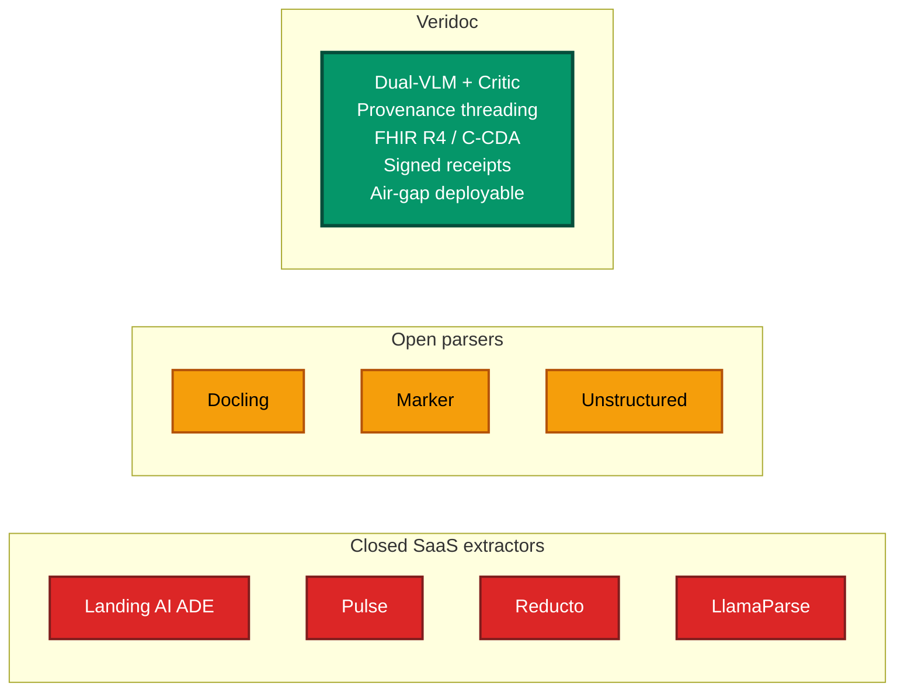
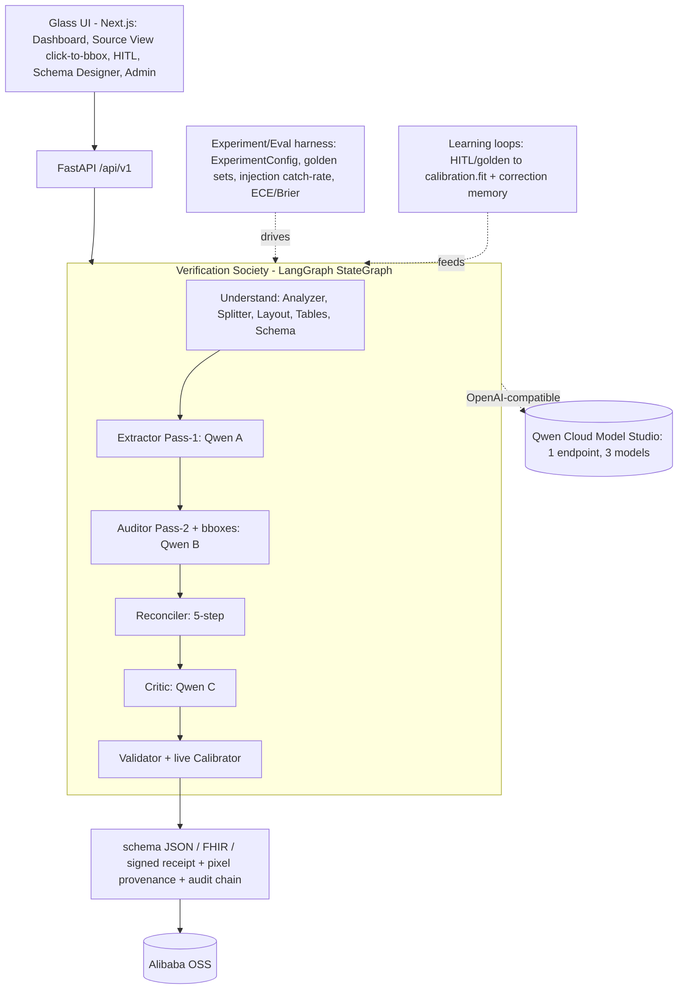
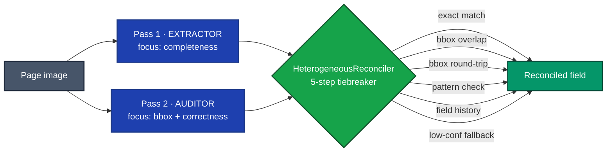
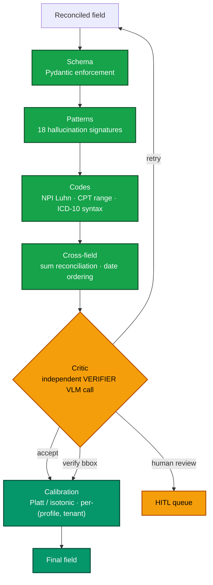
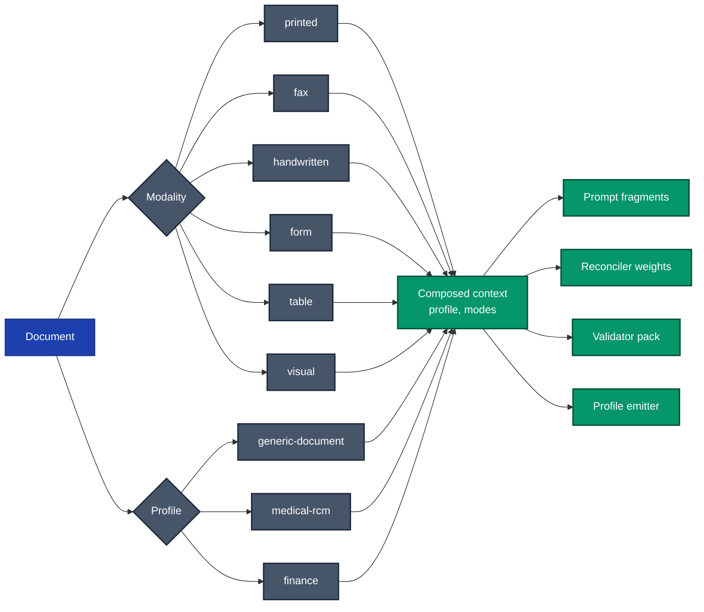
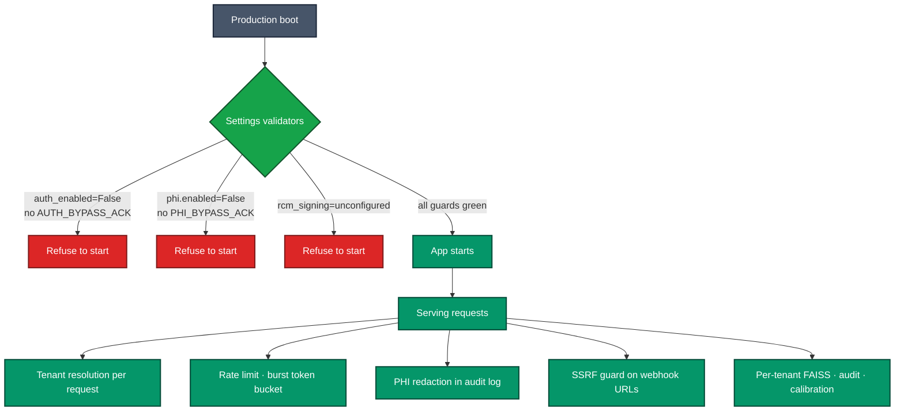
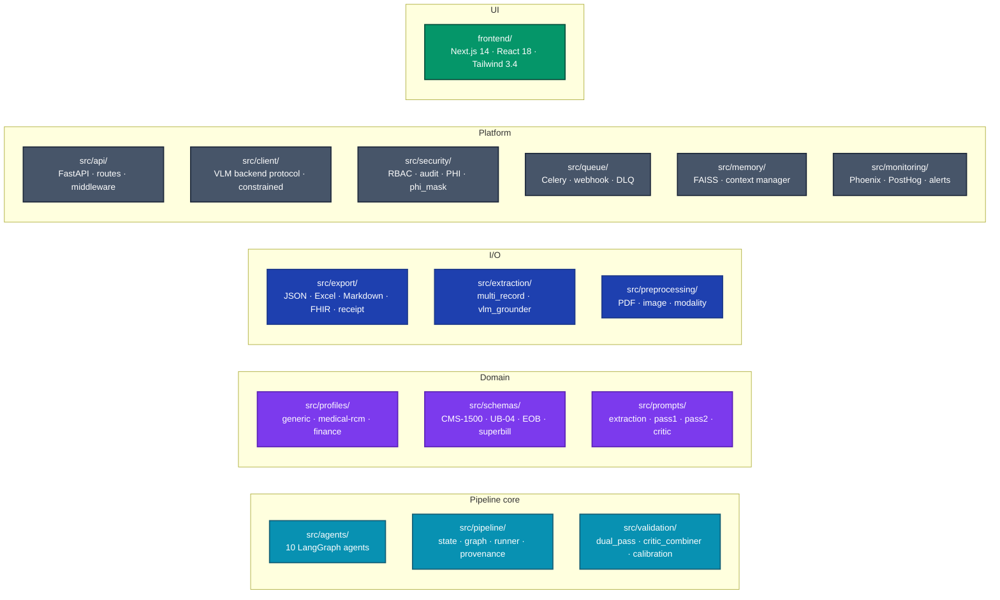
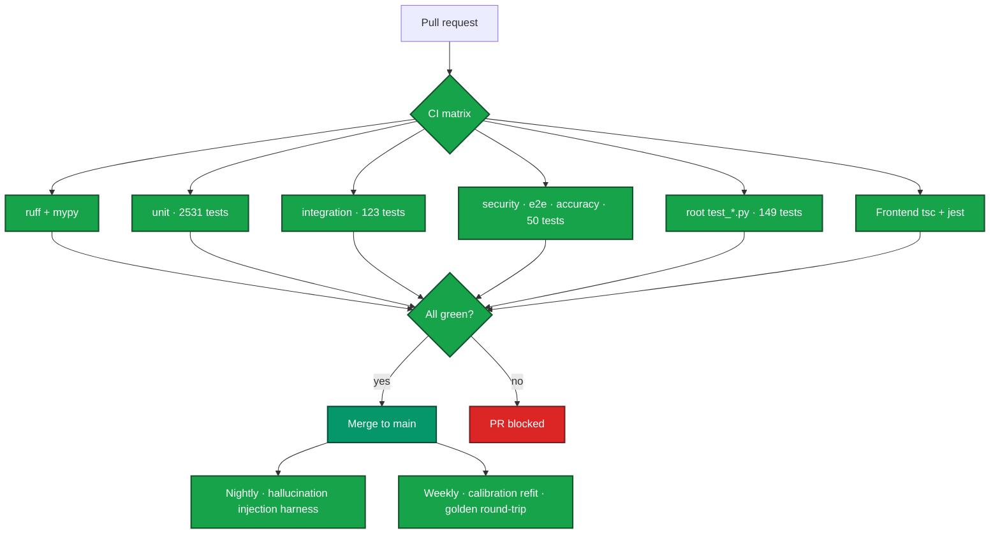
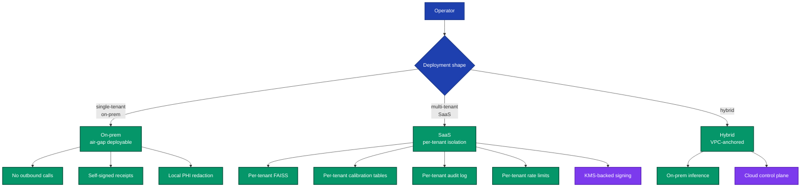

# Veridoc

**The verification layer for document AI — a society of models that cross-examine every field, ground each value to the pixel, and ship calibrated confidence.**


> **Veridoc turns any unstructured PDF, scan, or photo into a validated, schema-bound JSON extraction with per-field provenance back to source pixels.** Every other extractor hands you JSON from a single model and asks you to trust it. Veridoc runs a *society* of models — an Extractor and an Auditor read independently, a Reconciler arbitrates, and a Critic breaks ties — **each on a different model** — so every value is cross-examined, pixel-grounded, and calibrated. Generic-first (invoices, contracts, forms, financial docs), with optional profiles (finance, legal, insurance, medical-RCM/FHIR, logistics). Deployment-flexible: **Qwen Cloud or fully on-prem**. Apache 2.0.

> ✅ **Validated live on Qwen Cloud.** The full society ran end-to-end against Alibaba Model Studio and extracted **21 correct fields** from a real invoice — **pass 1 on `qwen3-vl-plus`, pass 2 on `qwen-vl-max`, Critic on `qwen-vl-plus`** — three distinct models cross-examining, with per-field provenance and calibrated confidence emitted. Deployment proof: [`src/client/backends/qwen_cloud_backend.py`](src/client/backends/qwen_cloud_backend.py) · full write-up: [`docs/SUBMISSION.md`](docs/SUBMISSION.md) · interactive architecture: [`docs/architecture/veridoc-architecture.html`](docs/architecture/veridoc-architecture.html).

---

## The market we're playing in

Veridoc competes directly with **Landing AI ADE**, **Pulse**, **Reducto**, and **LlamaParse** — and outside the closed-source tier, with open parsers like **Docling**, **Marker**, and **Unstructured**. Every one of those products stops short of what production document-intelligence actually needs.



| Capability | Landing AI ADE | Pulse | Reducto | Docling / Marker | **Veridoc** |
|---|---|---|---|---|---|
| **Multi-agent verification society** (models cross-examine every field) | no | no | no | no | **yes — Extractor ‖ Auditor → Reconciler → Critic, each a different model** |
| Per-field bbox provenance | partial | partial | partial | no | **yes, threaded end-to-end** |
| Heterogeneous dual read + Critic verification | no | no | no | no | **yes** |
| Constrained JSON-schema decoding | proprietary | proprietary | proprietary | no | **open + verifiable** |
| Calibrated confidence (Platt / isotonic) | no | no | no | no | **yes, per-(profile, tenant)** |
| FHIR R4 / C-CDA emission | no | no | no | no | **yes** |
| HMAC-signed export receipts | no | no | no | no | **yes** |
| Tamper-evident audit chain | no | no | no | no | **yes, with sidecar anchor** |
| Deployment-flexible (Qwen Cloud **or** air-gap) | no | no | no | partial | **yes** |
| License | proprietary | proprietary | proprietary | open | **Apache 2.0** |
| Domain profiles (finance · legal · insurance · medical · logistics) | bolt-on | no | no | no | **first-class, pluggable** |

The closed extractors stop at JSON. The open parsers stop at Markdown. Neither tier handles the inputs that actually matter — handwritten superbills, faxed claims, low-DPI scans, stamps, marks, multi-region forms — and neither emits standards-grade structured output a clinical or financial system can ingest unmodified.

**Veridoc is the only system in this space where a *society* of models cross-examines every field — bbox-grounded, calibrated, schema-verified, and audit-chained — under an open licence, deployable on Qwen Cloud or fully on-prem.**

---

## How it fits together



A single OpenAI-compatible **Qwen Cloud** endpoint serves three models — the Extractor, the Auditor,
and the Critic each bind to a distinct one, so the society is genuinely heterogeneous. An
experiment/eval harness and live learning loops (HITL + golden sets → calibration refit + correction
memory) sit alongside the pipeline, so accuracy and calibration are *measured and improved*, not assumed.

---

## Quickstart (60 seconds)

```bash
# 1. Install
pip install -e ".[dev]"

# 2. Point Veridoc at a model backend (model-agnostic via VLM_BACKEND):
#    a) Qwen Cloud (recommended) — one endpoint, a distinct Qwen model per society role:
#       export VLM_BACKEND=qwen_cloud
#       export VLM_QWEN_CLOUD_PRIMARY_URL=https://dashscope-intl.aliyuncs.com/compatible-mode/v1
#       export VLM_QWEN_CLOUD_API_KEY=sk-...                      # Model Studio key
#       export VLM_QWEN_CLOUD_PRIMARY_MODEL=qwen-vl-max           # Extractor
#       export VLM_QWEN_CLOUD_SECONDARY_MODEL=qwen2.5-vl-72b-instruct  # Auditor
#       export VLM_QWEN_CLOUD_CRITIC_MODEL=qwen-vl-plus           # Critic
#    b) Local — any OpenAI-compatible vision model via LM Studio at http://localhost:1234

# 3. Extract — generic profile (any PDF)
python main.py extract path/to/contract.pdf -o output/

# 4. Extract — Medical-RCM profile (FHIR R4 emission)
python main.py extract path/to/claim.pdf --mode healthcare -o output/

# 5. Bring up the full stack (REST API + Next.js UI)
python main.py
#   → API:   http://127.0.0.1:8000
#   → UI:    http://127.0.0.1:3000
```

Generic-mode output sits in `output/<stem>/`:

```
output/contract/
├── contract_results.json         # extracted fields + per-field provenance
├── contract_consolidated.xlsx    # per-row + provenance sheet
├── contract_report.md            # narrative + footnote provenance
├── bbox_overlay_p*.png           # confidence-coloured bounding boxes per page
└── receipt.json                  # HMAC-signed integrity attestation
```

Healthcare-mode adds `<stem>.fhir.json` — a validated FHIR R4 Bundle (Patient + Coverage + Claim resources for CMS-1500 / UB-04; Patient + ExplanationOfBenefit for EOB) you can drop into Epic, Cerner, or any FHIR-compliant clinical system unmodified.

---

## The seven-layer architecture

```mermaid
%% Seven-layer pipeline — flows left → right; each stage is independently observable.
flowchart LR
    IN(["PDF · scan · photo"]) ==> L1
    L1["<b>L1 · Ingress</b><br/>━━━━━━━━━━<br/>REST API<br/>CLI<br/>Next.js UI"]
    L2["<b>L2 · Preprocess</b><br/>━━━━━━━━━━<br/>PyMuPDF 300 DPI<br/>OpenCV · CLAHE<br/>Modality detect"]
    L3["<b>L3 · Understand</b><br/>━━━━━━━━━━<br/>Analyzer<br/>Splitter · Tables<br/>Profile detect"]
    L4["<b>L4 · Extract</b><br/>━━━━━━━━━━<br/>Pass 1 EXTRACTOR<br/>Pass 2 AUDITOR<br/>Reconciler"]
    L5["<b>L5 · Validate</b><br/>━━━━━━━━━━<br/>Schema · Patterns<br/>Codes · Cross-field<br/>Critic · Calibration"]
    L6["<b>L6 · Output</b><br/>━━━━━━━━━━<br/>JSON · Excel · MD<br/>FHIR R4 · Bbox PNGs<br/>Signed receipt"]
    L7["<b>L7 · Egress</b><br/>━━━━━━━━━━<br/>Webhook + DLQ<br/>Audit chain<br/>Phoenix · PostHog"]
    OUT(["Validated structured output"])

    L1 ==> L2 ==> L3 ==> L4 ==> L5 ==> L6 ==> L7 ==> OUT

    OBS["<b>Cross-cutting</b> — LangGraph v3 state machine · durable SQLite checkpoints · PHI redaction · multi-tenant isolation · Phoenix span per stage"]
    L1 -.observes.- OBS
    L4 -.observes.- OBS
    L7 -.observes.- OBS

    classDef io fill:#0f172a,stroke:#020617,color:#fff,stroke-width:2px
    classDef ingress fill:#1e40af,stroke:#1e3a8a,color:#fff,stroke-width:2px
    classDef preproc fill:#475569,stroke:#1e293b,color:#fff,stroke-width:2px
    classDef understand fill:#0891b2,stroke:#155e75,color:#fff,stroke-width:2px
    classDef extract fill:#7c3aed,stroke:#5b21b6,color:#fff,stroke-width:2px
    classDef validate fill:#16a34a,stroke:#14532d,color:#fff,stroke-width:2px
    classDef output fill:#059669,stroke:#064e3b,color:#fff,stroke-width:2px
    classDef egress fill:#f59e0b,stroke:#b45309,color:#000,stroke-width:2px
    classDef meta fill:#374151,stroke:#111827,color:#fff,stroke-width:2px,stroke-dasharray: 6 4
    class IN,OUT io
    class L1 ingress
    class L2 preproc
    class L3 understand
    class L4 extract
    class L5 validate
    class L6 output
    class L7 egress
    class OBS meta
```



The whole pipeline is a **LangGraph v3 state machine** with durable SQLite checkpointing — interrupt-resume works mid-extraction, even across process restarts. Every layer is independently testable, independently observable (one Phoenix span per stage), and independently disable-able via feature flags.

> Want the same picture with the per-layer detail? See [docs/VERIDOC_MASTER_PLAN.md §3](docs/VERIDOC_MASTER_PLAN.md#3-the-seven-layer-architecture).

---

## Six core differentiators

### 1. A society of models — heterogeneous read, reconciler, and critic



Two passes with different prompt frames — **and, on Qwen Cloud, different models** (Extractor, Auditor, and Critic each bind to a distinct Qwen model) — produce orthogonal failure modes. The reconciler arbitrates field-by-field with a documented 5-step tiebreaker; the Critic breaks ties from an independent verifier frame. Per-(profile, modality) reconciler weights mean fax-mode handwritten inputs get different tiebreakers than clean printed invoices.

### 2. Bbox-grounded click-to-source provenance

Every extracted field carries a `FieldValue[T]` envelope:

```python
{
  "patient_name": {
    "value": "Jane Doe",
    "_provenance": {
      "page": 1,
      "bbox": [0.142, 0.218, 0.387, 0.241],
      "source_block_id": "block_4_3",
      "extraction_path": ["pass1", "pass2", "reconciler"],
      "agent_signatures": {"pass1": 0.92, "pass2": 0.94, "critic": 0.93},
      "confidence_raw": 0.93,
      "confidence_calibrated": 0.81,
      "vlm_model_id": "operator-chosen-vlm"
    }
  }
}
```

The Next.js Source View tab consumes this envelope: click a field → the bbox lights up on the rendered PDF; click a bbox → the field expands with its lineage timeline (Pass 1 → Pass 2 → reconciler → Critic → calibration). Bboxes are stored normalised `(x, y, w, h ∈ [0, 1])` so any renderer can re-project into its own pixel space without coordinate drift.

### 3. Six-layer validation pyramid + calibrated confidence



Each layer catches a different failure mode. The Critic is an independent VLM call from a verifier frame — **not** a re-extractor — that votes accept / verify-bbox / retry / human-review. Calibration converts the model's often-optimistic raw confidence into empirically-grounded probabilities, with per-(profile, tenant) lookup tables and a nightly self-improving refit loop.

### 4. Modality + profile axes (one chip in the UI)

Veridoc decides two orthogonal things about every document:

- **Modality** — what it looks like: `printed`, `handwritten`, `fax`, `visual`, `table`, `form`. Drives the image-enhancement pipeline and per-mode prompt fragments.
- **Profile** — what it's about: `generic-document`, `medical-rcm`, `finance`. Drives the schema overlay, validator pack, reconciler weights, and optional emitters.



Auto-detection runs by default. The upload UI surfaces both axes as chip rows for operator override; the CLI exposes `--mode {healthcare,general,auto}` and `--profile <name>`.

### 5. Tamper-evident audit chain + HMAC-signed receipts

Every export bundle ships with a `receipt.json` that binds the SHA-256 of every artefact + the audit-chain tail hash + the processing id + an HMAC-SHA-256 signature into one offline-verifiable JSON object:

```bash
python -c "from src.export.signed_receipt import verify_receipt; verify_receipt('output/claim/receipt.json', key=...)"
# → {"valid": True, "artefact_hashes_match": True, "audit_chain_intact": True}
```

The audit log itself is a hash-chained append-only journal with a sidecar anchor file; truncation, rotation, or in-place edits all surface as `chain_intact=False`. Designed for HIPAA-grade auditability, deployable air-gapped (no cloud key-management dependency), with a clean upgrade path to KMS-backed PKCS#7 signing for production cloud deployments.

### 6. Default-deny security posture



Production refuses to boot with auth disabled, PHI redaction disabled, or RCM signing unconfigured — each gated by an explicit `*_BYPASS_ACK` env var that mirrors the HIPAA-grade-by-default pattern. Webhook URLs route through a DNS-resolving SSRF check that rejects RFC-1918, link-local, loopback, and metadata-IP targets. API keys carry ownership claims that survive revocation. Every audit log entry is PHI-masked through the same redactor pipeline before disk.

---

## What's inside the box



| Surface | What's there |
|---|---|
| **Agents** | Orchestrator (LangGraph) · Analyzer · Splitter · TableDetector · Extractor (Pass 1 / Pass 2) · Reconciler · Critic · Validator |
| **Backend protocol** | `VLMBackend` interface — operator picks any vision model via config; **Qwen Cloud** (Model Studio, role→model) + LM Studio / vLLM / Gemma adapters ship in-tree |
| **Profiles** | `generic-document` (any PDF) · `medical-rcm` (CMS-1500/UB-04/EOB/Superbill) · `finance` (invoices, W-2, 1099); legal-contract / insurance-form / logistics scaffolded |
| **Validation** | Pydantic schemas · 18 hallucination patterns · CPT/ICD/NPI/POS validators · cross-field rules · Critic agent · `ConfidenceCalibrator` (Platt + isotonic + linear) |
| **Memory** | FAISS vector store, per-tenant isolation, context retrieval into prompts |
| **Exports** | JSON (4 styles) · Excel (4-sheet) · Markdown (4 styles) · **FHIR R4 Bundle** · bbox overlay PNGs · signed receipt |
| **Security** | RBAC (7 roles) · JWT with revocation · AES-256-GCM at rest · PHI redaction (ML + regex) · audit chain with sidecar anchor · SSRF webhook guards |
| **Observability** | Arize Phoenix (OpenInference / OTel) · PostHog · structlog · Prometheus · per-stage span attributes |
| **Frontend** | Next.js 14 App Router + React 18 + TypeScript 5 + Tailwind + Zustand + TanStack Query · "Glass" UI (glassmorphism, light/dark, ⌘K palette) · Source View with click-to-bbox · WCAG-pass a11y |
| **Tests** | 2853 passing — unit, integration, security, e2e, accuracy splits |

---

## How Veridoc is verified



Hallucination resistance is measured continuously: a nightly injection harness mutates known-good extractions with six injection types (`value_swap`, `amount_fake`, `phantom_field`, `bbox_drift`, `field_drop`, `placeholder_inject`), runs the full pipeline, and computes catch-rate per layer per injection. The current bar: ≥ 85 % catch-rate on `phantom_field` and `bbox_drift` with < 5 % false-positive rate on clean inputs.

---

## Performance & operating envelope

| Metric | Target | Notes |
|---|---|---|
| Field-fidelity (Synthea CMS-1500) | ≥ 92 % | dual-VLM mode, calibrated confidence |
| Hallucination rate (post-Critic) | < 1 % | measured on the nightly injection corpus |
| Critic catch-rate (phantom-field) | ≥ 85 % | nightly gate |
| End-to-end latency (per page) | 15–25 s | LM Studio + local GPU, single-instance |
| VLM calls per page | 2–4 | Pass 1 + Pass 2 + optional Critic + optional bbox round-trip |
| Audit-log fsync overhead | < 1 ms / batch | batched flush, one fsync per N events |
| Memory footprint (state dict) | < 50 MB per 20-page doc | post-Phase-8 page-image dedup |

| GPU configuration | Throughput |
|---|---|
| Single RTX 4090 | 50–100 pages / hour |
| Dual mid-tier GPU | 200–400 pages / hour |
| Distributed (Celery workers) | scales linearly |

---

## Compliance & deployment posture



| Capability | State |
|---|---|
| HIPAA-grade PHI redaction (ML token classifier + regex fallback) | shipped, opt-in |
| AES-256-GCM at rest (PBKDF2 600k / Scrypt 2¹⁴) | shipped |
| Tamper-evident audit chain + sidecar anchor | shipped |
| Multi-tenant isolation (FAISS / calibration / audit / checkpoints) | shipped (flag-gated) |
| Air-gap install verification | scripted |
| KMS-backed PKCS#7 signing for RCM emission | scaffolded |
| WORM audit log via S3 object-lock / append-only volume | deployment-side option |

---

## Source tree

```
veridoc/
├── src/
│   ├── agents/             # LangGraph nodes — orchestrator, analyzer, extractors, critic
│   ├── api/                # FastAPI routes, middleware, models
│   ├── client/             # VLM backend protocol, constrained decoding
│   ├── config/             # settings.py — Pydantic Settings with prod-boot guards
│   ├── export/             # JSON, Excel, Markdown, FHIR, receipt
│   ├── extraction/         # multi-record, vlm_grounder
│   ├── memory/             # FAISS vector store, context manager
│   ├── monitoring/         # Phoenix, PostHog, alerts
│   ├── pipeline/           # state, graph, runner, provenance
│   ├── preprocessing/      # PDF, image enhancer, modality
│   ├── profiles/           # generic, medical-rcm, finance (+ stubs)
│   ├── prompts/            # extraction, pass1, pass2, critic
│   ├── queue/              # Celery, webhook, DLQ
│   ├── schemas/            # CMS-1500, UB-04, EOB, superbill, validators
│   ├── security/           # RBAC, audit, PHI redactor, phi_mask
│   └── validation/         # dual_pass, critic_combiner, calibration
├── frontend/               # Next.js 14 app
├── tests/                  # unit · integration · security · e2e · accuracy
├── docs/                   # see docs/README.md
└── main.py                 # CLI + dev-stack launcher
```

Full file-by-file footprint lives in [docs/VERIDOC_MASTER_PLAN.md §H](docs/VERIDOC_MASTER_PLAN.md#h-module-map-file-by-file-change-footprint).

---

## Documentation map

| Doc | What's inside |
|---|---|
| [ARCHITECTURE.md](ARCHITECTURE.md) | **Design of record** — the Verification Society, Qwen Cloud model layer, deployment topology |
| [docs/QWEN_HACKATHON_EXECUTION.md](docs/QWEN_HACKATHON_EXECUTION.md) | Qwen Cloud integration + Alibaba (ECS + OSS) deployment plan |
| [docs/MODES.md](docs/MODES.md) | Modality / profile detection deep-dive |
| [docs/PHI_MODE.md](docs/PHI_MODE.md) | Opt-in PHI redaction operator guide |
| [docs/OBSERVABILITY.md](docs/OBSERVABILITY.md) | Phoenix · PostHog · audit-chain ops |
| [docs/PRODUCT_OVERVIEW.md](docs/PRODUCT_OVERVIEW.md) | One-page product summary for evaluators |
| [docs/archive/](docs/archive/) | Superseded direction docs (AWS Bedrock, Google/Gemini) — history only |

---

## Working set

- **Backend:** Python 3.11+, FastAPI, LangGraph v3, LangChain 1.x, Pydantic 2.x, openai-compatible VLM client, FAISS, openpyxl, PyMuPDF, OpenCV
- **Frontend:** Next.js 14 App Router, React 18, TypeScript 5, Tailwind, Zustand, TanStack Query, Lucide, Framer Motion — "Glass" glassmorphism UI
- **Inference:** Qwen Cloud / Alibaba Model Studio (OpenAI-compatible), or any local OpenAI-compatible vision model via LM Studio — model-agnostic by design
- **Observability:** Arize Phoenix (OpenInference), PostHog, structlog, Prometheus
- **Storage:** SQLite (LangGraph checkpoints), FAISS (vector memory), append-only audit-log JSONL, Alibaba OSS (artifact store)
- **Queue:** Celery + Redis (optional — sync mode works without)

---

## Contributing

1. Fork
2. `git checkout -b feature/your-thing`
3. `pip install -e ".[dev]"` then `pytest tests/ -m "not slow"` — 2853 tests should pass
4. `cd frontend && npm ci && npx tsc --noEmit` — 0 errors
5. Commit, push, open a PR

PRs that touch the pipeline core also need to pass the nightly hallucination-injection harness — `pytest tests/eval/inject/ -m gpu` on the self-hosted runner. The CI bot picks this up automatically.

---

## License

**Apache 2.0** — see [LICENSE](LICENSE). No commercial-use restrictions. Compatible with downstream proprietary integration.

---

*The verification layer for document AI. Open. Trustworthy. Deployment-flexible.*
