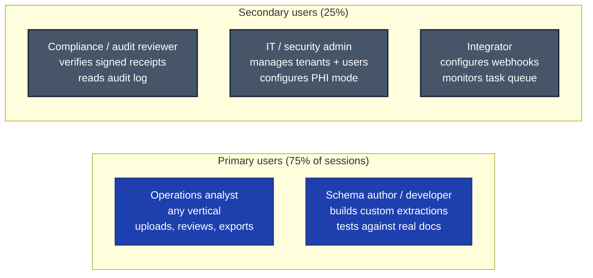
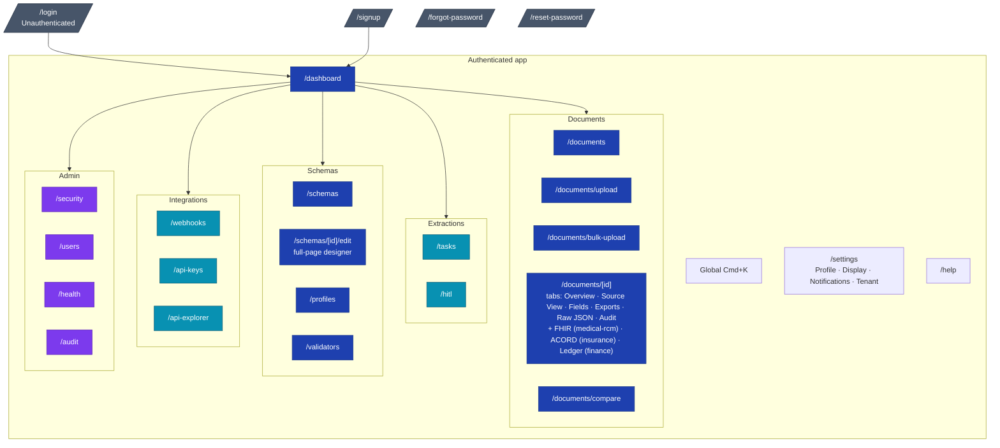

# Veridoc — Frontend Redesign Brief

> **How to use this file.** Paste the whole file into a Claude design session in one shot. The "Active Prompt" at the top is the instruction; everything after it is reference context Claude must design against. Don't summarise or truncate — the personas, per-screen specs, design tokens, and accessibility constraints are load-bearing.

---

## Active Prompt

You are redesigning the entire frontend of **Veridoc**, an open-source document-intelligence product that competes with Landing AI ADE, Pulse, Reducto, and LlamaParse. The current Next.js 14 app works but looks generic — it's a serviceable React app that doesn't yet communicate the product's positioning.

**Veridoc is a general-purpose document-extraction tool, not a healthcare app.** It turns any unstructured PDF, scan, photo, or office file into validated, schema-bound JSON with bbox-grounded provenance. Use cases include invoices, contracts, forms, scientific papers, government applications, bills of lading, leases, ACORD insurance forms, W-2s / 1099s, bank statements, research data, and — yes — medical claims (CMS-1500, UB-04, EOB, superbills). The medical-RCM profile is the most mature specialisation today, but the product is **generic-first**: it ships with `generic-document` as the default profile and the medical surface is *one* of several profiles, alongside `finance`, `legal-contract`, `insurance-form`, and `logistics`. Roughly half of your design budget should go to the generic, profile-agnostic surface (upload, document detail, schemas, etc.) and the other half to the profile-specific accents (chips, badges, the medical-RCM FHIR tab, etc.).

Your job is to produce a **complete, opinionated redesign** that:

1. **Treats Veridoc as a category-defining product.** Not "another document parser" — the open, auditable, HIPAA-grade-capable alternative to closed SaaS extractors. The design should feel like a serious engineering product (think: Linear, Stripe, Vercel, Arize Phoenix), not a generic SaaS dashboard.
2. **Solves the hard UI moments well.** The Source View tab (PDF/PNG on left, field list on right, two-way bbox highlight sync) is the headline interaction. The upload flow needs to surface dual axes (modality + profile) without feeling like a wizard form. The schema designer needs to be a genuine first-class surface — the killer feature of generic mode. The tasks view needs real-time progress without flicker. The security/audit views need authority without being intimidating.
3. **Ships a complete design system with native dark + light mode.** Not "dark mode added later". A persistent **theme toggle** in the global header (three-state: light / dark / system) is a hard requirement on every authenticated screen. Every component is designed in both modes simultaneously, every color is a token (CSS custom property), every screen passes WCAG 2.2 AA contrast in both modes. The toggle's state persists in `localStorage` and is read at first render to prevent flash.
4. **Hits WCAG 2.2 AA** as a hard requirement, not an afterthought. Every interactive surface is keyboard-navigable; every modal traps focus; every action has an accessible label.
5. **Is generic-first.** A user landing on `/documents/upload` who is uploading an invoice should not feel like a tourist in a medical app. The medical-RCM features are profile-gated and only surface when relevant.

### What to deliver

A single, complete design response covering all of the following, in this order:

1. **Design system** — color tokens (light + dark, with contrast ratios), typography scale, spacing rhythm, elevation, motion, focus ring, iconography. Plus a Tailwind config delta showing only the additions/changes.
2. **Theme system** — the three-state toggle (light/system/dark), persistence model, no-flash rendering technique, `prefers-color-scheme` integration, cross-tab sync, per-canvas override.
3. **Component inventory** — every primitive and composed component listed in §14: variants, sizes, states (default/hover/focus/active/disabled/loading/error), ARIA pattern, keyboard interactions, light + dark ASCII wireframes.
4. **Per-screen redesigns** — every screen in §7: information architecture, ASCII wireframe, interaction notes, empty/loading/error states, profile-variant notes, one-paragraph rationale tying back to product positioning.
5. **Two deep-dives** — the Source View tab (§13) and the Schema Designer (§12), expanded to full specs with component contracts, interaction timings, keyboard models, and responsive breakpoints.
6. **Before/after** — 6-8 highest-impact current screens compared against your redesign, with specific callouts on what changed and why.
7. **Rollout plan** — a 90-day phased migration plan: which design-system primitives ship first, which screens migrate in what order, no flag-day rewrite.

Ship everything in one comprehensive response with clear section headers. Don't split into separate files; the user wants a single artefact they can scroll through.

### Constraints

- **Stack is fixed.** Next.js 14 App Router + React 18 + TypeScript 5 + Tailwind 3.4 + Zustand + TanStack Query + Lucide React + Framer Motion + react-pdf (opt-in). Don't propose a different framework.
- **No commercial design-system dependencies** (no MUI, no Mantine, no Chakra, no Ant). In-house primitives only.
- **Apache 2.0 compatible** for any assets you propose.
- **No emojis in product UI** unless they're functional (status indicators where one glyph beats one word). The current chip emojis (`🏥`/`📄`) should probably go — propose proper iconography. Functional status icons from Lucide are preferred.
- **No "AI" branding gimmicks.** No "✨ AI-powered" labels, no animated sparkles, no chatbot framing. Veridoc is an extraction engine.
- **Provenance is the headline feature.** Every interaction with extracted data should make the bbox + lineage one click away.
- **Generic-first.** Don't design the whole UI around CMS-1500. A contract review user should feel equally first-class.

### Tone

- **Engineering-grade.** Microcopy is direct, terse, accurate. Error messages give the exact reason. Empty states explain what to do next.
- **Calm under load.** Documents may contain PHI or sensitive financial data. The UI feels composed even on a 200-page document.
- **Transparent.** Every confidence score visible. Every Critic verdict surfaced. Every signed receipt one click away. Nothing important hides behind "Show details".

Now study the brief below — Veridoc's positioning, personas, sitemap, per-screen specs, design system, theme strategy, and accessibility — and produce the deliverables.

---

## 1. What Veridoc is

Veridoc turns any unstructured PDF, scan, photo, or office file into validated, schema-bound JSON with **per-field provenance** that points back to source pixels.

**It is generic-first.** The default profile is `generic-document` and works on any input. On top of that, Veridoc ships specialised profiles for high-value domains:

| Profile | Documents handled | Emitters |
|---|---|---|
| `generic-document` | Any PDF, image, office doc | JSON · Excel · Markdown · bbox PNGs · signed receipt |
| `medical-rcm` | CMS-1500, UB-04, EOB, Superbill | + FHIR R4 Bundle · C-CDA · X12N 275 |
| `finance` | Invoices, W-2, 1099, bank statements, financial reports | + ledger-friendly DATAFRAME_FLAT JSON |
| `legal-contract` | Contracts, NDAs, MSAs, leases | + clause-indexed CSV |
| `insurance-form` | ACORD forms, claim attachments | + ACORD-shaped JSON |
| `logistics` | Bills of lading, customs declarations, HS-code docs | + EDI 856/859 stubs |

It competes with:

- **Landing AI ADE** (closed, SaaS, generic) — Veridoc differentiates on: open licence, dual-VLM with Critic, HIPAA-grade auditability, schema-bound output by design.
- **Pulse / Reducto / LlamaParse** (closed extractors) — Veridoc adds bbox-grounded click-to-source provenance, tamper-evident signed receipts, and a real schema designer.
- **Docling / Marker / Unstructured** (open parsers) — those stop at Markdown; Veridoc carries structured schemas, calibrated confidence, and downstream-system interop.

The frontend has to make this differentiation **visible at first glance**. A user landing on the dashboard immediately understands: this is a serious, auditable, professional tool that works on any document — not a chatbot wrapper.

---

## 2. Personas (design for these five — note the deliberate domain mix)



### P1 — Operations analyst (the daily driver, domain varies)

- **Could be:** an accounts-payable clerk extracting invoices · a paralegal extracting contract clauses · a medical biller extracting CMS-1500 fields · a logistics coordinator extracting BOL details · a researcher pulling structured data from PDFs of scientific papers.
- **Goal:** upload documents, get clean structured data, flag anything that looks wrong, hand off to the next system (ERP, billing, CRM, data warehouse).
- **Pain:** today's tools force them to scroll through low-confidence fields one at a time; bbox highlights are missing; corrections aren't tracked; profile-specific features clutter the UI even when they're processing a non-medical document.
- **Design implication:** the document detail page must let them tab through fields by ascending confidence with keyboard shortcuts, see bboxes in context, edit/approve inline. Profile-specific tabs (FHIR, ACORD, etc.) only appear when that profile is active.

### P2 — Schema author / developer

- **Goal:** create a custom extraction schema for a specific document type the operator handles. Test it against real samples. Version it. Roll it out.
- **Pain:** schema design is usually a YAML/JSON file edit; there's no UI; live preview against a sample doc is rare.
- **Design implication:** the schema designer is a **full-page workspace**, not a modal — drag-to-reorder fields, inline editing, real-time prompt preview, sample-document test pane, version history.

### P3 — Compliance / audit reviewer

- **Goal:** "show me that the signed receipt for processing #123456 is intact and the PHI was redacted in the audit log."
- **Design implication:** dedicated audit/security views, signed-receipt verification as a first-class action, visual diff for tampering.

### P4 — IT / security admin

- **Goal:** add a user, set their tenant, configure PHI mode, check security posture.
- **Design implication:** Settings and Security are clean and scannable. Multi-tenancy is a first-class concept.

### P5 — Integrator (developer using the REST API)

- **Goal:** configure webhooks, monitor task queue, debug delivery failures.
- **Design implication:** API explorer, webhook builder + test endpoint, structured task logs, DLQ with replay.

---

## 3. Design principles

1. **Provenance over polish.** A click from field to source bbox matters more than a pretty animation.
2. **Calm density.** Information density is OK — these are operator tools. But density must be *calm*: clear hierarchy, generous line-height, surfaces that breathe.
3. **State you can read.** Every async operation has visible loading, error, empty, success. No mystery spinners.
4. **Keyboard-first.** Every primary action has a shortcut. Every modal traps focus. Every list is Tab-navigable.
5. **Theme is a peer, not a fallback.** Dark and light get equal design attention. Token-based — zero hardcoded hex in components. A toggle in the header is always one click away.
6. **Honest copy.** Errors say what failed and why. Empty states say what to do next. No "Oops!"
7. **Confidence is visible.** Raw AND calibrated, both shown. Banded color: green ≥ 0.85, amber 0.5-0.85, red < 0.5.
8. **The Critic verdict is a first-class signal.** When flagged, visible in the row — not behind "more info".
9. **Generic-first.** The default surface works on any document. Profile-specific UI surfaces only when that profile is active.
10. **One toggle hierarchy per concept.** Confidence is one badge, not three. Modality is one chip row. Profile is one dropdown. Don't sprinkle the same info in five places.

---

## 4. Brand identity & visual direction

### Reference visual languages (study, then differentiate)

- **Linear** — calmness, density without claustrophobia, primary-action placement.
- **Stripe Dashboard** — data-table treatments, tag/chip system, balance of density + readability.
- **Vercel Dashboard** — monochrome confidence, empty/loading state craft.
- **Arize Phoenix** — span/trace visualisation; Veridoc's provenance timeline should feel adjacent.
- **GitHub** — audit-log treatment, diff visualisations, security surface tone.
- **Retool** (for the schema designer specifically) — how a power-user builder UI handles drag-drop and live preview.

**What Veridoc must NOT look like:** Anthropic.ai marketing site (too consumer), Bootstrap admin dashboards (too utilitarian), Notion (too soft for compliance work), any "AI assistant" chatbot, Squarespace/Wix (too decorative).

### Brand attributes

- **Trustworthy** — handling PHI / financials / contracts. Feels like a vault.
- **Open** — Apache 2.0; surfaces feel like documentation, not Enterprise upsells.
- **Technical** — the audience reads JSON. "Raw JSON" is a feature, not a fallback.
- **Auditable** — visible provenance, confidence, verdicts, signed receipts.
- **Domain-flexible** — equally credible for legal review, finance extraction, medical claims, research data.

### Suggested palette direction (Claude can refine)

**Light mode:**
- Canvas `#fafaf9` (warm off-white)
- Surface `#ffffff`
- Raised `#f5f5f4`
- Ink primary `#0c0a09` (near-black, warm)
- Ink secondary `#44403c`
- Ink muted `#78716c`
- Border default `#e7e5e4`
- Border strong `#d6d3d1`
- Accent brand `#1e40af` → hover `#1e3a8a`
- Status success `#16a34a` · warning `#d97706` · danger `#dc2626` · info `#0891b2`
- Confidence high `#16a34a` · medium `#d97706` · low `#dc2626`

**Dark mode:**
- Canvas `#0a0a0a` (warm black, not pure)
- Surface `#171717`
- Raised `#262626`
- Ink primary `#fafaf9` (warm white)
- Ink secondary `#a8a29e`
- Ink muted `#78716c`
- Border default `#262626`
- Border strong `#404040`
- Accent brand `#3b82f6` (desaturated 15%) → hover `#60a5fa`
- Status success `#22c55e` · warning `#f59e0b` · danger `#ef4444` · info `#06b6d4`
- Confidence high `#22c55e` · medium `#f59e0b` · low `#ef4444`

**No bright pastels, no rainbow gradients, no glassmorphism, no neon.** The product is auditable; the UI should be too.

---

## 5. Brand voice & microcopy

- **Voice:** Direct, terse, technically precise. Operator-respectful.
- **Tense:** Present for state ("3 documents in queue"); imperative for actions ("Upload PDF").
- **Don't:** exclamation marks, emojis in copy, jocular phrasing ("Oops!"), generic platitudes ("Something went wrong"), sales-speak, pluralised generic nouns with adjectives ("Awesome Documents").
- **Do:** name specific things ("Extraction failed: VLM backend timed out after 30s"), surface the next action ("Retry · Open in Source View"), give numbers ("5 of 12 fields below 0.70 confidence").
- **Error messages must include:** what failed, why, what the user can do. Three sentences max.
- **Empty states must include:** what this view will show, primary action, no generic clipart.
- **Domain neutrality.** Default copy stays profile-agnostic ("Extracted fields", not "Extracted claim fields"). Profile-specific copy only inside profile-specific views.

---

## 6. Information architecture: the global frame

Every authenticated screen shares the same chrome:

```
┌──────────────────────────────────────────────────────────────────┐
│ Header (64px)                                                    │
│ ┌──────┐  ┌───────────────────────────┐  ┌─────────┬──────┬───┐  │
│ │ logo │  │ search (Cmd+K)            │  │ theme ▾ │ bell │ ↩ │  │
│ │      │  │                           │  │         │      │   │  │
│ └──────┘  └───────────────────────────┘  └─────────┴──────┴───┘  │
├──────────────────────────────────────────────────────────────────┤
│ ┌────┬─────────────────────────────────────────────────────────┐ │
│ │    │                                                         │ │
│ │ Si │                                                         │ │
│ │ de │                Main content area                        │ │
│ │ ba │                                                         │ │
│ │ r  │                                                         │ │
│ │    │                                                         │ │
│ └────┴─────────────────────────────────────────────────────────┘ │
└──────────────────────────────────────────────────────────────────┘
```

### Header (sticky, 64px)

- **Logo / wordmark** — links to `/dashboard`.
- **Global search** — Cmd+K (Ctrl+K on Windows/Linux). Opens a command palette: search documents by filename, hash, processing_id; jump to any route; run common actions ("Upload document", "New schema").
- **Theme toggle** ⭐ — three-state: light / dark / system. See §11 for the deep-dive. Persists in `localStorage.theme`. Always visible; one of the most important global affordances.
- **Notification bell** — unread count badge; click → notification center popover (recent extractions complete, HITL flags, system warnings).
- **User menu** — avatar (initials by default), name, tenant badge (if multi-tenant build); dropdown: Profile, Settings, Switch tenant (if admin + multi-tenant), Sign out.

### Sidebar (collapsible, 240px expanded · 56px collapsed)

Sections, in order:
- **Dashboard** (overview icon)
- **Documents** — Documents (list) · Upload · Bulk upload
- **Extractions** — Tasks · HITL review queue
- **Schemas** — Schemas · Profile catalog · Custom validators
- **Integrations** — Webhooks · API keys · API explorer
- **Admin** (admin-only) — Security · Users · Health · Audit log
- **Help** (footer-anchored)

Each item: icon (Lucide) + label + active-state highlight (left accent rail + tinted bg). Collapsed mode shows icons only with tooltip on hover. Sidebar collapse state persists in `localStorage`.

### Footer

A thin strip below the sidebar showing: Veridoc version, build hash, environment badge (dev / staging / prod), link to changelog.

---

## 7. Sitemap



---

## 8. Per-screen specs

Every screen below: redesign it. State the IA, the wireframe (ASCII or precise component composition), interaction model, empty/loading/error states. Rationale paragraph ties back to product positioning. Specify **light + dark** treatments where they materially differ.

### 8.1 `/login`

**Purpose:** unauthenticated entry. Single-tenant on-prem deploys often have one user; not a SaaS funnel.

**Layout (centered card, max-width 420px):**
- Veridoc wordmark (no oversized hero illustration)
- Username + password fields with real-time error clearing (R1.3 landed)
- Primary "Sign in"
- Optional "Forgot password?" if backend supports
- Footer line: Veridoc version + environment badge
- Theme toggle visible in top-right (even on unauth screens)

**Must NOT contain:** background gradients, marketing copy ("Join 10,000+ companies"), animated blobs.

**Edge states:** password expired (HIPAA 90-day rotation) · account locked · MFA challenge (placeholder, roadmap).

### 8.2 `/signup`

**Purpose:** only relevant when self-signup is enabled (single-tenant deploys often disable).

**Fields:** username · email · password (with strength meter) · tenant id (if multi-tenant build + admin invite mode disabled).

### 8.3 `/forgot-password` and `/reset-password`

Placeholders for the standard flow. Design but flag as roadmap unless backend has the routes.

### 8.4 `/dashboard`

**Purpose:** first screen after login. Daily standup view.

**Above the fold (4 sections):**

1. **Throughput strip** — last 24h: documents processed · avg extraction time · hallucination flags caught · HITL queue depth. 4 large stat cards. Each: number, label, delta vs previous 24h, sparkline (last 24h hourly).
2. **Active extractions** — small live list (top 3) with progress bars; click → `/tasks`. Each row: filename · profile chip · stage badge (analyzer / pass1 / pass2 / critic / export) · elapsed.
3. **Confidence band breakdown** — donut showing % of last-24h extractions in each band; legend lists counts; click any segment to deep-link `/documents` filtered to that band.
4. **Profile distribution** — small horizontal bar showing which profiles ran in the last 24h (`generic-document` vs `medical-rcm` vs `finance` vs ...). Tells the operator at a glance what the product is being used for today.

**Below the fold:**

- **Recent activity feed** — last 20 events (extraction complete, webhook delivered, HITL approved, schema published, user added). Dense single-column, timestamps localised, click → relevant detail.
- **System health summary** — 4-up grid: VLM backend, queue depth, audit chain anchor verified at, last calibration refit.

**Empty state (fresh install):** title "Welcome to Veridoc" · one sentence: "Upload your first document to see throughput, confidence, and activity here." · primary "Upload document" · secondary "Read the docs". No mascot.

**Loading:** skeleton cards with shimmer; layout doesn't reflow when data arrives.

**Error:** if metrics endpoint fails, banner at top with retry; don't blank the page.

### 8.5 `/documents`

**Purpose:** find a specific extracted document.

**Layout:**

- **Filter bar (sticky, below header):** date range · mode (Healthcare / General / Auto) · profile (all 6 + custom) · confidence band · status · tenant (admin multi-tenant only). All filters reflect in URL query params.
- **View toggle:** Table view (default) · Card view (thumbnails-first; useful for visual document types).
- **Data table:**
  - Columns: thumbnail (40×52px), filename, profile chip, doc_type detected, confidence (banded badge), pages, time elapsed, status, last actor.
  - Row click → `/documents/[id]`
  - Multi-select via checkboxes + shift-range
  - Right-click / kebab: re-extract · mask PHI · download bundle · sign receipt · compare to another extraction
- **Pagination:** cursor-based, 50 per page; "Load 50 more"; not infinite scroll.

**Density:** 56px rows. One-line truncated filenames with tooltip.

**Empty state:** "No documents match these filters" + "Clear filters".

### 8.6 `/documents/upload` (one of the most important screens)

**Purpose:** get a document into the system with the right mode/profile/PHI settings.

**Redesign goal:** **single-page form** with progressive disclosure, not a 4-step wizard. The current wizard is friction; experienced operators want everything visible.

**Layout (single column, max-width 720px, centered):**

```
┌─────────────────────────────────────────────────────────────┐
│  Upload document                                            │
│  Drop a PDF, image, or office file.                         │
├─────────────────────────────────────────────────────────────┤
│  ┌───────────────────────────────────────────────────────┐  │
│  │            [drop zone — dashed border]                 │  │
│  │       Drop file here or click to browse                │  │
│  │       PDF · PNG · JPEG · TIFF · DOCX · XLSX            │  │
│  └───────────────────────────────────────────────────────┘  │
│                                                             │
│  Files queued:                                              │
│  • claim_001.pdf  2.1 MB  fax + form (auto-detected) [×]   │
│                                                             │
│  ─── Profile ─────────────────────────────────────────────  │
│  ( ) Auto-detect   ( ) Generic   ( ) Medical-RCM           │
│  ( ) Finance       ( ) Legal     ( ) Insurance             │
│  ( ) Logistics                                              │
│                                                             │
│  ─── Modality (override auto-detect) ─── [show advanced ▾] │
│                                                             │
│  ─── Schema (override profile default) ─ [show advanced ▾] │
│                                                             │
│  ─── PHI mode ──────────────────────────── [show advanced ▾]│
│                                                             │
│  Will extract 1 document using `medical-rcm` profile,       │
│  modality auto-detected (fax + form), PHI redaction ON.     │
│  Outputs: JSON · Excel · Markdown · FHIR R4 · bbox PNGs ·   │
│  signed receipt.                                            │
│                                                             │
│       [ Cancel ]              [ Start extraction ▶ ]        │
└─────────────────────────────────────────────────────────────┘
```

**Key interactions:**

1. **Drop zone** — drag-or-click, multi-file. After drop: filename + size + auto-detected modality chip resolves async ("detecting…" → "fax + form").
2. **Profile radio row** — radiogroup with `aria-checked`. "Auto-detect" highlighted as default. Hover-tooltip on each: one sentence + "what this changes".
3. **Modality row** — collapsed by default; "show advanced" expands. Multi-select toggles (checkbox semantics): printed · handwritten · fax · form · table · visual. `aria-checked="true"` on each pressed toggle.
4. **Schema selector** — collapsed; dropdown of schemas filtered by current profile; "Auto-select" is default; link to "Create new schema".
5. **PHI mode** — collapsed; tri-state radio: default (use profile) · force on · force off (production requires `PHI_BYPASS_ACK`).
6. **Live preview footer** — text summary of what will happen and what outputs to expect. Updates as the user changes options.
7. **Bulk-upload affordance** — if user drops > 5 files, "Bulk mode" banner appears: "You're uploading 12 files. Switch to bulk-upload view? [Switch ▶]" → `/documents/bulk-upload`.

**Edge states:**
- File too large → inline error on dropzone with specific size + limit.
- Wrong type → "Veridoc accepts PDF, PNG, JPEG, TIFF, DOCX, XLSX. You uploaded: foo.zip."
- Backend unavailable → red banner with retry; preserve uploads in `localStorage` so reload doesn't lose them.

### 8.7 `/documents/bulk-upload`

**Purpose:** ingest 10s-1000s of documents from a folder, S3 prefix, or zipped archive.

**Layout:**
- Top: source picker (Local folder · ZIP file · S3 / GCS prefix · URL list).
- Middle: per-document table — filename, detected modality, target profile, status (pending / queued / processing / done / failed). Per-row override available before submit.
- Right rail: bulk settings (apply profile to all · apply schema to all · concurrency cap).
- Footer: "Start bulk extraction" button + ETA estimate ("12 documents · est. 4-6 min").

### 8.8 `/documents/[id]` — document detail (headline screen, tabs)

**Purpose:** review extraction, fix flagged fields, download outputs.

**Layout:**
- **Sticky header (88px):**
  - Row 1: filename · doc_type · profile chip · status badge · primary actions (Re-extract · Download bundle · Verify receipt · Compare ▾)
  - Row 2: tab strip
- **Tab strip:** Overview · **Source View** · Fields · Exports · Raw JSON · Audit
  - **Profile-conditional extras:** FHIR (medical-rcm) · ACORD (insurance-form) · Ledger (finance) · Clauses (legal-contract)
- Body fills viewport.

**Tabs:**

**a. Overview** (default) — two-column:
- Left (60%): extracted fields as card list, grouped by section. Sections come from the schema; e.g. medical-rcm = Patient/Provider/Diagnoses/Charges; finance invoice = Vendor/Customer/Line Items/Totals; legal contract = Parties/Term/Obligations/Termination.
  - Each row: label · value · confidence badge · jump-to-bbox icon button.
- Right (40%): summary card — doc_type · modality · profile · pages · overall confidence · Critic verdict · tool calls log (when Gemma backend with function-calling) · processing time · last actor.

**b. Source View** — see §10.

**c. Fields** — flat sortable table of every field (label · value · confidence · raw · calibrated · provenance link · last actor · last modified). For power users.

**d. Exports** — every artefact in the bundle: JSON · Excel · Markdown · bbox PNGs (one per page) · signed receipt · profile-specific files (FHIR / ACORD / ledger). Each row: filename · size · SHA-256 first 12 chars · download · view inline (if previewable). Footer: "Verify signed receipt" → drag-drop modal, runs client-side, shows pass/fail + verbose diff.

**e. Raw JSON** — full extraction JSON, syntax-highlighted, Ctrl+F intercepted for in-document search. Copy / download.

**f. Audit** — chronological event log for this document: enqueued, analyzer, modality detected, schema selected, Pass 1, Pass 2, reconciler, Critic, calibration, exports, receipt signed. Each event: timestamp · actor · brief diff. Click → expand to structured payload.

**Profile-conditional tabs:**

- **FHIR** (medical-rcm only) — renders FHIR R4 Bundle with syntax highlight; "Download .fhir.json" + "Copy to clipboard"; deep-link to hl7.org FHIR validator.
- **ACORD** (insurance-form only) — same idea but ACORD-shaped JSON + download.
- **Ledger** (finance only) — DATAFRAME_FLAT preview with header row + first 50 rows; "Download CSV / Excel".
- **Clauses** (legal-contract only) — clause-indexed table: clause type · text excerpt · page · confidence; click to jump to Source View on that bbox.

### 8.9 `/documents/compare`

**Purpose:** diff two extractions of the same document (e.g., legacy vs dual-VLM rerun; with-PHI-mask vs without; schema-v1 vs schema-v2).

**Layout:**
- Two-pane side-by-side; each pane has a doc picker at top.
- Body: diff table — field name · value_left · value_right · status (same · differ · only-in-left · only-in-right).
- Filter: "show differences only".
- Per-row "Open in Source View" jumps to that field's bbox.

### 8.10 `/tasks`

**Purpose:** real-time queue view.

**Layout:**
- Header strip: queue depth · workers active · backpressure indicator · throughput last 5 min.
- Filter: status (queued · processing · succeeded · failed · dead) · profile.
- Table: task_id (last 8) · filename · profile chip · stage · progress bar · elapsed · ETA · actions (cancel · retry · open document).
- Updates via 3s polling (WebSocket = roadmap). Rows update in-place; no flicker.

**Empty state:** "Queue is empty. Upload a document or wait for the next batch."

### 8.11 `/hitl` — human-in-the-loop review queue

**Purpose:** dedicated queue for documents the Critic flagged as `human_review`.

**Layout:**
- Left rail: queue list (filename + flag reason + confidence + age).
- Right pane: active document in a focused-review layout — Source View canvas on top, flagged field list below with quick keyboard nav (`j`/`k` to next/prev field, `a` to approve, `e` to edit, `r` to reject, `s` to skip).
- Bulk approve / bulk reject for batch operations.

### 8.12 `/schemas`

**Purpose:** browse + manage extraction schemas.

**Layout:**
- Header: "Schemas" + "New schema" button.
- Filter: profile binding · search by name.
- Card grid: each card = name, version, fields count, last modified, used-by count (how many extractions used this schema), profile chip, status (draft / published / archived).
- Click card → `/schemas/[id]` (read view) or `/schemas/[id]/edit` (designer).

### 8.13 `/schemas/[id]/edit` — Schema Designer (see §12 deep-dive)

### 8.14 `/profiles` — Profile catalog

**Purpose:** browse available profiles (built-in + community); install / enable / configure.

**Layout:**
- Grid of profile cards: name, description, doc types it targets, validators included, emitters available, status (built-in · installed · available · disabled).
- Click → profile detail with full description, sample extraction, configuration options.

### 8.15 `/validators` — Custom validator library

**Purpose:** browse + edit reusable validators (Luhn, ICD-10, regex patterns, lookup tables).

**Layout:**
- Table: validator name · type (regex · checksum · lookup · custom) · used-by count · last modified.
- New validator → modal: name, description, type, implementation (regex / lookup file / Python snippet for advanced).

### 8.16 `/webhooks`

**Purpose:** webhook subscriptions, delivery log, DLQ.

**Layout:**
- Tab strip: Subscriptions · Delivery Log · Dead Letter Queue.
- **Subscriptions tab:** list (url, event types, signing secret last-rotated, active toggle); "New subscription" → modal with URL + event-type picker + test-delivery button.
- **Delivery log:** recent deliveries (status, event, timestamp, response code, duration).
- **DLQ:** failed deliveries table (subscription, event, last error, retry count, next retry, status); bulk redeliver; per-row force-redeliver.

### 8.17 `/api-keys`

**Purpose:** manage personal / programmatic API keys.

**Layout:**
- Table: key name · scope · last used · created · status.
- "New API key" → modal with name + scope picker; on submit, shows the secret ONCE with copy button + warning.
- Per-row: rotate · revoke. Revocation requires ownership (R1.7 confirmed).

### 8.18 `/api-explorer`

**Purpose:** interactive REST API docs.

**Layout:**
- Left rail: endpoint tree (Documents · Schemas · Webhooks · Auth · Admin).
- Right pane: endpoint detail — method, URL, params, request schema, response schema, "Try it" panel with editable params + bearer-token input, run button, response viewer.
- Live: hits the real API; uses the operator's current session.

### 8.19 `/security` (admin only)

**Purpose:** security posture at-a-glance + audit log access.

**Above-fold:**
- 4-up: audit chain status (anchor verified at + chain intact / broken) · PHI mode · active sessions · failed logins last 24h.
- "Verify audit chain now" button (runs the integrity check, shows result).

**Below-fold:** see `/audit` for the log table.

### 8.20 `/audit` (admin or auditor)

**Purpose:** full searchable audit log.

**Layout:**
- Filter bar: actor · event type · date range · tenant.
- Table: timestamp · actor · event type · target · result · brief detail.
- Row expand: structured payload (PHI-masked via the same redactor as the writer).
- Export: JSONL · CSV.

### 8.21 `/users` (admin only)

**Purpose:** RBAC + tenant assignment.

**Layout:**
- Table: username · email · roles · tenant_id · last login · status · MFA.
- Per-row: edit roles · reset password · lock/unlock · view sessions · view audit history.
- "New user" → modal with username + email + roles + tenant assignment.
- "Role permissions cheatsheet" link → modal with role × permission matrix.

### 8.22 `/health` (admin or developer)

**Purpose:** component readiness.

**Layout:**
- 8-up grid: VLM backend · Celery · Redis · Postgres · SQLite checkpoints · FAISS · Phoenix · PostHog. Each card: status (green/amber/red) · latency · version · last check.
- Header banner: "Last check HH:MM:SS, refresh in Ns" + manual refresh.

### 8.23 `/settings`

**Purpose:** per-user preferences.

**Sections (left-rail navigation in a single page):**
- **Profile** — username · email · password change · MFA setup (roadmap) · session timeout.
- **Display** — theme (light/dark/system) · density (comfortable/compact) · default landing tab on document detail · timezone · date format.
- **Notifications** — email on extraction failure · daily/weekly digest · webhook test alerts.
- **API & Integrations** — quick link to `/api-keys` and `/webhooks`.
- **Tenant** (if user is admin in multi-tenant build) — switch tenant context · tenant settings · per-tenant quotas.
- **Advanced** — clear local cache · export user data · delete account (if self-signup deploy).

### 8.24 `/help`

**Purpose:** in-app docs + keyboard shortcuts.

**Layout:**
- Top search.
- Left rail: docs tree.
- Right pane: rendered markdown.
- Footer: "Keyboard shortcuts" → modal listing every shortcut grouped by context.

---

## 9. Design system spec (the deliverable)

### 9.1 Color tokens (CSS custom properties — both modes)

Define every token in `:root` (light, default) and `:root.dark` (or `[data-theme="dark"]`). Components reference tokens via Tailwind (`bg-canvas` mapped to `var(--bg-canvas)`), never raw hex.

**Categories:**

- **Surface:** `--bg-canvas`, `--bg-surface`, `--bg-surface-raised`, `--bg-overlay`, `--bg-inverse`, `--bg-hover`, `--bg-active`
- **Ink:** `--text-primary`, `--text-secondary`, `--text-muted`, `--text-disabled`, `--text-inverse`, `--text-link`, `--text-link-hover`
- **Border:** `--border-default`, `--border-strong`, `--border-focus`, `--border-divider`
- **Accent (brand):** `--accent`, `--accent-hover`, `--accent-active`, `--accent-muted`, `--accent-soft-bg`
- **Status:** `--status-success`, `--status-warning`, `--status-danger`, `--status-info` (each with `-fg` for text-on-status and `-bg` for soft fill)
- **Confidence band:** `--conf-high` (≥ 0.85), `--conf-medium` (0.5-0.85), `--conf-low` (< 0.5), each with `-bg`.
- **Code / mono:** `--code-bg`, `--code-text`, `--code-comment`, `--code-keyword`, `--code-string`, `--code-number`.

Every token: documented light + dark value, documented contrast ratio against its paired ink (4.5:1 body, 3:1 large/UI). Use axe-core to verify in CI.

### 9.2 Typography

- **Sans:** Inter (or IBM Plex Sans), system fallback `ui-sans-serif`.
- **Mono:** JetBrains Mono (or IBM Plex Mono).
- **Scale (rem):** `display` 32/40 semi · `h1` 24/32 semi · `h2` 20/28 semi · `h3` 16/24 medium · `body` 14/20 regular · `small` 12/16 regular · `mono` 13/20 regular.
- **Line-height:** body ≥ 1.4, headings ≥ 1.25.
- **font-display: swap.** No blocking webfonts.

### 9.3 Spacing

4-base scale: 4 · 8 · 12 · 16 · 24 · 32 · 48 · 64 · 96. No arbitrary values in components.

### 9.4 Elevation

5 levels: `elev-0` flush · `elev-1` slight (card hover, dropdown) · `elev-2` modal/popover · `elev-3` toast · `elev-modal` full-screen scrim.

**Dark mode:** elevation uses lighter surface tint (not heavier shadow). Modal in dark = `#262626` over `#171717` canvas with 60% black scrim. No drop-shadow (invisible).

### 9.5 Motion

Tokens: `instant 0ms` · `fast 120ms` · `base 200ms` · `slow 320ms`. Easing: `ease-out` entrances, `ease-in` exits, `cubic-bezier(0.16, 1, 0.3, 1)` for the "settling" feel on bbox highlights.

Honour `prefers-reduced-motion: reduce` → opacity-only, no transforms.

### 9.6 Focus ring

One canonical `.focus-ring` utility: 2px outline + 2px offset, color `--border-focus`. Every interactive element uses it; no per-component custom focus rings.

### 9.7 Iconography

- **Lucide React** primary.
- Sizes: `sm` 14 · `md` 16 · `lg` 20 · `xl` 24.
- Stroke width 1.5 (Lucide default). Don't override.
- Status icons get colored bg; functional icons inherit text color.

---

## 10. Theme system (light / dark / system) — DEEP DIVE

The theme toggle is a **first-class global affordance**. Get this right and every screen feels finished; get it wrong and dark mode is the "afterthought" tier of polish.

### 10.1 Toggle UX

**Location:** global header, right side, between search and notifications. **Always visible** on authenticated screens and on `/login` / `/signup`.

**Affordance:** segmented control with 3 options, current option active:

```
┌──────────────────────────────┐
│ [ ☀ Light ][ 🌗 System ][ 🌙 Dark ] │
└──────────────────────────────┘
```

(Icons used here are functional — clear glyphs for theme state are permitted under the "no emojis unless functional" rule.)

Alternative compact form (better for narrow viewports): a single icon button that opens a popover with the 3 options.

**States:** active option has filled bg using `--accent-soft-bg`; the active icon uses `--accent`; inactive options use `--text-muted`. Keyboard: Tab into the control, arrow-left/right to switch, Enter or Space to commit.

### 10.2 Resolution logic

1. Read `localStorage.theme` at first render. Values: `"light"` · `"dark"` · `"system"` (default if absent).
2. If `"system"`: resolve via `window.matchMedia('(prefers-color-scheme: dark)')`.
3. Subscribe to changes in `prefers-color-scheme` so a system-theme user sees Veridoc follow OS-level switches in real time.
4. On toggle: write to `localStorage`, broadcast a `theme-changed` event, swap the `data-theme` attribute on `<html>`.

### 10.3 No-flash rendering

Critical: the resolved theme must apply **before first paint**. The canonical pattern is a tiny inline script in the `<head>` that reads localStorage / matchMedia synchronously and sets `data-theme` before the React tree mounts. Without this, every page load briefly flashes the wrong theme.

```html
<script>
  (function() {
    const stored = localStorage.getItem('theme');
    const theme = stored === 'light' || stored === 'dark'
      ? stored
      : (window.matchMedia('(prefers-color-scheme: dark)').matches ? 'dark' : 'light');
    document.documentElement.setAttribute('data-theme', theme);
  })();
</script>
```

This script must run before any CSS-in-JS, before any React hydration, and ideally inline in `app/layout.tsx`'s `<head>`.

### 10.4 Per-component dark variants

Every component spec in `COMPONENTS.md` must show **both modes** (ASCII wireframes or descriptions). Don't say "see light mode but invert colors" — actually specify the dark token used.

### 10.5 Persistence & cross-tab sync

The `theme-changed` event uses `BroadcastChannel` (or `storage` event fallback) so opening Veridoc in two tabs and toggling in one immediately flips the other.

### 10.6 Per-document theme override

(Optional, nice-to-have): the document detail page lets users force **light mode for the Source View canvas** even if global is dark — because some documents are easier to read against white. A small toggle near the canvas.

### 10.7 Tests

- `frontend/src/__tests__/theme-system.test.tsx` (new): assert that initial render respects `localStorage.theme`, that toggling persists, that `prefers-color-scheme` is honoured when theme = system, that no-flash works (test the inline script runs before first paint).
- Visual regression (deferred to Phase 13B): screenshot diff every key screen in both modes.

---

## 11. Accessibility (WCAG 2.2 AA — non-negotiable)

- **Keyboard-only navigation** — every interactive element reachable via Tab; logical tab order; visible focus via `.focus-ring`.
- **Screen reader** — `<button>` and `<a>` semantics; ARIA only where native semantics aren't enough (Modal, Dropdown, Tabs, Tooltip, Listbox, Switch); every form input has a `<label>` or `aria-label`.
- **Contrast** — body text 4.5:1, large/UI 3:1, in **both modes**. axe-core in CI.
- **Reduced motion** — respect `prefers-reduced-motion`.
- **Color independence** — never rely on color alone. Confidence bands use color + numeric + icon.
- **Focus trap in modals** — first focusable auto-focuses; Tab cycles within dialog; Esc closes (with dirty-form confirmation); focus returns to trigger on close.
- **Skip link** — "Skip to main content" first focusable on every page.
- **Heading hierarchy** — one `<h1>` per page; no level skips; landmarks (`<main>`, `<nav>`, `<aside>`, `<footer>`).
- **Form errors** — message linked via `aria-describedby`; `aria-invalid="true"` on input.
- **Live regions** — toasts use `role="status"` (polite) or `role="alert"` (assertive).
- **Theme toggle** — `role="radiogroup"` with three `role="radio"` options; arrow-key navigation; `aria-checked` reflects state.

---

## 12. Schema Designer — DEEP DIVE

The killer feature of generic mode. A schema designer that's actually usable changes the product from "another extractor" to "a tool I'd reach for to extract any document type". Today there's no UI; this is greenfield.

### 12.1 Layout (full-page, 3-pane)

```
┌────────────────────────────────────────────────────────────────────┐
│ Header: ▶ My Invoice Schema v3  · profile: finance  [Save · Test]  │
├──────────────┬─────────────────────────────────┬───────────────────┤
│              │                                 │                   │
│ Field tree   │  Field editor (current)         │  Live preview     │
│ (250px)      │  (flex)                         │  (400px)          │
│              │                                 │                   │
│ ▾ Header     │ Name:        invoice_number     │  [Sample PDF]     │
│   • vendor   │ Type:        string             │  • vendor: Acme   │
│   • date     │ Required:    yes                │  • date: 2026...  │
│   • inv_no   │ Description: The vendor's       │  • inv_no: 1234   │
│ ▾ Line items │              invoice number     │                   │
│   • item     │ Examples:    INV-1234           │                   │
│   • qty      │              ABC123             │                   │
│   • amt      │ Validators:  [+ Add validator]  │                   │
│ ▾ Totals     │   ▸ regex: ^[A-Z]+-?\d+$        │                   │
│   • subtot   │                                 │                   │
│   • tax      │ Prompt fragment (auto):         │                   │
│   • total    │   "Extract the vendor's         │                   │
│              │    invoice number..."           │                   │
│ [+ field]    │                                 │                   │
│ [+ section]  │                                 │                   │
└──────────────┴─────────────────────────────────┴───────────────────┘
```

### 12.2 Left pane: Field tree

- Hierarchical: sections → fields. Drag-to-reorder. Drag between sections.
- Each field row: name · type icon · required indicator · validators count · drag handle.
- "+ field" inline at the bottom of each section; "+ section" at the bottom of the tree.
- Right-click → duplicate, delete, move to section.

### 12.3 Middle pane: Field editor

- Name, type (string · number · date · currency · boolean · enum · list · object · custom), required flag, description, examples (multiline, one per line).
- Validators — chips with "+" button; click validator type → modal selector (regex · checksum · lookup · custom).
- Prompt fragment preview — read-only render of the prompt template substituting this field's metadata. Real-time as the user edits.
- Linter — inline warnings for prompt-injection risk in description/examples (backticks, control chars, suspicious phrases), naming collisions, missing-validators-for-currency-type, etc.

### 12.4 Right pane: Live preview

- Drag-or-paste a sample document → runs extraction with the current schema (server-side, full pipeline; or just analyzer if user wants to be fast).
- Output rendered as a field list matching the schema's structure; each value shown with confidence.
- Toggle: "Run full extraction" (slow, accurate) vs "Quick analyze" (fast, no VLM).

### 12.5 Header

- Schema name (editable inline) + version (auto-incremented on save).
- Profile binding (dropdown).
- Status badge: draft · published · archived.
- Actions: Save (creates new version) · Test (runs against the current preview doc) · Publish (promotes draft to published) · Export schema as YAML/JSON · Import.

### 12.6 Empty state

If user lands on schema designer with no sample doc loaded → middle pane shows a hint: "Drop a sample document in the preview pane to see live extraction." Field editor still works; designer is usable without a preview.

---

## 13. Source View — DEEP DIVE

The headline interaction. Get this right and the product feels professional.

### 13.1 Layout

Two-pane split, 60/40 default, draggable divider:

```
┌────────────────────────────────────────────────────────────────────┐
│ Sticky tab header                                                  │
├──────────────────────────────────────┬─────────────────────────────┤
│  PDF/PNG canvas (60%)                │  Field list (40%)           │
│                                      │                             │
│  ┌────────────────────────────────┐  │  ┌──────────────────────┐  │
│  │                                │  │  │ patient_name         │  │
│  │  <page image with bbox rects>  │  │  │ Jane Doe             │  │
│  │                                │  │  │ ▮▮▮▮▮▮▯▯ 0.81 cal     │  │
│  │                                │  │  │            0.93 raw  │  │
│  │                                │  │  ├──────────────────────┤  │
│  │                                │  │  │ npi                  │  │
│  │                                │  │  │ 1234567893           │  │
│  │                                │  │  │ ▮▮▮▮▮▮▮▮ 0.95        │  │
│  │                                │  │  ├──────────────────────┤  │
│  └────────────────────────────────┘  │  │ Provenance ▾         │  │
│                                      │  │  • pass1 0.93        │  │
│  [◀ Page 1 of 3 ▶]  [PNG | PDF]    │  │  • pass2 0.92        │  │
│  Zoom: − 100% +                      │  │  • reconciler ✓      │  │
│                                      │  │  • critic accept     │  │
│                                      │  │  • calib 0.81        │  │
│                                      │  └──────────────────────┘  │
└──────────────────────────────────────┴─────────────────────────────┘
```

### 13.2 Interactions

1. **Click a field** → bbox highlights on canvas (accent stroke + 8% accent fill), canvas auto-pages if needed, 200ms settle.
2. **Click a bbox** → corresponding field row scrolls into view + expands provenance timeline.
3. **Hover field** → soft outline on bbox; no auto-page.
4. **Render-mode toggle** PNG (default, 5KB) · PDF (opt-in, 150KB lazy-loaded react-pdf with text-layer + Ctrl+F + copy/paste).
5. **Page nav:** prev/next buttons + keys `j`/`k`; `gg`/`G` for first/last (documented in `/help`).
6. **Zoom:** Ctrl/Cmd+scroll · `0` to reset · `+`/`-` keys.
7. **Field nav:** `n`/`p` cycle through fields by ascending confidence (low-conf first — operator's daily job).
8. **Field actions** (per-row kebab): edit value · approve · reject · flag for review · view in raw JSON.

### 13.3 States

- **Loading:** skeleton canvas at correct aspect ratio (pre-allocate from `provenance.bbox` source dims); shimmer rows on right.
- **No provenance:** "Source View requires dual-VLM extraction. This document was extracted with the legacy single-VLM engine." → "Re-extract" button.
- **PDF mode unavailable:** "PDF mode is opt-in and not installed. Use PNG mode (default) or ask your admin to install `react-pdf`."
- **Page-image fetch failed:** inline error per page with retry; canvas not blanked.

### 13.4 Responsive

- ≥ 1280px: 60/40 split (default).
- 1024-1280px: 50/50.
- < 1024px: stacked (canvas top, list below), tab toggle.
- Mobile (< 768px): tab is non-default; banner "Source View is designed for desktop."

### 13.5 Dark mode for the canvas

- Canvas background: `--bg-surface-raised` (light tint in dark mode so the PDF/PNG doesn't blind the user).
- Bbox stroke: `--accent` (slightly desaturated in dark).
- Bbox fill: `--accent-soft-bg` at 10% opacity.
- Page image itself: rendered as-is (we don't invert; the document is the source of truth).
- Optional **per-canvas light-mode override** (see §10.6): a small toggle at the canvas corner forces light mode for *just* the canvas chrome, regardless of global theme.

---

## 14. Component inventory

For each component: variants, sizes, states (default/hover/focus/active/disabled/loading/error), ARIA, keyboard.

### Primitives

- **Button** — primary · secondary · ghost · destructive. sm/md/lg. Native `<button>`; if rendered as `<a>`, `role="button"`.
- **IconButton** — square, icon only, with `aria-label`.
- **Input** — text · email · password · number. With label, helper, error message linked via `aria-describedby`.
- **Textarea** — resize handle, max-rows, char counter.
- **Select** — native `<select>` ≤ 20 options; custom Listbox otherwise (`role="combobox"` + `role="listbox"`).
- **Combobox** — typeahead with filter (for schema picker, validator picker).
- **Checkbox / Radio** — native semantics, styled, grouped with `<fieldset>` + `<legend>`.
- **Switch** — `role="switch"` + `aria-checked`.
- **Chip / Tag** — variants: neutral · status (success/warning/danger/info) · confidence (high/medium/low) · profile (one per profile, distinct color). Removable variant has `aria-label="Remove"`.
- **Badge** — count + dot indicator on table rows.
- **Tooltip** — `role="tooltip"` + `aria-describedby`; 500ms delay; Esc dismisses.
- **Skeleton** — animated shimmer, respects reduced-motion.
- **Spinner** — `role="status"` + `aria-label="Loading"`.
- **Avatar** — initials default; image opt-in; sizes sm/md/lg.
- **Kbd** — styled keyboard-key hint for shortcuts (e.g. `⌘ K`).

### Composed

- **Card** — `elev-0` base · sm/md/lg padding · optional header/footer slots.
- **Modal** — `role="dialog"` + `aria-modal="true"` + focus trap; ESC closes (with dirty-form confirm); click-outside configurable.
- **Dropdown** — `role="menu"` + `role="menuitem"`; arrow nav; Enter activate; Esc close. Variants: button-triggered · kebab · right-click context.
- **Tabs** — `role="tablist"` + `tab` + `tabpanel`; arrow-left/right; Home/End; Space/Enter activate.
- **Data table** — sticky header · row hover · row click · multi-select with shift-range · sortable headers · optional column resize.
- **File uploader** — drag-drop zone + click; per-file status; remove action; bulk clear.
- **Toast** — `role="status"` or `role="alert"`; auto-dismiss; pause-on-hover.
- **Empty state** — small monochrome illustration, title, body, primary action, secondary link.
- **Command palette (Cmd+K)** — `role="combobox"` with filtered listbox; arrow nav; Enter to run; sectioned by intent (Navigate, Documents, Actions).
- **Confidence badge** — band color + numeric (cal · raw on hover).
- **Provenance timeline** — vertical step list: agent · timestamp · confidence delta · expandable payload.
- **Profile chip** — colored chip with profile name + icon; distinct color per built-in profile.
- **Signed receipt verifier** — modal with drag-drop zone; runs client-side; pass/fail + verbose diff.
- **PDF page canvas (Source View)** — see §13.
- **Schema field editor** — see §12.
- **Theme toggle** — 3-state segmented control or popover; see §10.

---

## 15. Interaction patterns

### Real-time updates

- Tasks list, queue stats, active extractions — TanStack Query `refetchInterval` 3s.
- Optimistic UI for user-triggered actions (cancel, retry, approve) → revert on error + toast.
- Stable React keys; rows update in-place; no flicker.

### Drag-drop

- File uploader drop zone with clear hover affordance.
- Schema field tree reorder via `dnd-kit` (verify in stack; if absent, propose).

### Multi-select

- Tables: checkbox + shift-range; sticky action bar at bottom when ≥ 1 selected; bulk actions appropriate to selection.

### Confirmation patterns

- **Destructive** (delete user, drop schema, purge queue) → modal with type-to-confirm ("Type DELETE to confirm").
- **Significant** (re-extract, mask PHI, sign receipt) → inline confirm.
- **Minor** (close panel, dismiss toast) → no confirm.

### Search

- Global Cmd+K command palette: filter across documents (by filename / hash / processing_id), routes, common actions.
- In-page search: each table has a top search input; uses `Ctrl+F` interception only in code/JSON viewers (everywhere else, let browser-find work).

---

## 16. "Aha!" moments

The redesign should engineer these specifically:

1. **Upload → real-time stage progress.** The stages (analyzer → pass1 → pass2 → critic → calibration → exports) animate in the active-extraction card; each stage glows briefly when active.
2. **Click field → bbox highlights.** Smooth 200ms transition; bbox scales 0→100%; canvas auto-pages.
3. **Hover low-confidence field.** Tooltip shows raw vs calibrated + one-sentence explanation of why the calibrator reduced it.
4. **Verify signed receipt.** Drag-drop receipt.json → modal opens, runs in <200ms, green check + 4 hash match list. Failure shows the specific hash that diverged.
5. **Schema designer live preview.** Drag a sample doc into the right pane → results appear as the user types field descriptions.
6. **Theme toggle flips Source View canvas.** Per-canvas light-mode override (§10.6) means even in dark mode you can read a faxed document with normal eye effort.
7. **Cmd+K → "verify receipt"** — global shortcut works from anywhere; opens the verifier modal directly.

---

## 17. Deliverable format

Ship one complete design response with these sections in this order:

1. **Design system** (tokens + Tailwind delta + typography + spacing + elevation + motion + focus + iconography)
2. **Theme system** (3-state toggle, persistence, no-flash, cross-tab sync, per-canvas override)
3. **Component inventory** (§14 — light + dark wireframes, ARIA, keyboard)
4. **Per-screen redesigns** (every screen in §7 — IA, wireframe, edge states, profile-variant notes)
5. **Source View deep-dive** (§13 expanded)
6. **Schema Designer deep-dive** (§12 expanded)
7. **Before/after** (6-8 highest-impact screens, current vs proposed)
8. **Rollout plan** (90-day phased migration)

Single artefact, clear section headers. ASCII wireframes are fine. When patterns repeat (status badges, confidence badges, profile chips), define once in the component inventory and reference. Don't truncate with "and the rest is similar" — ship complete content.

Precision and completeness over polish.

---

## 18. Out of scope

- No marketing site.
- No mobile-native app (mobile-web is supported but not touch-first redesigned).
- No animations beyond functional.
- No icon design (use Lucide).
- No copywriting for marketing pages.
- No SSO flow design (placeholder only).
- No print stylesheets.
- No logo redesign (capture as footnote if you have strong opinion).

---

## 19. Constraints recap (don't violate)

1. Stack: Next.js 14 + React 18 + TS 5 + Tailwind 3.4 + Zustand + TanStack Query + Lucide + Framer Motion + react-pdf (opt-in).
2. Apache 2.0 compatible.
3. WCAG 2.2 AA on every screen, **both modes**.
4. Native dark + light with a header toggle; no-flash render.
5. No emojis in product copy unless functional.
6. No "AI" gimmick framing.
7. Provenance is the headline feature.
8. **Generic-first.** Don't design the UI around CMS-1500. Half your budget is profile-agnostic.
9. Token-driven — no raw hex in components.

---

## 20. Reference reading (for Claude to ground itself)

- `docs/PRODUCT_OVERVIEW.md` — competitive positioning, differentiators.
- `docs/VERIDOC_MASTER_PLAN.md` — architecture + roadmap.
- `docs/STATUS.md` — what ships today.
- `docs/MODES.md` — modality + profile axes (the chip rows on upload).
- `docs/PHI_MODE.md` — operator-facing PHI surface.
- `docs/CODEBASE_REVIEW.md` — recent code review for context on what surfaces matter.
- `frontend/src/lib/branding.ts` — current brand strings; redesign can propose updates.
- `frontend/tailwind.config.js` — current tokens.
- `frontend/src/components/document/SourceViewTab.tsx` — current Source View (context only).

---

## Closing instruction to Claude

When you produce the deliverables, **be opinionated**. The current frontend is functional but timid. Veridoc's positioning demands a UI that looks like Linear, Stripe, or Phoenix — not another React admin template. Pick one strong direction and defend it.

Where you diverge from the current implementation, **explain the why** in one short paragraph per change. "I removed the upload wizard because experienced operators want all controls visible at once" — not "I made this change to improve UX."

Show your work in the design tokens — every color choice justifiable on contrast / accessibility / brand grounds, not aesthetic preference. Same for typography, spacing, motion.

**Treat Veridoc as generic-first.** Half your design budget on profile-agnostic surfaces (upload, document detail, schemas, dashboard, tasks). The other half across all six profiles, not all-in on medical-RCM. A finance user, a contract reviewer, a logistics operator should feel equally first-class.

**Treat the theme toggle as a core feature.** Both modes designed simultaneously. Toggle visible always. No flash on first render. Persists. Cross-tab synced. Every screen, every component, both modes documented.

Ship complete, not partial. When patterns repeat (e.g. status badges across screens), define once in the component inventory section and reference elsewhere. Don't say "and the rest is similar."

Start with the design system (tokens + theme) — that's the foundation — then components, then screens, then the deep-dives, then before/after, then the rollout plan. One single response, clear section headers, top-to-bottom.

Go.
