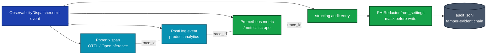
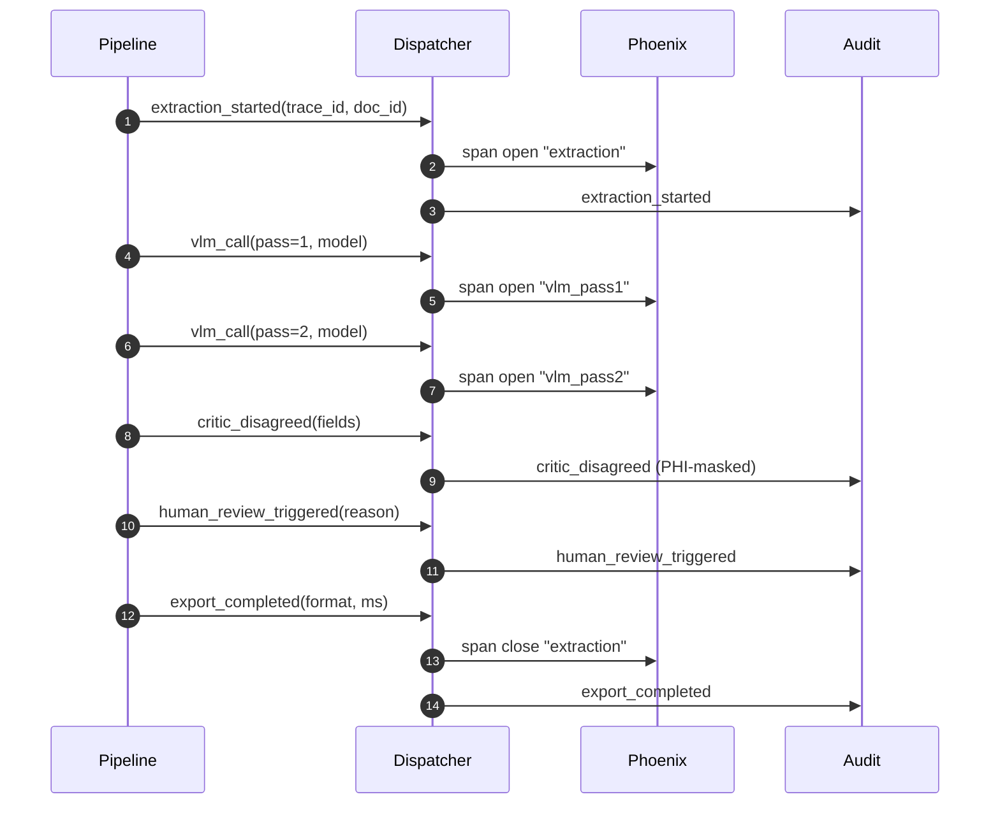

# AI Observability

> [!NOTE]
> **Operator deep-dive.** The canonical product description lives in [`VERIDOC_MASTER_PLAN.md`](./VERIDOC_MASTER_PLAN.md) (see [§4 Cross-cutting concerns](./VERIDOC_MASTER_PLAN.md#4-cross-cutting-concerns) and the canonical event vocabulary in [Appendix F](./VERIDOC_MASTER_PLAN.md#f-evaluation--calibration-loop)). This document goes one layer deeper on the operator surface: settings keys, wiring anchors, the event table, and how Phoenix/PostHog relate to `audit.py` / `metrics.py` / structlog.
>
> Opt-in LLM tracing + product analytics behind one dispatcher. Both
> sinks are off by default; enable via `settings.observability`.

## Dispatcher fan-out

One `emit(event)` call lands on every enabled sink. Each sink carries
the same `trace_id` so traces, metrics, audit entries, and product
events cross-correlate by ID.



Sink failures are isolated: a Phoenix outage doesn't affect PostHog
event capture, and neither blocks the extraction pipeline.

## Canonical event chain

Every extraction emits a deterministic sequence of events. The
`trace_id` is constant across all four sinks, so an operator can pivot
from a Phoenix trace into the audit log or a PostHog funnel with a
single ID copy-paste.



## Two sinks behind one dispatcher

The dispatcher fans out:

* **`emit_event(name, properties)`** — high-level pipeline events
  (`extraction_started`, `extraction_completed`,
  `human_review_triggered`, …)
* **`start_span(name, **attrs)`** — context-managed traces around
  VLM calls and pipeline nodes
* **`record_llm_call(**attrs)`** — token counts, latency, model name
  per call

Sink failures are isolated: a Phoenix outage doesn't affect PostHog
event capture, and neither blocks the extraction pipeline.

## Phoenix (LLM tracing)

[Arize Phoenix](https://github.com/Arize-ai/phoenix) is OpenInference
+ OpenTelemetry. Self-hosted, runs on `http://localhost:6006` by
default. No data leaves the host.

Auto-instruments two layers via `openinference-instrumentation-*`:

* **`LangChainInstrumentor`** — every node in the LangGraph state
  machine emits a span (preprocess / analyze / extract / validate /
  route / etc.)
* **`OpenAIInstrumentor`** — every VLM call from `LMStudioClient`
  (which uses the OpenAI SDK) gets full request / response /
  token-count attribution.

### Enable

```bash
pip install -e ".[dev,observability]"
```

```python
# src/config/settings.py → ObservabilitySettings
phoenix_enabled: bool = True               # OBSERVABILITY_PHOENIX_ENABLED
phoenix_endpoint: str = "http://localhost:6006"
phoenix_project_name: str = "doc-extraction"
```

### Run the local Phoenix UI

```bash
python -c "import phoenix; phoenix.launch_app()"
# Phoenix UI at http://localhost:6006
```

Process a document with the API or CLI; spans appear live in the UI,
including a tree view of the LangGraph traversal and per-VLM-call
token / latency / cost.

## PostHog (product analytics)

[PostHog](https://posthog.com/) gives you dashboards, funnels, cohort
analyses on the system itself — "what's the success rate by document
type?", "how often does the splitter fire?", "what's the human-review
rate this week?". Self-hostable; the SDK supports either PostHog
Cloud or a private instance via `posthog_host`.

### Enable

```python
# src/config/settings.py → ObservabilitySettings
posthog_enabled: bool = True               # OBSERVABILITY_POSTHOG_ENABLED
posthog_api_key: str  = "phc_..."          # OBSERVABILITY_POSTHOG_API_KEY
posthog_host: str = "https://us.posthog.com"  # OBSERVABILITY_POSTHOG_HOST
                                              # — point at your self-hosted host
```

### Events captured

The dispatcher emits these events when active. Add to the list as
new pipeline phases come online:

| Event | When | Properties |
|---|---|---|
| `extraction_started` | top of `PipelineRunner.extract_*` | `document_type`, `processing_id`, `page_count` |
| `extraction_completed` | terminal `complete` node | `confidence`, `retry_count`, `vlm_calls`, `processing_ms` |
| `human_review_triggered` | enter `_human_review_node` | `processing_id`, `reason`, `confidence` |
| `vlm_call` | every `BaseAgent.send_vision_request` | `agent`, `model`, `latency_ms`, `request_id` |

> [!TIP]
> **Tracing pivots into the audit log via `trace_id`.** Every event the dispatcher emits carries a `trace_id` that the audit logger also records. Copy a `trace_id` from a Phoenix span and grep the audit log to reconstruct the full regulatory trail for any extraction — including PHI-masked field-level events that don't surface in Phoenix or PostHog.

## Where it's wired

| Layer | Anchor |
|---|---|
| Dispatcher class | [src/monitoring/observability.py](../src/monitoring/observability.py) |
| Settings | `ObservabilitySettings` in [src/config/settings.py](../src/config/settings.py) |
| VLM-call span wrap | `BaseAgent.send_vision_request` in [src/agents/base.py](../src/agents/base.py) |
| Sink fan-out semantics | `ObservabilityDispatcher.start_span` opens N spans, closes in reverse |
| Failure isolation | `try/except` per-sink in `emit_event` / `record_llm_call` |

## What about the existing `audit.py` / `metrics.py` / structlog?

Untouched. They handle:

* **`audit.py`** — HIPAA-compliant tamper-evident audit log (separate
  from observability; covers regulatory needs). As of Phase 8, every
  audit message routes through `PHIRedactor.from_settings()` before
  write (see [PHI_MODE.md](./PHI_MODE.md#layered-defence)).
* **`metrics.py`** — Prometheus exposition for ops dashboards
  (`/metrics` endpoint)
* **`structlog`** — structured app logs with PHI masking

Phoenix + PostHog complement those rather than replace them. Pick
the layers your deployment needs:

| You need | Enable |
|---|---|
| HIPAA audit | `audit.py` (always-on) |
| Ops dashboards | Prometheus scrape on `/metrics` |
| App logs | structlog (always-on) |
| LLM tracing / debugging | Phoenix |
| Product analytics / cost tracking | PostHog |

> [!IMPORTANT]
> **Audit is always-on; observability sinks are opt-in.** Disabling Phoenix or PostHog has no regulatory consequence — they're for developer/operator workflow. Disabling `audit.py` would break the HIPAA tamper-evident chain and is not exposed as a settings option. The two systems answer different questions: audit answers *"what happened to this document?"* (regulatory), observability answers *"why is the pipeline slow / wrong today?"* (operational).

## Testing the dispatcher off-line

`tests/unit/test_observability.py` covers the dispatcher's contract
(fan-out, isolation, no-op safety) with `_FakeSink` — no Phoenix /
PostHog SDKs are required to validate the wiring. The actual sink
classes degrade to `try_create() → None` when their SDKs aren't
installed, so default-install / air-gapped builds incur no overhead.
