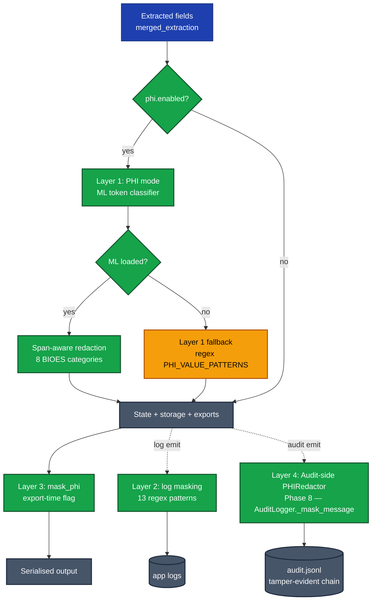
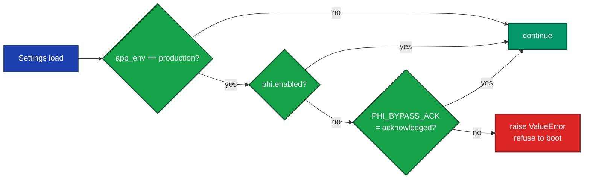

# PHI Mode (WS-6)

> [!NOTE]
> **Operator deep-dive.** The canonical product description lives in [`VERIDOC_MASTER_PLAN.md`](./VERIDOC_MASTER_PLAN.md) (see the PHI mode row in [§4 Cross-cutting concerns](./VERIDOC_MASTER_PLAN.md#4-cross-cutting-concerns)). This document goes one layer deeper on the operator surface: ML/regex layering, settings, per-request override, air-gap vendoring, the Phase 7 boot guard, and the Phase 8 audit-side redaction layer.

> Opt-in PHI / PII redaction for extracted field values, off by
> default. Enable globally via `settings.phi.enabled = True` (env
> `PHI_ENABLED=1`) or per-request via `ProcessRequest.phi_mode = True`.

## What it does

When PHI mode is on, every string field in `merged_extraction` is
routed through `src.security.phi_redactor.PHIRedactor` after the
validator finishes and **before** the data hits storage / exports /
audit logs / Mem0. Two layers, in order:

1. **ML layer** — `openai/privacy-filter` HuggingFace token
   classifier. Apache 2.0, 1.5B parameters / 50M active, BIOES tags
   over 8 PII categories: `account_number`, `private_address`,
   `private_email`, `private_person`, `private_phone`, `private_url`,
   `private_date`, `secret`. Loaded lazily on first redact().
2. **Regex fallback** — uses the same `PHI_VALUE_PATTERNS` as the
   export-time `mask_phi` primitive (SSN / phone / email /
   street-address / date shapes). Activates when the ML layer is
   unavailable (`transformers` not installed, model not vendored,
   network blocked) AND `settings.phi.fallback_to_regex` is True
   (default).

The ML layer's spans are reported in `Span(start, end, label,
original)` records so audit logs know *which* category fired without
exposing the value. The regex layer collapses any matched value to a
single `[REDACTED]` token because it can't reliably reverse-map
patterns to spans.

## Layered defence

PHI mode is one of **four** independent layers. Each catches a
different class of leak; defence-in-depth is the design intent.



| Layer | When it runs | Where it lives |
|---|---|---|
| **Layer 1 — PHI mode** (this doc) | After validation, before storage | `src/security/phi_redactor.py` (WS-6) |
| **Layer 2 — PHI masking in logs** | Every log emit | `src/config/logging_config.py` (13 regexes) |
| **Layer 3 — `mask_phi` export flag** | At serialisation time | `src/security/phi_mask.py` (WS-1) |
| **Layer 4 — Audit-side PHIRedactor** *(Phase 8)* | Every audit event emit, before chain hash | `AuditLogger._mask_message` routes through `PHIRedactor.from_settings()` in [`src/security/audit.py`](../src/security/audit.py) |

Enable everything you need; they don't conflict. PHI mode does the
heavy lifting; `mask_phi` is the export-time defence-in-depth in
case PHI mode is bypassed; log masking catches anything that escapes
either; the Phase 8 audit-side layer ensures the tamper-evident
regulatory log itself never persists raw PHI even if a field slipped
through Layer 1.

## Production boot guard (Phase 7)

> [!IMPORTANT]
> **Production refuses to boot with `phi.enabled=False`** unless the operator has explicitly acknowledged the bypass via `PHI_BYPASS_ACK`. The fail-closed default protects against the highest-blast-radius production incident: a config oversight that ships PHI in the clear. Pairs with the analogous `AUTH_BYPASS_ACK` guard for `api.auth_enabled=False`.

The check runs once at settings load, in `Settings.model_post_init`:



Accepted ack values (case-insensitive): `1`, `true`, `yes`,
`acknowledged`. Any other value (or an unset env var) raises
`ValueError("PHI redaction is disabled in production ... Refusing to
boot.")`. The bypass is intentionally noisy — it must be a deliberate
deployment-config decision, not a forgotten flag.

## Settings

```toml
# pyproject.toml — already declared as an opt-in extra
[project.optional-dependencies]
phi = [
    "transformers>=4.45.0",
    "torch>=2.4.0",
]
```

```python
# src/config/settings.py → PHISettings
enabled: bool = False                    # PHI_ENABLED
model_id: str = "openai/privacy-filter"  # PHI_MODEL_ID
local_only: bool = True                  # PHI_LOCAL_ONLY  (air-gap-safe)
fallback_to_regex: bool = True           # PHI_FALLBACK_TO_REGEX
```

## Per-request override

The API request can opt in or out independently of the global
setting:

```jsonc
POST /api/v1/documents/upload
{
  "phi_mode": true   // null = follow settings.phi.enabled
                     // true = force redaction
                     // false = bypass even if globally enabled
                     //         (caller asserts non-PHI input)
}
```

The frontend exposes this as a tri-state Select on the upload page
(*Server default* / *Force PHI redaction* / *Bypass PHI redaction*).

## Air-gapped / on-prem deployment

**The redactor never auto-downloads the model.** With `local_only =
True` (the default), `transformers` is told to use only locally-cached
weights. If the cache is missing, the loader fails closed and the
regex fallback activates.

To pre-vendor the model on a host with network access:

```bash
pip install transformers
huggingface-cli download openai/privacy-filter
# Default cache dir: ~/.cache/huggingface/hub/
# Bundle the cache directory into your air-gapped deployment.
```

Then on the air-gapped host, point `HF_HOME` (or `HUGGINGFACE_HUB_CACHE`)
at the bundled cache directory before starting the API server.

## Audit trail

Each redaction run logs a structured `phi_redaction_applied` event
with:

* `processing_id` — to tie it back to a specific extraction
* `field_count` — how many fields were rewritten
* `layer` — `"ml"`, `"regex"`, or `"noop"`

The list of *which* fields were rewritten lands in
`state["phi_redacted_fields"]` and is surfaced in the **Decision
Trail** section of the markdown export. Original PHI strings are
**never** kept in state — only the redacted form plus per-field
spans (which name the *category*, not the value).

## Limitations

> [!CAUTION]
> **PHI mode is a redaction *aid*, not a HIPAA compliance guarantee.** Treat it as one control in a broader compliance program — never as a substitute for human review on high-sensitivity workflows. The boot guard, layered defences, and audit-side redaction reduce blast radius; they do not eliminate it.

Known failure modes:

* Under-detection of uncommon names / regional naming conventions.
* Over-redaction of public entities (well-known organisation names).
* Fragmented boundaries on mixed-format text (e.g. "Dr. Smith" might
  redact only "Smith").
* Performance degrades on non-English text and non-Latin scripts.

For high-sensitivity workflows (medical / legal / financial / HR /
government) keep PHI mode **on** AND keep human review in the loop.
