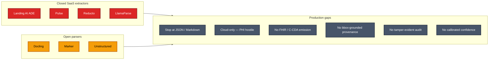
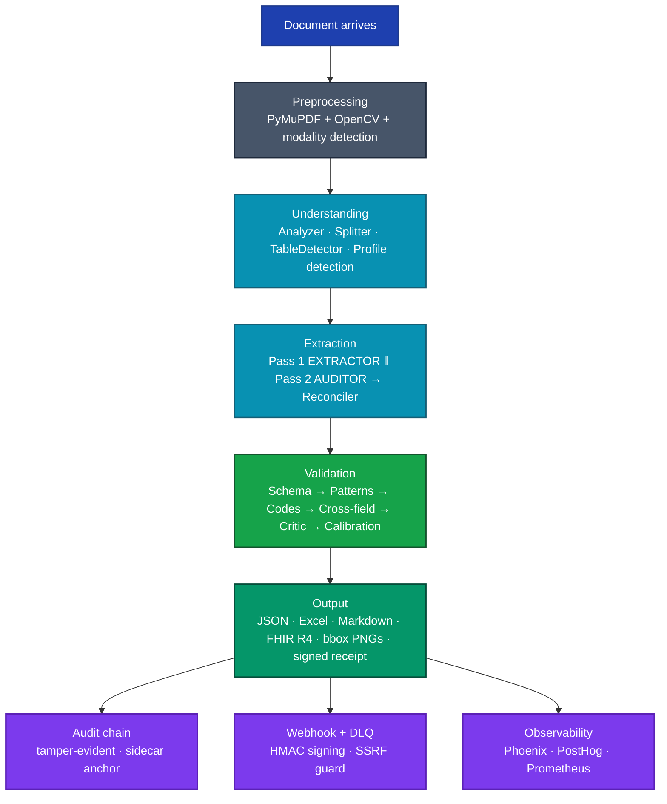

# Veridoc — Product Overview

> **One-page product summary.** For the canonical architecture and forward roadmap, see [`VERIDOC_MASTER_PLAN.md`](./VERIDOC_MASTER_PLAN.md). For shipping reality at the latest merge, see [`STATUS.md`](./STATUS.md).

## The problem

US healthcare and finance both still run on **paper, fax, and scans**. CMS-1500 claims, UB-04 hospital bills, EOB remittances, superbills, invoices, contracts, W-2s, and 1099s move between providers, payers, vendors, and clearinghouses as low-quality PDFs and faxed images — frequently handwritten, frequently smudged, always carrying sensitive data. Manual data entry costs the US economy tens of billions of dollars annually and introduces errors that downstream payment and clinical systems can't catch.

The existing extraction market splits into two tiers, and neither tier solves the problem:

## What Veridoc is

**Veridoc** is an open-source, on-prem-first / cloud-capable document intelligence engine. It turns any unstructured PDF, scan, or photo into a validated, schema-bound JSON extraction with **per-field provenance** that points back to source pixels, **calibrated confidence** that maps to empirical accuracy, and a **tamper-evident audit chain** with HMAC-signed export receipts.

It ships generic-first — works on contracts, invoices, forms, books, research papers — with a **Medical-RCM profile** that adds CMS-1500 / UB-04 / EOB / Superbill schemas, NPI / CPT / ICD validators, and FHIR R4 / C-CDA / X12N 275 emission.

## Where Veridoc wins

| Dimension | Closed SaaS (Landing AI, Pulse, Reducto, LlamaParse) | Open parsers (Docling, Marker, Unstructured) | **Veridoc** |
|---|---|---|---|
| Bbox-grounded per-field provenance | partial — line-level only | not threaded | **threaded end-to-end, click-to-source UI** |
| Dual-VLM with reconciler | no | no | **yes — 5-step tiebreaker** |
| Independent Critic verification | no | no | **yes — third-VLM verifier frame** |
| Calibrated confidence | no | no | **yes — Platt / isotonic, per-(profile, tenant)** |
| Constrained JSON-schema decoding | proprietary | no | **open + tool-use-forcing + post-validate** |
| FHIR R4 / C-CDA / X12N emission | no | no | **yes** |
| HMAC-signed export receipts | no | no | **yes — offline-verifiable** |
| Tamper-evident audit chain | no | no | **yes — sidecar anchor file** |
| Default-deny security posture | n/a | n/a | **yes — refuses to boot with auth or PHI off in prod** |
| Air-gap deployable | no | partial | **yes — verified by scripted check** |
| License | proprietary | mixed open | **Apache 2.0** |

## How it works (one diagram)

Every stage runs as a LangGraph v3 node with durable SQLite checkpointing. The pipeline survives mid-extraction process restarts — checkpoint at each transition, resume on next boot.

## Six core differentiators

1. **Heterogeneous dual-VLM with reconciler.** Pass 1 (EXTRACTOR frame, completeness focus) ‖ Pass 2 (AUDITOR frame, bbox-mandated). 5-step tiebreaker. Per-(profile, modality) reconciler weights.
2. **Bbox-grounded click-to-source provenance.** Every field carries `(page, bbox, source_block_id, extraction_path, agent_signatures, confidence_raw, confidence_calibrated, vlm_model_id)`. Source View tab in the UI renders side-by-side PDF + JSON with bidirectional bbox highlight sync.
3. **Six-layer validation pyramid + calibrated confidence.** `schema → patterns → codes → cross-field → Critic → calibration`. Critic is an independent VLM call from a verifier frame, **not** a re-extractor. Calibration uses Platt / isotonic / linear with auto-selection and per-(profile, tenant) lookup tables.
4. **Two-axis dispatch — modality + profile.** Six modalities (printed / handwritten / fax / form / table / visual) drive image preprocessing; six profiles (generic-document / medical-rcm / finance / legal-contract / insurance-form / logistics) drive schemas, validators, reconciler weights, and emitters. One chip in the upload UI surfaces both.
5. **Tamper-evident audit chain + HMAC-signed receipts.** Every export bundle ships with a `receipt.json` binding SHA-256 of every artefact + audit-chain tail hash + processing id + HMAC-SHA256 signature into one offline-verifiable JSON object. Audit log itself is a hash-chained append-only journal with sidecar anchor file.
6. **Default-deny security posture.** Production refuses to boot with auth disabled, PHI redaction disabled, or RCM signing unconfigured — each gated by an explicit `*_BYPASS_ACK` env var. Webhook URLs route through DNS-resolving SSRF check. API keys carry ownership claims. Every audit log entry is PHI-masked.

## How Veridoc is verified

- **Test baseline: 2853 passing.** Unit (2531) + integration (123) + security/e2e/accuracy (50) + root suites (149). All four CI splits pass on every PR.
- **Nightly hallucination-injection harness.** Six injection types (`value_swap`, `amount_fake`, `phantom_field`, `bbox_drift`, `field_drop`, `placeholder_inject`) mutate known-good extractions; gate: ≥ 85 % catch-rate on `phantom_field` + `bbox_drift`, < 5 % false-positive on clean inputs.
- **Weekly calibration refit.** `PartitionedCalibrator.fit_all()` runs the full golden corpus; ECE gate (post-fit ECE must not regress > 0.02 vs prior fit) blocks rollout on degradation.
- **Frontend gauntlet.** `npx tsc --noEmit` (0 errors), `npx jest --passWithNoTests`, ESLint with `jsx-a11y`, dark-mode visual review.

## Performance targets

| Metric | Target | Where measured |
|---|---|---|
| Field-fidelity on Synthea CMS-1500 | ≥ 92 % | weekly round-trip eval |
| Hallucination rate post-Critic | < 1 % | nightly injection corpus |
| Critic catch-rate (phantom-field) | ≥ 85 % | nightly injection corpus |
| End-to-end latency per page | 15–25 s | local LM Studio, single GPU |
| VLM calls per page | 2–4 | Pass 1 + Pass 2 + optional Critic |
| Throughput per RTX 4090 | 50–100 pages / hour | sustained, dual-pass mode |

## Deployment shapes

| Shape | Story | Status |
|---|---|---|
| **Single-tenant on-prem** (default) | One host, one model, air-gap deployable | shipping |
| **Multi-tenant SaaS** | Per-tenant FAISS / calibration / audit / checkpoints / rate limits | flag-gated |
| **Hybrid** | On-prem inference + cloud control plane | partial — control plane is roadmap |

## Roadmap (selected)

- **Cloud backend.** AWS Bedrock support behind the same `VLMBackend` protocol — config-driven model selection, no opinionated defaults.
- **Streaming Source View.** Server-sent events stream Pass 1 / Pass 2 / Critic stages live as they emit bboxes, so reviewers see the extraction unfold in real time.
- **Visual regression CI.** Playwright + Percy / Chromatic on every PR that touches the Source View or document-detail page.
- **Per-tenant Bedrock Guardrails.** When the cloud backend lands, attach a tenant-mapped guardrail ARN to every Bedrock call for in-model PII / PHI policy enforcement.

Full forward plan: [`VERIDOC_MASTER_PLAN.md` Part III](./VERIDOC_MASTER_PLAN.md#part-iii--the-forward-roadmap-phases-9-14).

## License

**Apache 2.0** — see [LICENSE](../LICENSE). No commercial-use restrictions. Designed for downstream proprietary integration without legal friction.

## Quick links

- End-to-end command: `python main.py extract <pdf> --mode healthcare -o output/`
- Full architecture: [`VERIDOC_MASTER_PLAN.md`](./VERIDOC_MASTER_PLAN.md)
- Demo walkthrough: [`DEMO_SCRIPT.md`](./DEMO_SCRIPT.md)
- Shipping reality: [`STATUS.md`](./STATUS.md)
- Modality / profile detection: [`MODES.md`](./MODES.md)
- PHI operator guide: [`PHI_MODE.md`](./PHI_MODE.md)
- Observability operator guide: [`OBSERVABILITY.md`](./OBSERVABILITY.md)
