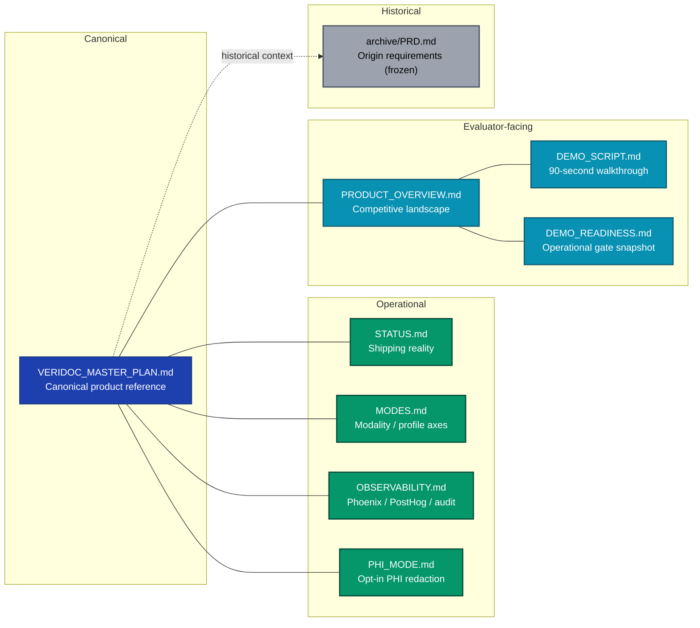
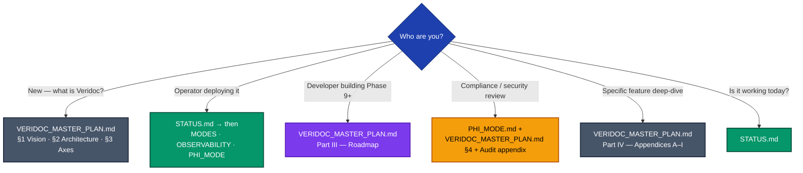
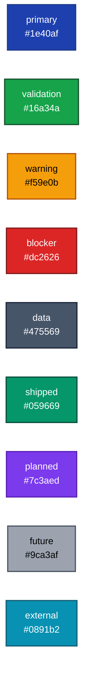

# Veridoc — Documentation index

Veridoc is an open-source, on-prem-first / cloud-capable document-intelligence
engine. It uses heterogeneous dual-VLM extraction with provenance threading and
a six-layer validation stack, structured around two orthogonal axes — **modality**
(what kind of input) and **profile** (what semantic schema). A generic baseline
runs out of the box; the medical-RCM profile (CMS-1500 / UB-04 / EOB / superbill)
is the first specialization. **LM Studio** and **AWS Bedrock** are parallel
first-class backends. Phase 8 is complete (2,853 passing tests); **Phase 9 — the
Bedrock backend pivot — is next**.

Veridoc is positioned against **Landing AI ADE**, **Pulse**, **Reducto**, and
**LlamaParse** in the closed SaaS tier, and **Docling**, **Marker**, and
**Unstructured** in the open-parser tier. See
[`PRODUCT_OVERVIEW.md`](./PRODUCT_OVERVIEW.md) for the competitive landscape and
the differentiator table.

> [!TIP]
> If you only have 30 seconds: read `STATUS.md` for what works today, then
> `VERIDOC_MASTER_PLAN.md` §1–3 for the product framing.

## Documentation map

## Where do I start?

## Document roles

| Document | Purpose | When to read | Update cadence |
|---|---|---|---|
| [`VERIDOC_MASTER_PLAN.md`](VERIDOC_MASTER_PLAN.md) | Canonical product reference | First read; phase planning | On phase merge |
| [`STATUS.md`](STATUS.md) | Current shipping reality | Before any work | Every PR that lands |
| [`PRODUCT_OVERVIEW.md`](PRODUCT_OVERVIEW.md) | Competitive landscape + differentiators | Evaluator / reviewer first-touch | When competitor positioning changes |
| [`MODES.md`](MODES.md) | Modality + profile detection deep-dive | Adding a mode/profile | When axes change |
| [`OBSERVABILITY.md`](OBSERVABILITY.md) | Telemetry surface ops | Setting up Phoenix/PostHog | When event names change |
| [`PHI_MODE.md`](PHI_MODE.md) | PHI redaction enablement | HIPAA-grade deployments | When PHI flow changes |
| [`DEMO_SCRIPT.md`](DEMO_SCRIPT.md) | 90-second demo walkthrough storyboard | Recording a demo video | When the demoable surface shifts |
| [`DEMO_READINESS.md`](DEMO_READINESS.md) | Operational readiness snapshot | Before a live demo | After a demo verification pass |
| [`archive/PRD.md`](archive/PRD.md) | Origin requirements (pre-Phase-9) | Historical context only | Frozen |

## Conventions used in these docs

> [!NOTE]
> **Mermaid diagrams** render natively on GitHub, GitLab, VS Code (with the
> Markdown Mermaid extension), and MkDocs. No client install needed.

> [!IMPORTANT]
> **GitHub admonitions** — these docs use the GitHub flavour:
> `> [!NOTE]`, `> [!TIP]`, `> [!IMPORTANT]`, `> [!WARNING]`, `> [!CAUTION]`.
> They degrade gracefully to blockquotes on renderers that don't support them.

**Phase numbering.** Phases 0–8 are **shipped** (rendered emerald/green in
diagrams). Phases 9–13 are **planned** (purple). Phase 14 is **future** (gray).
The canonical phase ledger lives in `VERIDOC_MASTER_PLAN.md` §6.

### Semantic color palette

| Class | Role | Hex |
|---|---|---|
| `primary` | Headline / entry node | `#1e40af` |
| `validation` | Passing / validated path | `#16a34a` |
| `warning` | Caution / partial | `#f59e0b` |
| `blocker` | Blocking issue | `#dc2626` |
| `data` | Data / reference node | `#475569` |
| `shipped` | Shipped phase / feature | `#059669` |
| `planned` | Planned (next phases) | `#7c3aed` |
| `future` | Future / aspirational | `#9ca3af` |
| `external` | External system / SaaS | `#0891b2` |

## Quick links

- Current test status & gap list — [`STATUS.md`](STATUS.md)
- Competitive positioning — [`PRODUCT_OVERVIEW.md`](PRODUCT_OVERVIEW.md)
- Phase status ledger — [`VERIDOC_MASTER_PLAN.md` §6](VERIDOC_MASTER_PLAN.md#6-phase-status-ledger)
- Phase 9 (Bedrock backend pivot) plan — [`VERIDOC_MASTER_PLAN.md` — Phase 9](VERIDOC_MASTER_PLAN.md#phase-9--backend-pivot)
- Architecture appendices (A–I) — [`VERIDOC_MASTER_PLAN.md` Part IV](VERIDOC_MASTER_PLAN.md#part-iv--appendices)
- 90-second demo storyboard — [`DEMO_SCRIPT.md`](DEMO_SCRIPT.md)
- Demo operational readiness — [`DEMO_READINESS.md`](DEMO_READINESS.md)
