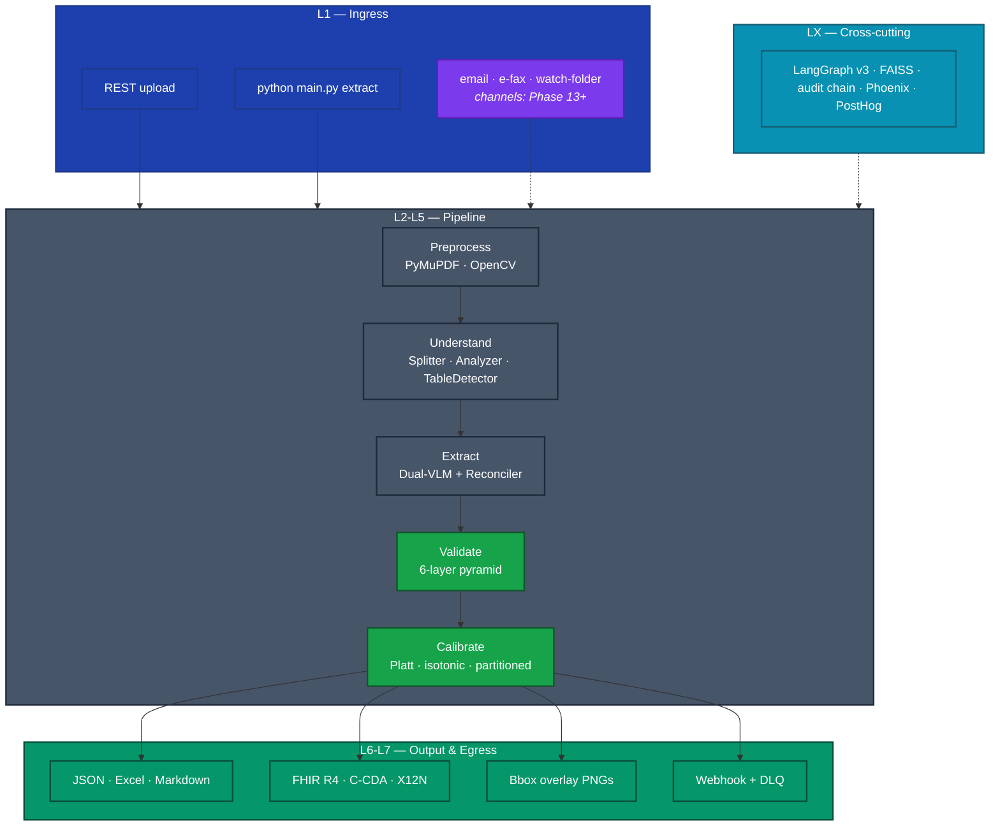

# Project Status


> Shipping reality at the latest merge. For the full design and the
> Phase 9-14 forward plan, see
> [VERIDOC_MASTER_PLAN.md](./VERIDOC_MASTER_PLAN.md) — that is the
> single canonical reference. This file is intentionally narrow: what
> is wired, what is flag-gated, what is *not* shipping yet.

> [!NOTE]
> **Current test baseline: 2853 passing, 0 failed, 11 pre-existing skips.**
> Verified locally on 2026-05-19 across all four CI splits (unit / integration / security+e2e+accuracy / root test_*). Run `pytest tests/ -m "not slow"` to reproduce.

> [!TIP]
> The dev stack runs end-to-end today. LM Studio at `localhost:1234` with any vision-capable model produces a full JSON + Excel + Markdown + FHIR R4 + bbox-overlay + signed receipt bundle via `python main.py extract <pdf> --mode healthcare`. Source View tab renders provenance overlays on the resulting JSON.

## System overview (60-second read)



## At a glance

| Surface | State |
|---|---|
| Backend | 2853 unit + integration tests · all green |
| Frontend | Next.js 14 · TypeScript clean · schema chooser + modality + PHI live |
| CI | `.github/workflows/ci.yml` runs ruff + mypy + pytest matrix on every PR |
| LangGraph | v3 (`langgraph >= 1.0`) with Command + interrupt + durable SQLite checkpointer |
| Phases shipped | 0 through 8 (V3 core + Phase 8 enterprise-MVP hardening) |
| Next phase | 9 — backend pivot: vLLM retired, AWS Bedrock in, MI300X out |
| Default LM | LM Studio @ `localhost:1234` (model-id is operator-chosen) |
| Cloud LM | AWS Bedrock (Phase 9 — landing; not yet default) |

## Phase progression

```mermaid
%% Phase progression — Phases 0-8 shipped, 9-14 planned
gantt
    title Veridoc V3 phase progression
    dateFormat X
    axisFormat %s

    section Phase 0-2 — Foundation
    VLM backend abstraction       :done, p0, 0, 1
    Constrained decoding          :done, p1, 1, 2
    Heterogeneous dual-VLM        :done, p2, 2, 3

    section Phase 3-5 — Quality
    Critic + bbox round-trip      :done, p3, 3, 4
    Provenance threading + UI     :done, p4, 4, 5
    Profiles + RCM specialization :done, p5, 5, 6

    section Phase 6-8 — Hardening
    Eval + calibration + obs      :done, p6, 6, 7
    Production hardening          :done, p7, 7, 8
    Enterprise-MVP hardening      :done, p8, 8, 9

    section Phase 9-13 — Forward
    Backend pivot (Bedrock in)    :active, p9, 9, 10
    Pre-launch validation         :p10, 10, 11
    Performance finish            :p11, 11, 12
    Production deployment prep    :p12, 12, 13
    Customer polish               :p13, 13, 14

    section Phase 14 — Future
    Product roadmap               :p14, 14, 15
```



See [master plan §6](./VERIDOC_MASTER_PLAN.md#6-phase-status-ledger) for the full ledger with test counts.

## Feature ledger

Every row is wired into the running pipeline (not just present in source). Where any older plan disagrees, this table wins.

### Pipeline & agents

| Feature | Phase | Anchor |
|---|---|---|
| LangGraph v3 harness (Command, interrupt, durable SQLite ckpt) | core | [orchestrator.py](../src/agents/orchestrator.py) |
| Splitter + TableDetector agents (default-on) | core | [splitter.py](../src/agents/splitter.py), [table_detector.py](../src/agents/table_detector.py) |
| ModelRouter (multi-model dispatch) | core | [model_router.py](../src/client/model_router.py) |
| Constrained decoding (Pydantic-bound structured output) | P1 | [constrained.py](../src/client/constrained.py) |
| Heterogeneous dual-VLM (primary + secondary) | P2 | [model_router.py](../src/client/model_router.py) |
| Critic agent + bbox round-trip verification | P3 | [src/agents/](../src/agents/) |
| Provenance threading into all exports | P4 | [provenance.py](../src/pipeline/provenance.py) |
| HeterogeneousReconciler (per-field reconciliation) | P5 | [reconciler.py](../src/agents/reconciler.py) |
| Profiles (generic-document + medical-rcm) | P5 | [src/profiles/](../src/profiles/) |
| ConfidenceCalibrator (Platt / isotonic / partitioned) | P6 | [calibration.py](../src/validation/calibration.py) |
| Hallucination-injection harness | P6 | tests/eval/inject/ |
| HITL (`interrupt()` / `Command(resume=...)`) with thread-id tenant isolation | core | [orchestrator.py](../src/agents/orchestrator.py) |
| Cross-field validation | core | [cross_field.py](../src/validation/cross_field.py) |

### Modality, PHI, observability, webhooks

- **Modality** — auto-detected by the analyzer; override via `ProcessRequest.modality_override` or the upload-page chip. Reference: [master plan Appendix E](./VERIDOC_MASTER_PLAN.md#e-domain-modes--modality-vs-profile).
- **PHI mode** — opt-in. `openai/privacy-filter` HF token classifier (BIOES, 8 PII categories) routes every extracted string before storage / export / audit; regex fallback without `[phi]` extra. Production refuses to boot with PHI off unless `PHI_BYPASS_ACK` (Phase 7). See [PHI_MODE.md](./PHI_MODE.md).
- **Observability** — one `ObservabilityDispatcher` fans out to two opt-in sinks: **Arize Phoenix** (OpenInference / OTel, auto-instruments LangGraph + OpenAI SDK) and **PostHog** (product analytics). Both off by default. See [OBSERVABILITY.md](./OBSERVABILITY.md).
- **Webhooks** — HMAC-SHA256 signing, SSRF guards (Phase 8), in-line retry (3 attempts), SQLite DLQ with capped exponential backoff (10s → 24h) and poison-message auto-disable, admin DLQ + redeliver endpoints.

### Exports

| Format | Notes |
|---|---|
| JSON · MINIMAL / STANDARD / DETAILED | values, confidence, validation, audit trail |
| JSON · **DATAFRAME_FLAT** | one row per (record × field) for `pandas.read_json` |
| JSON · FHIR_COMPATIBLE | inline DocumentReference (legacy) |
| **FHIR R4 Bundle** | validated when `[fhir]` extra installed; Patient + Coverage + Claim for CMS-1500/UB-04, Patient + ExplanationOfBenefit for EOB |
| Excel | 4 sheets: All Records, Duplicates, Page Summary, Processing Summary |
| Markdown | SIMPLE / DETAILED / SUMMARY / TECHNICAL + **Decision Trail** section |
| **Bbox overlay PNGs** | per-page confidence-coloured rectangles (green ≥ 0.85, amber 0.5-0.85, red < 0.5) |
| RCM signing manifest | signed export bundle (Phase 7/8) — [src/export/rcm_signing.py](../src/export/rcm_signing.py) |

### Security & compliance

| Item | State |
|---|---|
| Dev-token bypass | removed (backend + frontend) |
| `/health/*` endpoints | liveness public; detail / security / alerts / dependencies require `system:metrics` |
| Default checkpointer | SQLite under `.extraction_checkpoints/` (gitignored) |
| Redis defaults | TLS + AUTH warnings; `result_expires` 1h |
| `mask_phi` enforcement | wired through consolidated_export + CLI `--mask-phi` |
| Schema-wizard prompt-injection sanitiser | `_sanitize_schema_text` in `build_field_prompt` |
| NPI Luhn | shipped |
| RBAC | 7 roles, JWT issuer claim, JTI revocation, key-owner enforcement on revoke (Phase 8) |
| AES-256-GCM encryption | PBKDF2 600k / Scrypt 2^14, key entropy validation |
| PHI masking in logs | 13 regexes via structlog + stdlib filter |
| Audit chain hashing + sidecar anchor (Phase 8) | `verify_audit_chain_with_anchor()` |
| Multi-tenant middleware | `TenantResolverMiddleware` (Phase 8); per-tenant FAISS / calibration / audit / checkpoints |
| Production-boot guards | refuses to start with `auth_enabled=False` (without `AUTH_BYPASS_ACK`) or `phi.enabled=False` (without `PHI_BYPASS_ACK`) |

## Known gaps

> [!WARNING]
> **Multi-tenancy is wired but dormant.** `VectorStoreManager.for_tenant()` exists but no agent calls it; `TenantResolverMiddleware` reads `request.state.user_claims` that the AuthN middleware never sets. Single-tenant on-prem (the default) is unaffected. Multi-tenant launch is gated on a one-day tenancy-plumbing fix queued before Phase 9.

Other not-yet-shipping items:

- **vLLM and MI300X still in the codebase.** Phase 9 removes them; until then, the backend abstraction still carries unused vLLM glue. Default-shipping path is LM Studio.
- **AWS Bedrock backend is Phase 9.** Not yet wired — see master plan Part III, Phase 9.
- **CI mypy step uses `|| true`.** Drop the pipe once `mypy src --strict` is clean.
- **Streamlit UI** is legacy; canonical UI is the Next.js app.
- **Docker** images / compose were removed in `5a4e521` — out of scope until requested.
- **Florence-2 second LM Studio instance** — `ModelRouter` supports it but operators must stand up the second port; default is single-model.
- **EDI 837/835 write path** not implemented (read-only).
- **Property / contract / performance test directories** aren't comprehensive yet.

## How to run things

```bash
# Install
pip install -e ".[dev]"

# Optional extras
pip install -e ".[dev,phi]"            # PHI redaction (transformers + torch)
pip install -e ".[dev,observability]"  # Phoenix + PostHog
pip install -e ".[dev,fhir]"           # validated FHIR R4
pip install -e ".[dev,profiles-rcm]"   # Medical-RCM emitters (C-CDA, X12N 275)

# Test
pytest tests/ -m "not slow"            # 2853 tests

# Run
python main.py extract path/to/doc.pdf
python main.py extract doc.pdf --mask-phi
python main.py                          # web app (backend + frontend)

# Observability (when enabled in settings)
# Phoenix UI: http://localhost:6006
```
