# Veridoc — Master Plan

> **Single canonical reference.** Merges the original `docs/MVP/` design docs (Phase 0-7 V3 work) with the Phase 8 enterprise-MVP hardening and the Phase 9-14 forward roadmap.
>
> **Working name:** Veridoc *(rename TBD; all user-facing strings centralised in `frontend/src/lib/branding.ts`).*
> **Status:** Phases 0-8 complete and shipping (2575 tests passing). Phases 9-14 are the forward plan.
> **Backend story:** **LM Studio** (local / on-prem) + **AWS Bedrock** (cloud / SaaS). vLLM and AMD MI300X explicitly retired.
> **Last consolidated:** 2026-05-10.

---

## Document roles

The `docs/` tree is intentionally small. Each file has one job; if
two files cover the same ground, the master plan wins and the other
file gets a pointer at the top.

| File | Role |
|---|---|
| `VERIDOC_MASTER_PLAN.md` (this file) | **Canonical** — product foundations, phase ledger, forward roadmap, reference appendices. If anything else disagrees with this, this wins. |
| `STATUS.md` | Shipping reality at the latest merge — what's wired, what's flag-gated, known gaps. Intentionally narrow. |
| `MODES.md`, `OBSERVABILITY.md`, `PHI_MODE.md` | Operator-facing per-feature deep-dives. Each declares the canonical section of the master plan and goes one level deeper (heuristics, wiring anchors, settings keys, runbooks). |
| `docs/archive/` | Pre-Phase-9 historical reference. The original PRD lives here as the origin requirements document. |

Origin requirements: the original product spec is preserved at
[docs/archive/PRD.md](./archive/PRD.md). It predates the V3 build and
is kept for historical traceability only — the master plan supersedes
it for any design question.

> [!NOTE]
> **This document is the single source of truth.** If `STATUS.md`, an operator deep-dive (`MODES.md`, `OBSERVABILITY.md`, `PHI_MODE.md`), or any `docs/MVP/` file disagrees with this plan, this plan wins. Per-feature docs declare which section of this plan they extend.

---

## Table of contents

- [Part I — Product foundations](#part-i--product-foundations)
  - [1. What Veridoc is](#1-what-veridoc-is)
  - [2. Design principles (non-negotiable)](#2-design-principles-non-negotiable)
  - [3. The seven-layer architecture](#3-the-seven-layer-architecture)
  - [4. Cross-cutting concerns](#4-cross-cutting-concerns)
  - [5. Performance targets](#5-performance-targets)
- [Part II — Status of the V3 build (Phases 0-8 done)](#part-ii--status-of-the-v3-build-phases-0-8-done)
  - [6. Phase status ledger](#6-phase-status-ledger)
  - [7. What's actually shipping](#7-whats-actually-shipping)
- [Part III — The forward roadmap (Phases 9-14)](#part-iii--the-forward-roadmap-phases-9-14)
  - [Guiding constraints carried into the roadmap](#guiding-constraints-carried-into-the-roadmap)
  - [Phase 9 — Backend pivot (vLLM out, Bedrock in)](#phase-9--backend-pivot-vllm-out-bedrock-in)
  - [Phase 10 — Pre-launch validation](#phase-10--pre-launch-validation)
  - [Phase 11 — Performance finish](#phase-11--performance-finish)
  - [Phase 12 — Production deployment prep](#phase-12--production-deployment-prep)
  - [Phase 13 — Customer polish](#phase-13--customer-polish)
  - [Phase 14 — Product roadmap (future)](#phase-14--product-roadmap-future)
- [Part IV — Reference appendices](#part-iv--reference-appendices)
  - [A. LangGraph topology + state shape](#a-langgraph-topology--state-shape)
  - [B. Dual-VLM extraction core (Pass 1 / Pass 2 / Reconciler)](#b-dual-vlm-extraction-core-pass-1--pass-2--reconciler)
  - [C. Six-layer validation pyramid](#c-six-layer-validation-pyramid)
  - [D. Provenance data model + export integration](#d-provenance-data-model--export-integration)
  - [E. Domain modes — modality vs profile](#e-domain-modes--modality-vs-profile)
  - [F. Evaluation + calibration loop](#f-evaluation--calibration-loop)
  - [G. Engineering Do's and Don'ts](#g-engineering-dos-and-donts)
  - [H. Module map (file-by-file change footprint)](#h-module-map-file-by-file-change-footprint)
  - [I. Cross-cutting "state-of-the-art" quality bar](#i-cross-cutting-state-of-the-art-quality-bar)
- [Final verification — what "done" looks like](#final-verification--what-done-looks-like)

---

# Part I — Product foundations

## 1. What Veridoc is

Veridoc is an open-source, **on-prem-first / cloud-capable** document-intelligence engine. It turns any unstructured PDF, scan, or image into a validated, schema-bound JSON extraction with **per-field provenance** that points back to source pixels.

It is **generic-first** — it works on contracts, invoices, forms, books, research papers — and ships with a **Medical-RCM profile** that adds CMS-1500 / UB-04 / EOB / Superbill schemas, NPI/CPT/ICD validators, and optional FHIR R4 / C-CDA / X12N 275 emission.

### Why Veridoc

Closed extractors (LandingAI ADE, Pulse, Reducto, LlamaParse) stop at JSON, are not healthcare-specific, and route through the cloud unconditionally. Open parsers (Docling, Marker, Unstructured) stop at Markdown and break on the inputs that actually matter — handwritten superbills, faxed scans, stamps, marks, multi-region forms.

Veridoc is the only system that combines:

1. **Heterogeneous dual-VLM extraction** with **orthogonal failure modes** between two different model families.
2. **Schema-guided constrained decoding** — every structured-output call is bound to a Pydantic schema at decode time. Malformed output is structurally impossible.
3. **Independent Critic agent** — a third VLM call from the *minority* model family that audits, not extracts. Its job is to find values that aren't actually visible in the image.
4. **Bbox round-trip verification** — for billing-critical fields, the bbox is cropped and re-queried on the secondary VLM. Catches the "correct location, wrong text" hallucination class.
5. **Provenance threaded into outputs, not just rendered as overlays** — every leaf in every JSON / Excel / Markdown / FHIR / C-CDA export carries `(page, bbox, source_block, extraction_path, confidence, vlm_model_id)`.
6. **Generic baseline + composable profiles** — Medical-RCM, Finance, Legal, Insurance, Logistics. Each is a registered profile with its own schemas, validators, prompt fragment, and optional emitter.

### Backend story

**Two first-class backends, parallel-equal.** Operators pick one (or both) per deployment:

- **LM Studio** — local / on-prem. Single-tenant by default. Air-gap-friendly. Self-hosted GPU. The default for HIPAA-grade, regulatory-constrained, or sovereign-data deployments.
- **AWS Bedrock** — cloud / SaaS. Multi-region via inference-profile ARNs. No GPU management. Cost-per-token model. Vision models exposed via Bedrock Runtime (Anthropic Claude, Amazon Nova, Meta Llama Vision, or any future vision-capable Bedrock model). Operators choose model-ids in config.

**Explicitly retired:**

- **vLLM** — was a first-class backend up to Phase 7; replaced by Bedrock for the cloud-scaled use case (Phase 9).
- **AMD MI300X** — sized in legacy docs as one of five GPU targets; no longer in scope. Hardware affinity is a deployment concern, not engine code.

> [!WARNING]
> **vLLM is being deleted, not deprecated.** Phase 9 removes `vllm_backend.py`, the `[vlm-server]` extra, every vLLM-specific test, and the `vllm` factory branch. Operators on the old vLLM path must migrate to LM Studio (self-hosted) or Bedrock (cloud). See `docs/MIGRATION_VLLM_TO_BEDROCK.md` for the env-var and code-path diff.

**Deferred:** LangChain-AWS chains (Phase 14). The current pipeline does not require chain semantics; LangChain adds a layer of abstraction that's only worth its weight when chain-of-thought reasoning over multiple turns is in play.

### What's in the box

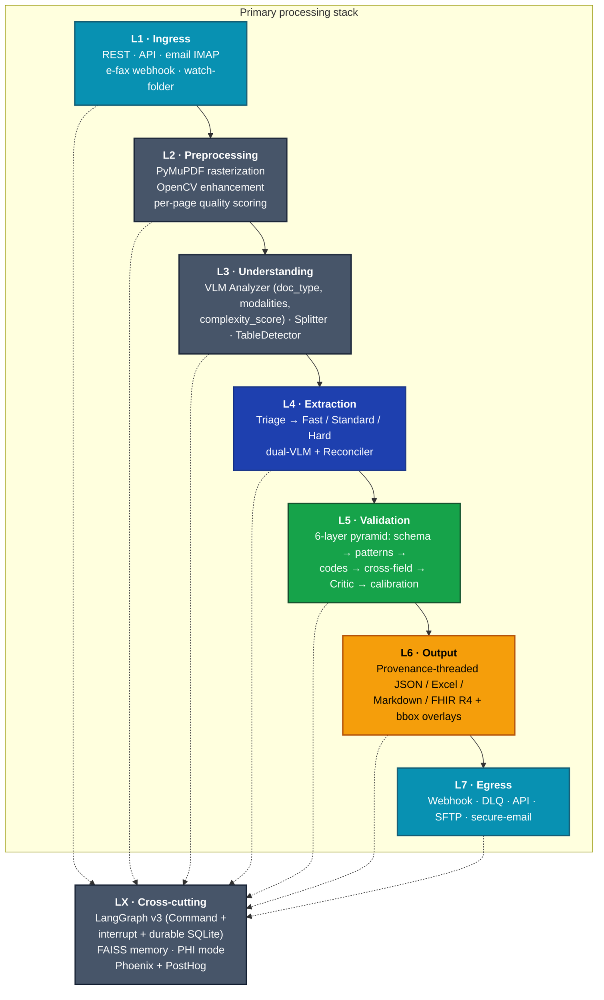

---

## 2. Design principles (non-negotiable)

Every architectural decision derives from these. They have held through Phases 0-8 and continue to hold through 9-14.

1. **Local-only inference is one option, not the only one.** LM Studio for local-only; Bedrock for cloud-scaled. Both first-class. (Updated Phase 9 — was "Local-only" pre-Phase-9.)
2. **VLM is the parser.** Don't layer a separate OCR/layout stack in front. The VLM does layout, reading order, tables, handwriting, and visual marks in one shot — and fails in correlated-with-content ways, not orthogonal-to-content ways.
3. **Two model families, not two prompts.** Heterogeneity lives in the *model family*, not in input representation.
4. **Schema-bound at decode time.** Every structured output goes through `constrained_decode()`. Malformed JSON is structurally impossible.
5. **Provenance is first-class data.** Every leaf carries `(page, bbox, source_block, extraction_path, confidence, vlm_model_id)`. Provenance survives validation, redaction, and export. If a leaf cannot carry provenance, it is `null`.
6. **Generic baseline; profiles are overlays.** The engine works on any document. Medical-RCM, finance, legal, etc. are registered profiles that compose with the core.
7. **Modality and profile are orthogonal.** Modality = what the page looks like (printed, handwritten, fax, table). Profile = what the document is about (medical-rcm, legal, finance).
8. **Defense in depth, not single-point quality.** Six layers of validation; three layers of anti-hallucination (constrained decoding, dual-VLM agreement, Critic).
9. **Validate strictly, fail closed.** A document that fails validation never emits. It routes to human review.
10. **Audit everything.** Every PHI-touching or revenue-affecting operation produces a structured audit-log entry with input/output hashes.

---

## 3. The seven-layer architecture

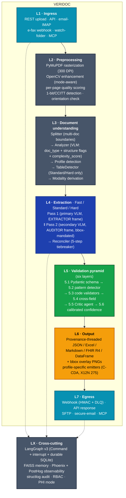

### End-to-end flow (Standard path, generic document)

```mermaid
%% Standard-path timing on a generic document. Median target <25s on a single H100 FP8.
sequenceDiagram
    autonumber
    participant C as Client
    participant I as Ingress (L1)
    participant P as Preprocess (L2)
    participant S as Splitter (L3)
    participant A as Analyzer (L3)
    participant PD as ProfileDetect (L3)
    participant T as Triage (L4)
    participant P1 as Pass 1 (primary VLM)
    participant P2 as Pass 2 (secondary VLM)
    participant R as Reconciler (L4)
    participant V as Validator (L5.1-5.4)
    participant Cr as Critic (L5.5)
    participant Cf as Confidence (L5.6)
    participant Rt as Route
    participant E as Emit (L6)
    participant W as Webhook (L7)

    C->>I: T+0.0s · submission accepted
    I->>P: T+0.1s · rasterize @ 300 DPI + OpenCV
    P->>S: T+0.6s · quality + 1-bit/CCITT signals
    S->>A: T+0.7s · single-segment fallback
    A->>PD: T+0.8s · doc_type, modalities, complexity_score
    PD->>T: T+2.5s · generic-document (medical-rcm if NPI/CPT/ICD)
    T->>T: T+2.6s · triage_path = "standard" (0.30 < complexity < 0.75)
    par parallel passes
        T->>P1: T+2.6s · launch
        T->>P2: T+2.6s · launch
    end
    P1-->>R: T+15s · pass1 complete
    P2-->>R: T+15s · pass2 complete
    R->>V: T+15.5s · reconciled extraction
    V->>Cr: T+16s · schema / pattern / codes / cross-field OK
    Cr->>Cf: T+19s · trust_score + concerns
    Cf->>Rt: T+19.2s · bbox round-trip on flagged fields
    Rt->>E: T+22s · AUTO-ACCEPT (calibrated_conf ≥ 0.85)
    E->>W: T+22.1s · provenance-threaded bundle
    W-->>C: T+22.5s · webhook fired; audit-log entry written
```

Median wall-clock target on a single H100 (FP8): **<25s** for the Standard path.

### Triage paths

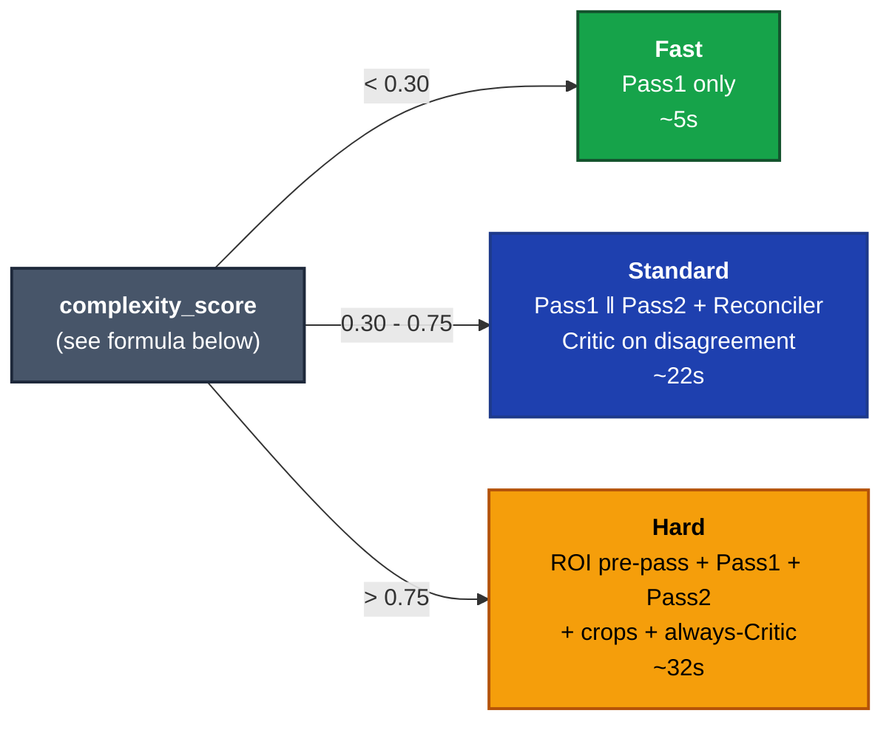

| Path | Pass 1 | Pass 2 | Critic | Bbox round-trip | Latency budget |
|---|---|---|---|---|---|
| Fast | ✓ | skip | skip | skip | ~5s |
| Standard | ✓ | ✓ | on disagreement | low-conf fields only | ~22s |
| Hard | ✓ + ROI pre-pass | ✓ on full + crops | always | every flagged field | ~32s |

Triage score formula (post-Phase 5):

```
complexity_score =
      0.25 * page_count_factor             # log-scaled, saturates at >10 pages
    + 0.20 * has_handwriting               # analyzer.has_handwriting
    + 0.15 * table_density                 # detected_tables_count / page_count
    + 0.15 * (1 - mean_quality_score)      # ImageEnhancer.analyze_quality average
    + 0.10 * doc_type_factor               # superbill 0.0, EOB 0.3, CMS-1500 0.5, UB-04 0.7, unknown 1.0
    + 0.10 * modality_penalty              # max(fax=0.7, handwritten=0.6, visual=0.4, else 0.0)
    + 0.05 * classification_uncertainty    # 1 - analysis.document_type_confidence
```

---

## 4. Cross-cutting concerns

| Concern | Implementation | Source |
|---|---|---|
| **Orchestration** | LangGraph v3 with `Command(goto=..., update=...)`, `interrupt()` for HITL, durable SQLite checkpointer per `thread_id` | `src/agents/orchestrator.py` |
| **Memory** | FAISS-only. Pattern history, calibration tables, field-history retrieval. No Qdrant/Neo4j. Per-tenant indices via `VectorStoreManager.for_tenant()` (Phase 7-8). | `src/memory/` |
| **Audit** | structlog with PHI-masking; tamper-evident chain hashing; chain anchor sidecar (Phase 8); `verify_audit_chain_with_anchor()` detects head/rotation truncation | `src/security/audit.py` |
| **Observability** | Phoenix + OpenInference (LangGraph + OpenAI SDK auto-instrumented) + PostHog product events + Prometheus metrics. All opt-in. Canonical event vocabulary (Phase 6). | `src/monitoring/observability.py` |
| **Security** | RBAC (7 roles, JWT issuer claim, JTI revocation), key-owner enforcement on revoke (Phase 8), AES-256-GCM (PBKDF2 600k / Scrypt 2¹⁴), 13 PHI regexes, prompt-injection sanitiser, SSRF defence on webhook URLs (Phase 8) | `src/security/`, `src/api/middleware.py`, `src/queue/_url_safety.py` |
| **PHI mode** | Opt-in. `openai/privacy-filter` HF token-classifier (BIOES, 8 categories) with regex fallback. Production refuses to boot with PHI off unless `PHI_BYPASS_ACK` (Phase 7). Audit logger routes through `PHIRedactor` (Phase 8). | `src/security/phi_redactor.py`, `phi_mask.py` |
| **Auth** | Production refuses to boot with `api.auth_enabled=False` unless `AUTH_BYPASS_ACK` (Phase 8). | `src/config/settings.py`, `src/api/app.py` |
| **Multi-tenancy** | `TenantResolverMiddleware` reads JWT claim → admin `X-Tenant-ID` header → default (Phase 8). Tenant-scoped FAISS, calibration, audit, checkpoints. Per-tenant rate limit with token-bucket burst (Phase 8). | `src/api/tenant_middleware.py`, `src/api/middleware.py` |
| **Configuration** | Pydantic v2 settings, env-driven, validated at startup. | `src/config/settings.py` |

> [!IMPORTANT]
> **Default-deny on auth and PHI.** Production refuses to boot with `api.auth_enabled=False` or `phi.enabled=False` unless the operator sets `AUTH_BYPASS_ACK` / `PHI_BYPASS_ACK` explicitly. The bypass acks are loud, traceable, and audit-logged — they are not a silent escape hatch.

### Failure modes and recovery

| Stage | Failure | Recovery |
|---|---|---|
| L1 | Channel unreachable | Retry with backoff; persistent → DLQ |
| L2 | PDF malformed / encrypted | Reject with explicit error; audit |
| L3 | Analyzer VLM timeout | One retry; then force `triage_path=hard` |
| L4 | Pass 1 OOM | Per-page retry with `image_resize_factor=0.7`; mark `degraded=true` |
| L4 | Pass 2 timeout | Per-page retry; on second failure, fall through to Pass-1-only with confidence penalty |
| L4 | Constrained decoder cannot satisfy schema | `Command(goto=human_review)` — never emit broken JSON |
| L4 | Pass 1 / Pass 2 disagree on >30% of fields | Force triage upgrade to "hard"; trigger Critic |
| L5.5 | Critic recommendation == "human_review" | Honor; route via `interrupt()` |
| L5 | XSD / cross-field hard fail | Block emission → human review |
| L6 | Profile emitter (C-CDA, X12) validation fails | Block emission → audit + alert |
| L7 | Egress channel down | Queue for retry; DLQ after 3 failures; poison-message detection auto-disables (Phase 8) |

LangGraph's per-`thread_id` SQLite checkpointing means every row above resumes from the last successful node, not from the top.

---

## 5. Performance targets

| Metric | Target | Stretch | Measured by |
|---|---|---|---|
| Field-fidelity (mean across sections, generic round-trip) | ≥90% | ≥95% | `tests/eval/generic_roundtrip.py` |
| Field-fidelity (medical-rcm Synthea round-trip) | ≥92% | ≥96% | `tests/eval/synthea_roundtrip.py` |
| Hallucination rate (extra fields without bbox grounding) | <2% | <1% | round-trip + injection harness |
| Critic catch-rate on injected hallucinations | ≥85% | ≥92% | `tests/eval/inject/` |
| Structural validity of emitted output (per format) | 100% | — | XSD/JSON-Schema validators |
| Median end-to-end latency, Standard path, single H100 FP8 | <25s | <18s | Phoenix histograms |
| Median end-to-end latency, Fast path | <8s | <5s | Phoenix histograms |
| Human-review rate (calibrated, generic profile) | <10% | <5% | routing distribution |

### Hardware sizing — LM Studio path

| GPU class | VRAM | Mode | Quant | Concurrent streams |
|---|---|---|---|---|
| Single H100 80GB | 80 | Standard | both VLMs FP8 | 1 |
| Dual L40S 2×48 | 96 | Standard | each VLM pinned, FP8 | 1 |
| Single A100 80GB | 80 | Standard | both VLMs FP8, 90% util | 1 |
| Single RTX 6000 Ada | 48 | Lite | primary VLM W4A16 | 1 |
| CPU only (llama.cpp) | 64 GB RAM | Lite | Q4 single VLM | ~8 docs/hour |

`VLM_MODE = lite | standard | hard` is a runtime setting.

### Hardware sizing — Bedrock path

| Bedrock config | Concurrent streams | Cost model |
|---|---|---|
| Single region, default rate limits | tens to low hundreds | Per input/output token, model-dependent |
| Inference-profile ARN with multi-region routing | hundreds | Same; routing handled by Bedrock |
| Bedrock Provisioned Throughput | thousands | Per-hour committed capacity |

Bedrock has no GPU sizing concern — that's AWS's problem. The Veridoc-side concern is the per-tenant rate limit (Phase 7-8) and the cost telemetry surface (Phase 9).

---

# Part II — Status of the V3 build (Phases 0-8 done)

## 6. Phase status ledger

| Phase | Goal | Status | Test count at end |
|---|---|---|---|
| **0** | VLM backend abstraction (LM Studio + vLLM) | ✅ shipped | ~2050 |
| **1** | Constrained decoding wired into existing extractor | ✅ shipped | ~2080 |
| **2** | Heterogeneous dual-VLM extraction (primary + secondary) | ✅ shipped | ~2150 |
| **3** | Critic agent + bbox round-trip | ✅ shipped | ~2210 |
| **4** | Provenance threading + click-to-source backend API | ✅ shipped | ~2260 |
| **5** | Profiles + RCM specialization + fax hardening | ✅ shipped | ~2340 |
| **6** | Eval harness + calibration loop + observability tightening | ✅ shipped | ~2490 |
| **7** | Production hardening (PHI enforcement, audit chain, multi-tenant, signing config, air-gap scripts) | ✅ shipped | **2540** |
| **8** | Enterprise-MVP hardening (audit-driven security blockers + wired dormant code + bugs + frontend Source View) | ✅ shipped | **2575** |
| **9** | Backend pivot: vLLM out, AWS Bedrock in, MI300X retired | planned | target ~2655 |
| **10** | Pre-launch validation: smoke flows + e2e + frontend build | planned | — |
| **11** | Performance finish: parallel passes + base64 dedup + workflow cache + ruff cleanup | planned | additive |
| **12** | Production deployment prep: KMS signers + CI workflows + air-gap verification + deployment guide | planned | additive |
| **13** | Customer polish: react-pdf validation + visual regression + memory/checkpoint migration | planned | additive |
| **14** | Product roadmap (future): LangChain AWS, streaming Source View, API key lifecycle, i18n, MCP, etc. | future | future |

```mermaid
%% Phase 0-14 progression. done = shipped, active = current planned phase, crit = required, future = optional roadmap.
gantt
    title Veridoc phase progression (no calendar dates — quality-gated)
    dateFormat X
    axisFormat %s

    section Shipped (V3 + MVP)
    P0 · Backend abstraction         :done, p0, 0, 1
    P1 · Constrained decoding        :done, p1, 1, 1
    P2 · Heterogeneous dual-VLM      :done, p2, 2, 1
    P3 · Critic + bbox round-trip    :done, p3, 3, 1
    P4 · Provenance + click-to-source:done, p4, 4, 1
    P5 · Profiles + RCM + fax        :done, p5, 5, 1
    P6 · Eval + calibration + obs    :done, p6, 6, 1
    P7 · Production hardening        :done, p7, 7, 1
    P8 · Enterprise-MVP hardening    :done, p8, 8, 1

    section Forward roadmap
    P9 · Backend pivot (vLLM out, Bedrock in)  :crit, active, p9, 9, 1
    P10 · Pre-launch validation                :p10, after p9, 1
    P11 · Performance finish                   :p11, after p10, 1
    P12 · Production deployment prep           :crit, p12, after p11, 1
    P13 · Customer polish                      :p13, after p12, 1

    section Future
    P14 · Product roadmap (LangChain, streaming, MCP, i18n) :p14, after p13, 2
```

---

## 7. What's actually shipping

**Frozen as of Phase 8 merge — 2575 tests passing.** This is the verifiable current state, not a target.

- LangGraph v3 orchestrator with `Command` routing, `interrupt()` HITL, durable SQLite checkpointer.
- Dual-VLM extraction (Pass 1 + Pass 2) with 5-step reconciler.
- Critic agent (family-rotated) with `CriticReport` schema; routes `accept | verify_bbox | retry | human_review`.
- Bbox round-trip verification on flagged fields.
- 6-layer validation pyramid: Pydantic schema → pattern detector (18 patterns) → code validators (CPT, ICD-10, HCPCS, NPI Luhn, NDC, taxonomy, CARC, RARC, POS, modifier compatibility) → cross-field rules → Critic → calibrated confidence (Platt / isotonic / linear, per-profile-per-tenant).
- Provenance threading: `FieldValue[T]` + `PHIFieldValue[T]` envelopes; null-sentinel rule enforced; `unwrap_value()` / `unwrap_provenance()` helpers; every leaf in every export carries `_provenance`.
- Profile axis: `generic-document` (default) + `medical-rcm` (CMS-1500 / UB-04 / EOB / Superbill) + `finance` + `legal` + `insurance` + `logistics` (descriptor scaffolding).
- Modality axis: `printed | handwritten | visual | fax | table | form`. Fax preprocessing hardened in Phase 5 (despeckle, 4-way orientation, 1-bit/CCITT detection).
- Confidence calibration: per-`(profile, tenant_id)` tables; ECE quality gate; rollback on regression > 0.02; first-fit auto-accept (Phase 8 bugfix).
- Source View tab in the frontend with two-way bbox highlight, provenance timeline, dual-mode render (PNG default + opt-in `react-pdf`).
- Branding centralisation in `frontend/src/lib/branding.ts`; design system documented in `frontend/src/lib/design.md`; semantic Tailwind tokens; working dark mode (`ThemeProvider` + `ThemeToggle`); Modal/Dropdown/Tooltip ARIA pass; focus-trap hook.
- Multi-tenant scaffolding: `TenantResolverMiddleware`; per-tenant FAISS, calibration, rate limit, checkpoint namespace.
- Webhook DLQ with HMAC, exponential backoff, poison-message detection (`opaque_timeout` signature included, Phase 8).
- Audit log with structlog + PHI masking + tamper-evident chain hashing + chain anchor sidecar + cross-rotation verification.
- PHI mode enforcement (production fails to boot without `PHI_BYPASS_ACK`).
- API auth enforcement (production fails to boot without `AUTH_BYPASS_ACK`).
- SSRF defence on webhook URLs with DNS resolution + RFC-1918/loopback/link-local rejection.
- API key ownership: `jti → user_id` persisted; revoke returns 404 (not 403) for non-owners.
- RCM signing config: file-based + AWS KMS / GCP KMS / Vault Transit stubs; `UnconfiguredSigner` fail-loud default.
- Hallucination injection harness with 6 injection types + confusion matrix per layer.
- Eval smoke driver: `tests/eval/smoke.py` compare-extraction + aggregate fidelity.
- Backend abstraction: `VLMBackend` protocol with `LMStudioBackend` and `VLLMBackend` ← **vLLM dropped in Phase 9**.

---

# Part III — The forward roadmap (Phases 9-14)

## Guiding constraints carried into the roadmap

1. **The 2575 baseline stays green at every merge.** New tests are additive.
2. **Improve, don't replace.** vLLM removal is the one exception — we delete because the alternative (deprecate-and-rot) is worse for clarity.
3. **Feature-flag every behaviour change.** Bedrock lands behind `VLM_BACKEND=bedrock`; everything else stays on LM Studio by default until cutover.
4. **Default-deny on safety-critical knobs.** Bedrock requires explicit AWS credentials; no silent fallback to anonymous IAM roles.
5. **State-of-the-art product, utmost perfection.** Every phase passes a higher bar than the V3 phases: defence in depth, P99 latency budgets, comprehensive observability, real load testing, audit-ready compliance. See [Appendix I](#i-cross-cutting-state-of-the-art-quality-bar).

---

## Phase 9 — Backend pivot (vLLM out, Bedrock in)

The core architectural change. Every test in the 2575 baseline that touches the backend layer either passes unchanged on LM Studio, or gets a Bedrock-backed twin that mocks `boto3`. No live AWS calls in CI.

### 9A — Codebase cleanup: remove vLLM + AMD MI300X

- **What.** Delete every vLLM-related file, code path, setting, doc, and test. Strip MI300X mentions from docs.
- **Where.**
  - **Delete:** `src/client/backends/vllm_backend.py`, `scripts/start_vllm_dual.sh`, the `[vlm-server]` extra in `pyproject.toml`, any vLLM-specific tests under `tests/unit/test_vllm_*.py` and `tests/integration/test_vllm_*.py`.
  - **Edit:** `src/config/settings.py` — drop `VLLMBackendSettings` class; drop `VLMSettings.vllm` field; remove `vllm` option from `VLMBackendName` enum; drop `VLLM_GUIDED_DECODING_BACKEND` env handling.
  - **Edit:** `src/client/backends/factory.py` — drop the `vllm` branch from `get_backend()`.
  - **Edit:** `src/client/backends/protocol.py` — leave the protocol generic; no vLLM-specific fields.
  - **Edit:** `src/client/constrained.py` — drop the vLLM `extra_body` / `guided_json` / XGrammar branch; keep only the LM Studio `response_format` path plus a new Bedrock path (added in 9B).
  - **Edit:** Every doc under `docs/MVP/` mentioning vLLM, XGrammar, Outlines, or MI300X. Grep targets: `vllm`, `XGrammar`, `MI300X`, `outlines`, `tensor parallelism`.
  - **Edit:** `docs/STATUS.md`, `README.md`.
- **How.** Single mechanical pass with grep+rename. The factory change is the only risk surface — it's already a switch statement so removing a case is one line. Tests that asserted vLLM behaviour get deleted; tests that exercised "either backend" get renamed to LM-Studio-only.
- **Test.** All 2575 pass post-deletion (under default flags). A new test asserts `get_backend("vllm")` raises `ValueError` with a clear migration message.
- **Risk.** Operators with existing vLLM deployments need a migration note. Mitigation: `docs/MIGRATION_VLLM_TO_BEDROCK.md` (one page) — points them to LM Studio for self-hosted or Bedrock for cloud, plus the env-var diff.

### 9B — Build `BedrockBackend`

The cloud-side first-class backend. Mirrors `LMStudioBackend`'s capabilities; pulls credentials from the standard AWS chain (IAM role > env vars > `~/.aws/credentials`).

- **What.** New `src/client/backends/bedrock_backend.py`. Implements the `VLMBackend` protocol. Three model families supported via adapter dispatch: **Anthropic Claude** (native invokeModel API), **Amazon Nova** (Bedrock Converse API), **Meta Llama Vision** (Converse API), generic `ConverseAdapter` fallback for everything else. Operators select models via config — no opinionated defaults.
- **Where.**
  - **New:** `src/client/backends/bedrock_backend.py` (~500 LOC).
  - **New:** `src/client/backends/_bedrock_adapters.py` — per-model-family request/response shape adapters.
  - **Edit:** `src/client/backends/factory.py` — add `bedrock` branch.
  - **Edit:** `src/client/backends/protocol.py` — confirm `BackendCapabilities` covers what Bedrock can/can't do (constrained decoding via tool-use, multi-image yes, tensor parallelism N/A, logprobs no).
  - **Edit:** `src/config/settings.py` — add `BedrockBackendSettings`:
    - `region: str`
    - `primary_model_id: str` (no default; explicit per env)
    - `secondary_model_id: str`
    - `critic_model_id: str`
    - `lite_model_id: str`
    - `max_retries: int`
    - `connect_timeout_s: float`
    - `read_timeout_s: float`
    - `profile_name: str | None`
    - `endpoint_url: str | None` (for FIPS endpoints)
    - `inference_profile_arn: str | None` (for cross-region inference)
    - `guardrail_id_map: dict[str, str]` (per-tenant Guardrail attachments)
  - **Edit:** `pyproject.toml` — add `boto3>=1.34` and `botocore>=1.34` under a new `[bedrock]` extra.
  - **Edit:** `src/client/constrained.py` — add Bedrock constrained-decoding path:
    - Anthropic Claude on Bedrock supports schema-bound generation via **tool-use forcing** (force a single tool call whose `input_schema` is the JSON Schema, parse `tool_use.input` as the result).
    - Nova and Llama use the Converse API's structured-output mode where available.
    - Generic fallback for older models: schema-in-system-prompt + post-validation.
- **How — implementation outline:**
  1. **Auth.** Use `boto3.client("bedrock-runtime", region_name=...)` with the default credential chain. Add a startup health check that calls `bedrock.list_foundation_models()` once per role and logs success — fail loud on `NoCredentialsError`.
  2. **Model-family dispatch.** A small registry maps model-id prefixes to adapter class:
     - `anthropic.claude-*` → `AnthropicAdapter`
     - `amazon.nova-*` → `NovaAdapter`
     - `meta.llama*-vision*` → `LlamaVisionAdapter`
     - Anything else → `ConverseAdapter` (generic, uses the Bedrock Converse API).

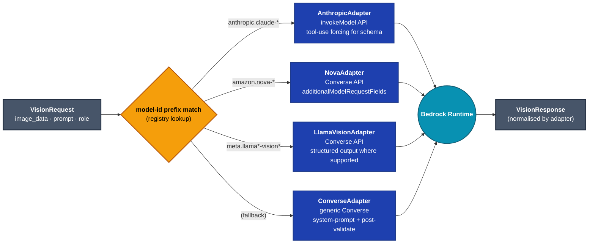
  3. **Request shape.** Each adapter transforms a `VisionRequest` (image_data + prompt + max_tokens + temperature + role) into the appropriate Bedrock body. Images base64-decoded and re-encoded in the model's expected format.
  4. **Response shape.** Each adapter normalises into a `VisionResponse`: extract text reply, mock or pass through token counts, record latency, set `has_json`.
  5. **Constrained decoding.** Anthropic adapter uses tool-use forcing; Nova/Llama use Converse `additionalModelRequestFields` for structured output where supported; fall back to system-prompt-injected schema + post-validation otherwise.
  6. **Retry + backoff.** `ThrottlingException`, `ModelTimeoutException`, `ServiceUnavailableException`. Use boto3's adaptive-retry config; per-call wrapper converts terminal errors into the existing `LMClientError` hierarchy.
  7. **Cost telemetry.** Every call emits a structured log with `input_tokens`, `output_tokens`, `model_id`, `cached_input_tokens` (Claude prompt-caching supported). PostHog event `bedrock_invoked` carries the same fields.
  8. **Cross-region inference profiles.** When `inference_profile_arn` is set, use it instead of `region_name` — production-grade multi-region failover.
  9. **PII / PHI tags.** Set `guardrailIdentifier` if `settings.api.multi_tenant_enabled` and the tenant has a Bedrock Guardrail configured. Tenant→guardrail mapping in settings.
- **Test.** All tests use `moto` (AWS service mocks) or `botocore.stub.Stubber` — zero live AWS calls. New `tests/unit/test_bedrock_backend.py` covers: adapter dispatch by model-id prefix, request shape per model family, response normalisation, retry on throttling, credential-chain failure, constrained-decoding tool-use path. `tests/integration/test_bedrock_dual_vlm.py` covers full pass1+pass2+reconciler with two mocked Bedrock model responses.
- **Risk.**
  - `boto3` adds ~5MB to install size. Mitigation: `[bedrock]` extra so on-prem-only installs skip it.
  - Bedrock model availability varies by region. Mitigation: `health()` per role returns a clear error when the model isn't available in the configured region; startup log lists what's reachable.
  - Cost runaway. Mitigation: cost-per-extraction telemetry mandatory; PostHog dashboard ships with the phase; per-tenant rate limit (Phase 7-8) already in place.

### 9C — Capability matrix update

- **What.** Update the documented capability matrix to reflect the new backend taxonomy.
- **Where.** `docs/MVP/ARCHITECTURE.md`, `docs/MVP/EXECUTION_PLAN.md`, `docs/MVP/DOS_AND_DONTS.md`, this master plan.

| Capability | LM Studio | AWS Bedrock |
|---|---|---|
| Heterogeneous dual-VLM | ✓ (two instances) | ✓ (two model-ids) |
| Constrained JSON schema | `response_format` JSON schema | Tool-use forcing (Anthropic), Converse structured output (Nova/Llama), system-prompt fallback |
| Token-level logprobs | partial (top-5) | ✗ (none) |
| Multi-image input | model-dependent | yes for Claude, Nova, Llama-3.2-Vision |
| Multi-region failover | N/A | inference profile ARN |
| PHI guardrails | external (PHI redactor) | external + Bedrock Guardrails |
| Realistic deployment | self-hosted GPU box | AWS account + region-availability |
| Cost model | fixed (GPU $/hr) | per-token usage-based |

### 9D — Config + model-selection ergonomics

> [!IMPORTANT]
> **No opinionated Bedrock model defaults — ever.** Model selection lives in the operator's config, not in defaulted code. Even when the team forms opinions, those opinions go in `docs/BEDROCK_SETUP.md`. The code's job is to fail loud with a clear pointer to the doc when `primary_model_id == ""`; it is not to pick a model.

- **What.** The whole Bedrock integration is config-driven. Operators set model-ids in settings or env. We ship sensible comments, not defaults.
- **Where.** `src/config/settings.py`, `.env.example`, `docs/BEDROCK_SETUP.md`.
- **How.** The `BedrockBackendSettings` fields documented in 9B all default to empty string (`""`). Startup validation: when `vlm.backend == "bedrock"` and `vlm.bedrock.primary_model_id == ""`, raise a clear error pointing at `docs/BEDROCK_SETUP.md`. The doc lists known-good model-ids per region with their tradeoffs (latency, cost, vision capability) so operators can choose, but the code never picks for them.
- **Test.** `tests/unit/test_bedrock_settings.py` — empty model-id raises at boot; populated config validates clean.

### 9E — Docs: setup, runbook, cost playbook, migration

- **What.** Three new docs, three updated docs.
- **New:**
  - `docs/BEDROCK_SETUP.md` — AWS account setup, IAM policy, region selection, model access requests, FIPS endpoints, inference profile configuration.
  - `docs/BEDROCK_RUNBOOK.md` — operator runbook: health verification, PostHog cost dashboard, runtime model-id swap, Guardrail enablement, throttling response playbook.
  - `docs/MIGRATION_VLLM_TO_BEDROCK.md` — for operators on the old vLLM path. Env-var diff. Code-path diff. Cost-model diff. Capability-loss notes (no logprobs).
- **Edit:**
  - `docs/MVP/EXECUTION_PLAN.md` — replace every vLLM/MI300X mention.
  - `docs/STATUS.md` — Phase 9 entry.
  - `README.md` — backend list updated.

### 9F — Verification gate

Before merging into the integration branch:

1. `pytest tests/unit/ tests/integration/ tests/test_integration.py tests/test_validation.py tests/security/` → **2575 + ~80 new = ~2655 pass** (zero regressions; new Bedrock tests added).
2. `pytest tests/unit/ ... -k bedrock` runs in **< 30s** (all mocked, no network).
3. `grep -ri "vllm\|MI300X\|XGrammar" src/ docs/` returns **zero results** outside of `MIGRATION_VLLM_TO_BEDROCK.md`.
4. `python -c "from src.client.backends.factory import get_backend; print(get_backend('lm_studio').health())"` works on default config.
5. `python -c "from src.client.backends.factory import get_backend; print(get_backend('bedrock').capabilities())"` returns the documented Bedrock capabilities **with stubbed boto3**.

---

## Phase 10 — Pre-launch validation

Two days of focused engineering. Catches failure modes that don't show up in unit/integration tests because they need real coordinated environment state.

### 10A — Manual smoke flows

- **What.** Run the 9 smoke flows from Phase 8's plan against a real `docker-compose up`'d stack, scripted in `scripts/smoke_phase8.sh`.
- **How.** Each flow asserts an expected HTTP response or filesystem state. Bash + `curl` + `jq`. Single script, < 5 min to run.
- **Flows.**
  1. **Auth fail-closed.** Boot prod-env without `AUTH_BYPASS_ACK` → startup error. Set ack → boot succeeds; unauth request to `/documents` → 401.
  2. **Path safety.** `curl -H "X-Request-ID: ../../../etc/x" -F file=@small.pdf /documents/upload` → 200, file lands inside upload dir.
  3. **API key ownership.** User A creates key, user B revokes → 404; A revokes own → 204.
  4. **SSRF.** Webhook subscribe to `http://169.254.169.254/latest/meta-data` → 400.
  5. **Tenant isolation.** Upload as tenant `acme`, query memory as tenant `globex` → empty.
  6. **Burst.** 15 rapid requests, rpm=60, burst=10 → first 10 pass, 5 throttled.
  7. **Source View.** Upload, wait for completion, navigate to `/documents/<id>?tab=source` → PDF renders, click field → bbox highlights, click bbox → field highlights, timeline shows ≥3 stages.
  8. **Dark mode.** Toggle to dark → no white flash, all components legible, focus ring visible on every interactive.
  9. **Workflow cache.** Submit two extraction tasks back-to-back, second's logs show `runner_cache_hit=true`.
- **Risk.** Smoke flow 7 requires a real dual-VLM extraction. With Bedrock as one backend, this depends on AWS access in the test environment. Mitigation: ship a `--lm-studio-only` mode for the script that exercises 8 of the 9 flows on a single LM Studio backend.

### 10B — Frontend build + lint

- **What.** Confirm `pnpm install && pnpm build && pnpm lint && pnpm test` is clean.
- **Test.** All four commands exit 0. Build size budget < 500KB initial JS, < 2MB total. Lint emits 0 errors and 0 warnings on changed files.
- **Risk.** First production build may surface unused-import warnings or dynamic-import-shape mismatches we didn't catch in dev. Budget half a day for cleanup.

### 10C — Real end-to-end with a real document

- **What.** Upload one real CMS-1500 (anonymised or synthetic), let it run through `EXTRACTION_ENGINE=dual_vlm`, open `/documents/<id>?tab=source`, click fields, verify bbox highlights, verify provenance timeline renders with all 5 stages.
- **Visual checklist:**
  - [ ] PDF page renders within 2s
  - [ ] All extracted fields appear in the right pane
  - [ ] Clicking a field highlights its bbox on the canvas
  - [ ] Clicking a bbox sets the corresponding field as active
  - [ ] Provenance timeline shows ≥ 3 stages with confidence deltas
  - [ ] Dark-mode toggle preserves all this; no broken contrast
  - [ ] Page navigator works prev/next without re-fetching
  - [ ] PDF mode toggle loads `react-pdf` dynamically (~150KB load)

---

## Phase 11 — Performance finish

Deferred Phase 8 items P1/P2/P4 plus the long-standing ruff cleanup. None blocks launch; all improve operating posture.

### 11A — P1: Pass1 ‖ Pass2 parallel fanout

- **What.** Replace sequential `Pass1 → Pass2 → Reconcile` edges with parallel `Pass1 ‖ Pass2 → Reconcile` via LangGraph's `Send` primitive.
- **Where.** `src/agents/orchestrator.py` (the comment around `:585-593` documents the deferred state).
- **How.** New `_fanout_extract` node returns `[Send(NODE_EXTRACT_PASS1, state), Send(NODE_EXTRACT_PASS2, state)]`. The reconciler's existing state-merge logic already handles both pass outputs independently. Behind `settings.orchestrator.parallel_passes_enabled` flag, default `False`.
- **Test.** `tests/integration/test_orchestrator_parallel_passes.py` — spans assert overlap when flag on, no overlap when off. Reorder-input idempotency unit tests guarantee the reconciler doesn't care which pass arrives first.
- **Risk.** Reconciler must be idempotent under reordering. Audit-log + Observability spans need correlation IDs to maintain trace coherence under parallel execution — already handled by the structlog contextvars from Phase 6.

### 11B — P2: page_images base64 dedup

- **What.** Drop `base64_encoded` from `page_images` dicts; keep `data_uri` only.
- **Where.** `src/pipeline/runner.py:439-440, 494-495, 568-569`.
- **How.** Mechanical grep for `base64_encoded` across `src/`. Add `src/pipeline/page_image.py::extract_b64(page) -> str` helper that strips the `data:image/png;base64,` prefix. Behind `settings.pipeline.legacy_page_image_dual_field` flag for one release.
- **Test.** `tests/unit/test_page_image_helpers.py`. Memory regression: `tests/integration/test_state_memory_footprint.py` — assert state-dict size on a 20-page extraction drops by ~30%.

### 11C — P4: Workflow compile cache

- **What.** Cache the compiled LangGraph workflow per worker process. Avoid the 200-500ms cold-start tax per Celery task.
- **Where.** `src/queue/tasks.py:433`; `src/pipeline/runner.py` constructor.
- **How.** Module-level `_RUNNER_CACHE: dict[tuple, PipelineRunner] = {}` keyed by `(enable_checkpointing, schema_version, settings_hash)`. Celery `worker_process_init` signal pre-warms one runner per worker.
- **Test.** `tests/integration/test_runner_cache.py` — fire two tasks, second logs `runner_cache_hit=true`.

### 11D — Ruff + mypy cleanup + drop `|| true`

- **What.** Fix the 92 pre-existing ruff issues. Flip the CI gate from warning-only to blocking. Drop the `|| true` suffix on ruff and mypy invocations.
- **How.** Single mechanical PR. Most of the 92 are unused imports, missing type annotations on `Any`-typed kwargs, and a handful of `B008` (function-call-in-default-arg) that need real attention.
- **Test.** `ruff check src/ && mypy src/` exits 0. CI workflow updated to fail on either.

---

## Phase 12 — Production deployment prep

Bridge from "code works in dev" to "first customer onboarded in prod". Three to five days plus ops/SRE alignment.

### 12A — Real KMS signer implementations

- **What.** Replace the `NotImplementedError` stubs in `src/export/rcm_signing.py` with real AWS KMS backend (natural pair with the Bedrock pivot).
- **How.** Use `boto3.client("kms").sign(KeyId=..., Message=payload, MessageType="RAW", SigningAlgorithm="RSASSA_PSS_SHA_256")`. Cache the client at signer construction. Handle `AccessDeniedException` and `KMSInvalidStateException` with structured errors. Return a `SignedPayload` with `signature_format="rsassa-pss-sha256"` and `signer_identity` set to the KMS key alias.
- **Test.** `tests/unit/test_aws_kms_signer.py` using `moto` to stub KMS. Round-trip: sign → verify with the corresponding public key.

### 12B — CI workflows

| Workflow | Cadence | Jobs |
|---|---|---|
| `ci.yml` | Every PR | unit-tests, integration-tests, frontend-build, frontend-lint, ruff, mypy, eval-smoke (5-doc generic round-trip < 90s) |
| `nightly.yml` | 02:00 UTC daily | hallucination-injection (Phase 6 inject harness, full 6-injection-type sweep), bedrock-smoke (10 real Bedrock calls against a cheap model), air-gap-verify |
| `weekly.yml` | Sunday 03:00 UTC | calibration-refit (Phase 6 `PartitionedCalibrator.fit_all()` with golden corpus; opens PR with new tables), synthea-roundtrip (full Synthea corpus, asserts ≥ 92% field-fidelity) |

**Risk.** Bedrock smoke calls need real AWS creds in CI. Mitigation: dedicated AWS account with a $5/mo budget cap and one cheap model.

### 12C — Self-hosted GPU runner (LM Studio path only)

- **What.** A self-hosted runner with an actual GPU for the integration tests that need a live LM Studio backend.
- **How.** Provision one mid-tier GPU box (4090 / L40S / single A100). Install LM Studio. Run a pre-configured model. Register as a self-hosted GitHub Actions runner with label `gpu-lm-studio`. Tests marked `@pytest.mark.gpu` run only on this runner.
- **Risk.** Single-box single-point-of-failure. Deferred until needed; nightly Bedrock smoke covers most live-backend regression risk.

### 12D — Air-gap install verification

- **What.** Run `scripts/verify_airgap.sh` (Phase 7 deliverable) inside a real `--network=none` container and confirm a sample extraction succeeds.
- **Test.** Script exits 0 in the isolated container. Captured in CI as `air-gap-verify` job.

### 12E — Production deployment guide

- **What.** A single `docs/DEPLOYMENT.md` that walks an SRE from zero to "first extraction completed" within 60 minutes.
- **Sections.**
  1. **Prerequisites.** AWS account, Bedrock model access, KMS key, IAM policies. OR self-hosted: GPU box, LM Studio model.
  2. **Environment variables.** Complete list with descriptions; every required field; every `*_BYPASS_ACK` flag and what it allows.
  3. **Secrets management.** SECRET_KEY, ENCRYPTION_KEY, AWS credentials. How to inject via Vault, AWS Secrets Manager, K8s Secrets, env-file.
  4. **Database setup.** Postgres for users + audit + DLQ tables. Redis for Celery. SQLite for LangGraph checkpoints.
  5. **First boot.** `docker-compose up` walkthrough. Health endpoint verification. First admin user creation.
  6. **First extraction.** Upload sample document. Verify it lands in storage. Verify extraction completes. Verify Source View tab renders.
  7. **Observability setup.** Phoenix or PostHog. How to read dashboards. How to alert on Critic disagreement rate.
  8. **Backup + restore.** Audit log archival. Calibration table snapshots. Checkpoint database.
  9. **Upgrade procedure.** Zero-downtime deploys via rolling restart. Schema migration sequencing.
  10. **Runbooks.** PHI redactor offline. Bedrock throttling. Webhook poisoning. Audit chain break.
- **Test.** Pass the doc to someone unfamiliar with the system; they should reach "first extraction completed" without asking questions.

---

## Phase 13 — Customer polish

Two to three days. Quality-of-life issues that don't block launch but become noticeable in the first weeks of production use.

### 13A — `react-pdf` integration validation

- **What.** The opt-in PDF mode of the Source View tab loads `react-pdf` dynamically. Phase 8 shipped this with a graceful "fallback when react-pdf is missing" but nobody has clicked the toggle on a real document.
- **How.**
  1. Add `react-pdf@^7.7` + `pdfjs-dist@^3.11` to `frontend/package.json` under `dependencies`. Pin worker URL via `frontend/public/pdfjs-worker.min.js` (vendored asset).
  2. Add backend endpoint `GET /api/v1/documents/{id}/pdf` that streams the stored PDF (verify exists; if not, small read-only route).
  3. Click the "PDF" mode toggle on a real document. Verify text layer + Ctrl+F search + bbox-overlay coordinate parity within 1px vs. PNG mode.
- **Test.** Playwright e2e or manual checklist. Bundle weight check: network panel shows the chunk loads only on toggle.

### 13B — Frontend visual regression

- **What.** Playwright + Percy (or storybook + Chromatic) for the document-detail page, dashboard, and Source View tab.
- **How.** Capture baseline screenshots of: dashboard light, dashboard dark, document detail (every tab) light + dark, Source View with active field selected, modal open, dropdown open, tooltip visible. Run on every PR. Diff threshold 2% to catch real regressions without flapping on antialiasing.

### 13C — Memory store reindex CLI

- **What.** A one-time CLI command to migrate existing global-scope FAISS data into per-tenant stores when an operator flips `multi_tenant_enabled` from False to True.
- **Where.** `scripts/migrate_memory_to_tenants.py`.
- **How.** CLI takes a `--tenant-map` JSON file mapping `processing_id → tenant_id` plus an optional `--default-tenant`. Loads the global FAISS index, walks every vector + metadata, dispatches each into the appropriate per-tenant manager. Dry-run mode prints the plan without writing.

### 13D — Checkpoint migration tool

- **What.** A one-time CLI to walk pre-Phase-8 SQLite checkpoints (using `proc:{id}` namespace) and rewrite them under the new `tenant:{id}:proc:{id}` namespace.
- **Where.** `scripts/migrate_checkpoints_to_tenants.py`.
- **How.** Same `--tenant-map` argument. Iterates the LangGraph checkpoint database, rewrites each row's namespace, leaves actual state untouched. Idempotent. Mandatory `--dry-run` + `--backup-to <path>` before any write.

---

## Phase 14 — Product roadmap (future)

Genuinely future scope. Each item is a multi-week effort and warrants its own planning session when prioritised.

### 14A — LangChain AWS Bedrock chains

Optional LangChain wrapping over the BedrockBackend for operators who want chain/agent composition (multi-turn, tool-use beyond schema-binding, retrieval-augmented prompts).

**Why deferred.** The current pipeline does not require chain semantics; LangChain adds a layer of abstraction that's only worth its weight when chain-of-thought reasoning over multiple turns is in play.

**When to revisit.** If/when a customer asks for agentic extraction (e.g., "find the policy number, then look up the policy in this other PDF, then…"). Not before.

### 14B — Streaming Source View

Live-update the Source View tab during extraction so the user sees bboxes appear as Pass1/Pass2 emit them, rather than waiting for the whole extraction to finish.

**Why deferred.** Requires server-side streaming (SSE or WebSocket) of partial state plus careful UX choices about how to surface "this field's value is still being verified". Big effort for incremental value vs. the current post-extraction snapshot.

### 14C — API key lifecycle

Rotation policy, scope-narrowing (read-only vs. read-write keys), automatic expiry enforcement, key-usage telemetry.

**Why deferred.** Phase 8 fixed the ownership bug but key lifecycle beyond that is a fuller security-feature build.

### 14D — i18n / localisation

Second locale (Spanish? French?). Branding strings are already centralised; need a messages catalogue and runtime locale switch.

### 14E — Distributed rate limiter

Replace the in-process token bucket (Phase 7/8) with a Redis-backed shared bucket for multi-worker deployments.

**Why deferred.** Single-worker deployments are fine on the in-process limiter. Multi-worker correctness becomes a real concern only when ops scale horizontally.

### 14F — MCP server

Expose the extraction pipeline as MCP (Model Context Protocol) tools so external agents can invoke extractions programmatically.

### 14G — Bedrock Guardrails per-tenant management

Phase 9's BedrockBackend hooks into Guardrails when the tenant has one configured. The actual tenant→guardrail mapping UI and management flow is out of Phase 9.

### 14H — More vertical profiles

Insurance (ACORD), legal (contract clause taxonomy depth), logistics (BOL, packing list). Schema scaffolding is ready (Phase 5); per-profile validators and few-shot exemplars are not.

---

# Part IV — Reference appendices

These appendices preserve the technical depth of the original `docs/MVP/` design docs. Every section is current as of Phase 8 merge; sections marked **[updated 9]** reflect the Phase 9 pivot.

## A. LangGraph topology + state shape

### Why LangGraph v3

Three primitives:

- **`Command(goto=..., update=...)`** — a node returns its next-node decision *and* its state update in a single object.
- **`interrupt(...)` + `Command(resume=...)`** — first-class human-in-the-loop. `_human_review_node` pauses with a structured payload; the API resumes with corrections.
- **Durable checkpointer (SQLite default)** — every node boundary is a checkpoint. Resume from the last successful node after worker crash.

`Send(...)` fanout for parallel-page extraction is the fourth primitive.

### Graph topology

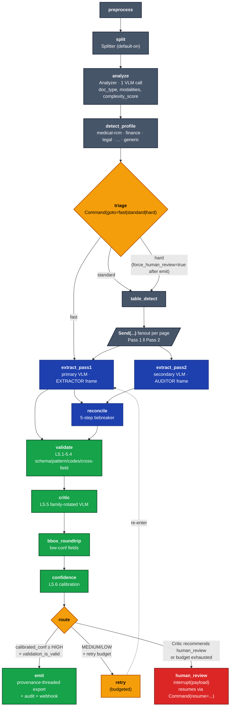

### Per-tenant isolation

- **Default checkpointer:** SQLite at `.extraction_checkpoints/checkpoints.db`. Postgres available for scale.
- **Per-tenant isolation:** `checkpoint_ns = f"tenant:{tenant_id}:proc:{processing_id}"` (Phase 7-8). Multi-tenant deployments share one Postgres without cross-tenant checkpoint visibility.
- **`thread_id`** derived from `pdf_path:processing_id`.
- **Resume semantics for multi-VLM:** each `Send(...)` returns into the parent state, so LangGraph checkpoints after every aggregated map-reduce. If Pass 1 finishes but Pass 2 OOMs at page 7 of 12, the checkpoint preserves completed Pass 1 fanout + partial Pass 2; resume re-issues only the failed page's Pass 2.

---

## B. Dual-VLM extraction core (Pass 1 / Pass 2 / Reconciler)

### Serving topology

**[updated 9] — LM Studio + Bedrock**, no vLLM.

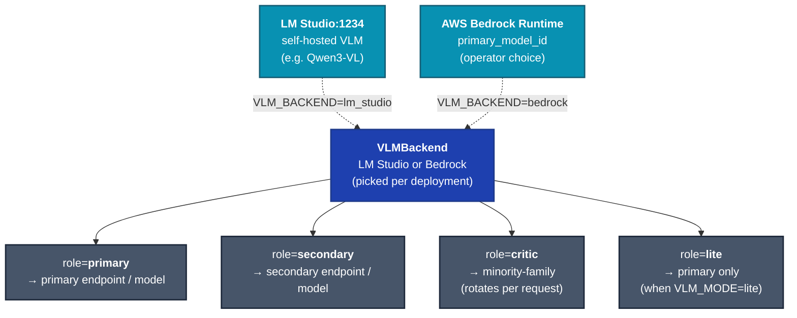

### Pass composition

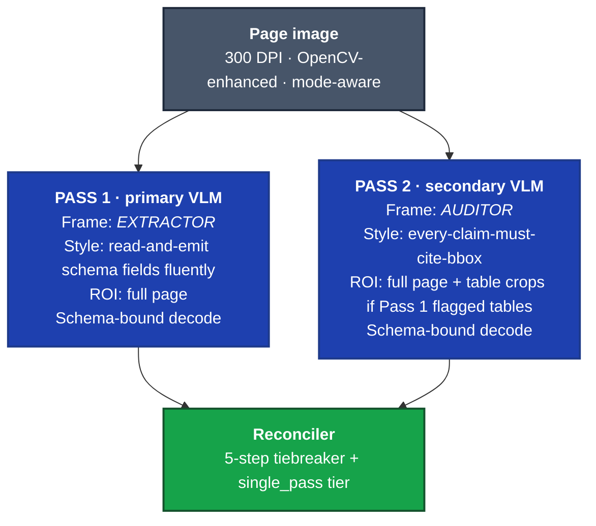

### Constrained decoding

Single entry point: `src/client/constrained.py::constrained_decode()`.

**LM Studio path:** `response_format={"type": "json_schema", "json_schema": {"name": "veridoc", "schema": ...}}`

**Bedrock path (Anthropic adapter):** Tool-use forcing — define one tool whose `input_schema` is the requested JSON Schema; pass `tool_choice={"type":"tool","name":"emit"}`; parse `tool_use.input` as the result.

**Bedrock path (Nova/Llama adapter):** Converse API's `additionalModelRequestFields` for structured output where the model supports it; fall back to system-prompt-injected schema + post-validation otherwise.

### Reconciler — 5-step tiebreaker

When Pass 1 and Pass 2 disagree on a field:

| # | Test | Decision |
|---|---|---|
| 1 | Exact match (string-equal or numeric within 1e-4 of magnitude) | Both agree → take Pass 1 (or either). Confidence boost: `max(c1, c2) + 0.05`. |
| 2 | **Bbox-overlap test** | Does Pass 1's value fall inside Pass 2's reported bbox region (IoU ≥ 0.4)? Pass 1 wins (visual ground truth from Pass 2). |
| 3 | **Bbox round-trip** | Crop the union bbox + 10% padding, re-query the secondary VLM, compare. Round-trip answer wins. |
| 4 | Pattern validator | `pattern_detector.py` flags one as a hallucination pattern → reject the flagged value. |
| 5 | Field-history match (FAISS) | Lookup historical extractions for this `(profile, doc_type, field_name)`. Historical match wins on similarity ≥ 0.88. |
| — | None of the above | Mark `low_confidence`; route to Critic + bbox-roundtrip. |

**Special case (Phase 8.B4):** When a field is present in only one of `pass1_fields` / `pass2_fields`, the present pass wins outright with native confidence and `tiebreaker="single_pass"`. Not counted as disagreement, not halved.

### Mode-aware reconciliation

| Mode | Numeric weight (P1, P2) | Text weight (P1, P2) |
|---|---|---|
| `fax` | (0.3, 0.7) — trust P2 text precision after 1-bit Otsu | (0.5, 0.5) |
| `handwritten` | (0.5, 0.5) | (0.7, 0.3) — trust P1 vision tower on cursive |
| `printed` | (0.5, 0.5) | (0.5, 0.5) |

### Confidence formula

```
agreement_score = 0.50 * dual_pass_similarity         # from reconciler
                + 0.30 * critic_trust_score           # 1.0 if Critic skipped
                + 0.20 * roundtrip_agreement_score    # 1.0 if not run

per_field_confidence = mean(token_logprob_confidence, schema_self_reported)

final_field_confidence = 0.7 * agreement_score + 0.3 * per_field_confidence
```

Fed as `(raw_final_field_confidence, ground_truth_match)` pairs to `ConfidenceCalibrator` (Platt / isotonic / linear, auto-selected). Per-`(profile, tenant_id)` tables (Phase 6).

---

## C. Six-layer validation pyramid

```
                              ╱╲
                             ╱  ╲
                            ╱5.6 ╲          Calibrated confidence
                           ╱──────╲          (routing threshold = measured accuracy)
                          ╱  5.5   ╲         Critic agent
                         ╱──────────╲         (independent VLM trust assessment)
                        ╱    5.4     ╲        Cross-field rules
                       ╱──────────────╲        (math, dates, dependencies)
                      ╱      5.3       ╲      Code validators
                     ╱──────────────────╲      (CPT/ICD/HCPCS/NPI Luhn/POS/modifier for medical-rcm,
                    ╱        5.2         ╲     IBAN/SWIFT for finance, etc.)
                   ╱──────────────────────╲   Pattern detector
                  ╱          5.1           ╲   (placeholders, round amounts, repetition)
                 ╱──────────────────────────╲ Pydantic schema (enforced
                ────────────────────────────  by constrained_decode at decode time)
              Reconciled extraction (from L4)
```

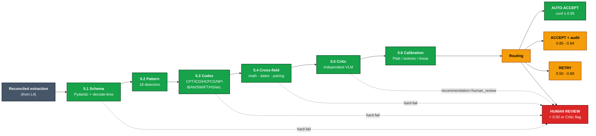

### 5.1 — Schema validation

Already enforced at decode time. Pydantic validator runs as a defensive double-check.

### 5.2 — Pattern detector

`src/validation/pattern_detector.py` — 18 patterns. Flags placeholder values, suspiciously round numbers, repeated identical values across fields, type-coherent-but-implausible values, spatial anomalies (extra fields without bbox grounding).

### 5.3 — Code validators (profile-specific)

| Profile | Validator | Rule |
|---|---|---|
| medical-rcm | CPT | 5 digits, or 4 digits + modifier; existence in CPT codeset |
| medical-rcm | ICD-10-CM | letter + 2 digits + optional decimal extension |
| medical-rcm | HCPCS | letter + 4 digits |
| medical-rcm | NPI | 10 digits + Luhn check digit |
| medical-rcm | NDC | 11 digits, 4-4-2 or 5-3-2 or 5-4-1 format |
| medical-rcm | POS code | 2 digits, fixed enum (~80 valid values) |
| medical-rcm | CPT-modifier compatibility | Modifier 50 (bilateral) only on bilateral-eligible CPTs, etc. |
| medical-rcm | CARC / RARC | format + bundled lookup |
| finance | ISO-4217 currency | 3-letter code |
| finance | IBAN | mod-97 check digit |
| finance | SWIFT/BIC | 8 or 11 chars, format |
| finance | EIN/TIN | 9 digits with format |
| logistics | HS code | 6/8/10 digit harmonized system code |
| logistics | ISO-3166-1 alpha-2 | country code |
| any | RFC 5322 email, E.164 phone, ISO-8601 date | universal validators |

### 5.4 — Cross-field rules

Medical-RCM (CMS-1500 / UB-04 / EOB):

- Date ordering: `service_date >= patient_birth_date`; UB-04 `admission_date <= discharge_date`
- Math reconciliation: CMS-1500 box 28 = sum of box 24F; UB-04 box 47 = sum of line-item charges; EOB total billed = sum of service-line charges
- CPT-modifier compatibility (per bundled table)
- CPT-ICD pairing (medical necessity) — each line-level CPT must point to ≥1 ICD-10 in box 21

Finance:

- Invoice total = sum of line items + tax
- Bank statement: opening + Σ(transactions) = closing
- Date ordering: invoice date ≤ due date

### 5.5 — Critic agent

**Why load-bearing.** Without a separate non-VLM parser as a "ground truth" check, the Critic is the only orthogonal lens onto the page.

The Critic does not re-extract; it verifies. Constrained-decoded to:

```python
class CriticConcern(BaseModel):
    field_path: str
    observed_in_image: bool
    issue: Literal["not_visible", "contradicts_image", "ambiguous", "supported"]
    severity: Literal["info", "warning", "error"]
    recommended_bbox: BBox | None

class CriticReport(BaseModel):
    trust_score: float = Field(ge=0, le=1)
    concerns: list[CriticConcern]
    recommendation: Literal["accept", "verify_bbox", "retry", "human_review"]
```

Routing:

| Recommendation | Action |
|---|---|
| `accept` | proceed to confidence node |
| `verify_bbox` | run bbox round-trip on every concern with severity ≥ warning |
| `retry` | re-run Pass 1 with the Critic's concerns embedded as negative exemplars (max 2 retries) |
| `human_review` | `interrupt(payload)` |

**Family rotation:** Critic must run on a different model family from the *consensus* of Pass 1 + Pass 2. If both passes were the primary, Critic = secondary. If they were heterogeneous already, Critic = whichever model is the minority opinion or a fresh one.

### 5.6 — Calibrated confidence

Routing thresholds (post-calibration):

| Calibrated confidence | Action |
|---|---|
| ≥ 0.95 | AUTO-ACCEPT |
| 0.85 - 0.94 | ACCEPT + flag for audit |
| 0.70 - 0.84 | optional Critic verification, then re-route |
| 0.50 - 0.69 | RETRY (max 2× with adjusted prompts) |
| < 0.50 | HUMAN REVIEW queue |

> [!TIP]
> **Defense in depth, not single-point quality.** The four anti-hallucination layers below (constrained decoding, dual-VLM agreement, Critic agent, bbox round-trip) are designed to fail orthogonally — each catches a class the others miss. If you're tempted to skip one for latency, run the hallucination-injection harness first.

### Four anti-hallucination layers in summary

| Layer | What it catches | Why it works |
|---|---|---|
| **Constrained decoding** | Malformed JSON, invented fields, type violations | Decode-time enforcement; structurally impossible to violate |
| **Dual-VLM agreement** | Single-model systematic biases | Different family training distributions = orthogonal failure modes |
| **Critic agent** | "Both passes confidently wrong" failures | Different task framing (verifier vs extractor) forces different latent space |
| **Bbox round-trip** | "Correct location, wrong text" failures | Focused crop has no surrounding distractors to confuse |

---

## D. Provenance data model + export integration

### Canonical types

```python
class Provenance(BaseModel):
    page: int
    bbox: BoundingBoxCoords
    source_block_id: str
    extraction_path: list[str]    # ["pass1_vlm", "pass2_vlm", "reconciler", "critic"]
    agent_signatures: list[str]
    confidence: float
    vlm_model_id: str
    mem0_match: str | None        # FAISS memory key if memory resolved a tiebreak

class FieldValue(BaseModel, Generic[T]):
    value: T
    provenance: Provenance

class PHIFieldValue(FieldValue, Generic[T]):
    value: str                  # "[REDACTED]" in non-privileged contexts
    encrypted_value: bytes      # AES-256-GCM ciphertext
    redacted_value: str
    provenance: Provenance      # fully intact
```

### Null-sentinel rule

If provenance cannot be constructed at any post-extraction stage, the field is `null` with a sentinel `Provenance` (`confidence=0.0`, `extraction_path=["extraction_failed"]`). The pipeline raises `ProvenanceMissingError` if a non-null value lacks provenance — the document routes to human review.

### Per-node contract

| Node | Contract |
|---|---|
| **Extractor Pass 1** | Construct `Provenance` with `extraction_path=["pass1_vlm"]`. Write `FieldValue[T]`. |
| **Extractor Pass 2** | Same with `extraction_path=["pass2_vlm"]`. Bbox **mandated** by schema. |
| **Reconciler** | Appends `"reconciler"` to `extraction_path`. Never replaces bbox/page/source_block_id; only appends to lineage. |
| **Validator (L5.1-5.4)** | Appends `"validator"` to `agent_signatures`. May update `provenance.confidence`. Never touches bbox or extraction_path. |
| **Critic** | Appends `"critic"` to `agent_signatures`. May annotate `provenance.mem0_match`. |
| **Bbox round-trip** | If round-trip wins, replace `value` but enrich bbox. Append `"bbox_roundtrip"` to extraction_path. |
| **PHI Redactor** | Rewrites `FieldValue.value` to `"[REDACTED]"` but leaves `FieldValue.provenance` intact. |

### Export integration

Every export format gains provenance. **Additive** — existing consumers that ignore the new keys continue to work.

| Format | Provenance shape |
|---|---|
| JSON STANDARD / DETAILED | `_provenance` sub-key on every leaf |
| JSON MINIMAL | omitted |
| JSON DATAFRAME_FLAT | columns `agent_signatures`, `extraction_path`, `vlm_model_id`, `mem0_match`, `source_block_id`, `bbox_x/y/width/height` |
| Markdown DETAILED / TECHNICAL | footnotes `¹ _p.1 box (0.12, 0.08) · pass1_vlm → reconciler · extractor/validator_` |
| Markdown SIMPLE / SUMMARY | omitted |
| Excel | fifth "Provenance" sheet keyed by `(record_id, field_name)` |
| FHIR R4 | `urn:veridoc:provenance:1.0` extension at field level |
| C-CDA | `urn:chartsend:provenance:1.0` sibling element per leaf (RCM profile only) |
| X12N 275 | PWK free-text fields, truncated (RCM profile only) |
| Bbox overlay PNG | reads canonical `Provenance.bbox` |

### Click-to-source UI

Source View tab (Phase 8): two-panel layout, left = PDF canvas (PNG default, opt-in `react-pdf`), right = field list with provenance timeline. Two-way bbox highlight, render-mode persisted in localStorage.

API endpoints:

| Endpoint | Purpose |
|---|---|
| `GET /api/v1/documents/{id}/pages/{page_number}` | PNG bytes for page image |
| `GET /api/v1/documents/{id}/provenance` | `dict[field_key, ProvenanceDTO]` |
| `GET /api/v1/documents/{id}/pdf` | Raw PDF passthrough (Phase 13 — verify or add) |

---

## E. Domain modes — modality vs profile

### The orthogonal axes

| Axis | Definition | Drives |
|---|---|---|
| **Modality** | What the page *looks like* | Image preprocessing, modality-aware prompt fragments, reconciler weights |
| **Profile** | What the document *is about* | Schema selection, validator pack, prompt header, optional emitter, post-processing rules |

A faxed handwritten CMS-1500 is `profile=medical-rcm` with `modes={fax, handwritten, form}`.

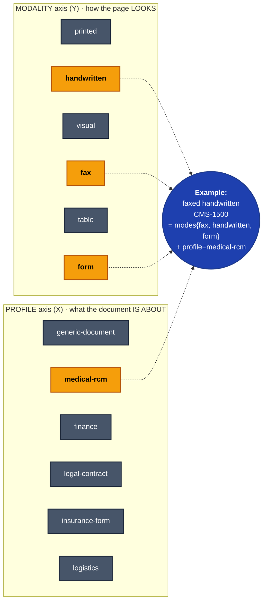

### Modality taxonomy

| Mode | Trigger | Effect |
|---|---|---|
| `printed` | default | base prompt + standard preprocessing |
| `handwritten` | analyzer.has_handwriting | gentler denoise, skip CLAHE, low-confidence prompt fragment |
| `visual` | low text density + no tables/handwriting | minimal preprocessing |
| `fax` | 1-bit/CCITT signal OR low contrast + low blur | Otsu binarization + morphological opening + despeckle + 4-way orientation classifier (Phase 5) |
| `table` | analyzer.has_tables | table-aware extraction prompt |
| `form` | analyzer.layout_type == "form" | label-value pair extraction prompt |

### Profile taxonomy

| Profile | Auto-detect signals | Default schemas | Validator pack | Output emitters |
|---|---|---|---|---|
| `generic-document` | default fallback | `enhanced_generic` (neutral core) + Schema Wizard | universal: dates, currency, addresses, email, phone | JSON / Markdown / Excel |
| `medical-rcm` | NPI / CPT / ICD detected, "HEALTH INSURANCE CLAIM FORM" header | CMS-1500, UB-04, EOB, Superbill | NPI, CPT, ICD-10, HCPCS, NDC, NUCC, CARC, RARC, POS, modifiers | FHIR R4, C-CDA + X12N 275 (profiles-rcm extra) |
| `finance` | invoice / W2 / 1099 / bank statement signals | invoice, receipt, bank_statement, w2, form_1099 | ISO-4217, IBAN mod-97, SWIFT/BIC, EIN/TIN | UBL invoice, OFX, JSON |
| `legal-contract` | clause-density, signature blocks, party headers | clause-list + parties + dates + obligations | date ordering, party-reference integrity | DOCX / JSON |
| `insurance-form` | ACORD watermark, claim-form layout | per ACORD form ID | policy-number formats, NAIC, state | JSON / ACORD XML (later) |
| `logistics` | BOL / packing-list keywords, HS-code patterns | shipper/consignee/items | HS code, ISO-3166-1, weight units, incoterms | JSON |

### Profile detection conservatism

When ambiguous, fall back to `generic-document` with **all applicable validator packs running advisory-only**. Never silently disable a check that would have caught a billing error.

### Generic baseline — what's neutral

`enhanced_generic` is `DOCUMENT_FIELDS + ENTITY_FIELDS + PERSON_FIELDS + FINANCIAL_FIELDS`. The legacy `HEALTHCARE_FIELDS` block moved to `medical-rcm` profile as an *overlay schema* in Phase 5. Non-medical documents no longer have medical fields invented.

---

## F. Evaluation + calibration loop

### Round-trip harness — four corpora

| Profile | Ground truth source | Render path | Domain |
|---|---|---|---|
| `generic` | Templates + Faker (forms, invoices, IDs, contracts-lite) → JSON ground truth | Jinja2 → HTML → WeasyPrint → noise filter | Generic engine |
| `medical-rcm` | Synthea C-CDA R2.1 | HL7 XSLT → HTML → WeasyPrint → noise filter | RCM profile |
| `legal` | CUAD (Contract Understanding Atticus Dataset, MIT) | Original PDFs (already noisy) | Legal profile |
| `forms` | FUNSD (199 scanned forms, label-studio JSON) | Original scans | Generic forms |

Four noise profiles (`clean` / `light` / `standard` / `heavy`), domain-independent.

### Metrics

```
section_fidelity   = (exact + 0.5 * partial) / total_ground_truth_fields
hallucination_rate = extra_fields_emitted / total_emitted_fields
structural_validity = binary per format (XSD / FHIR / JSON Schema)
```

Latency captured per stage as P50/P95/P99: preprocess, pass1, pass2, critic, validate, export.

### Cadence

- `generic` smoke (5 docs, light noise): every CI run, < 90s
- Full corpus (100 generic + 100 Synthea + sampled CUAD/FUNSD × 4 noise): nightly
- Cross-profile regression: weekly, gated on PR labels

### Calibration loop

| Source | Volume | Cadence | Use |
|---|---|---|---|
| Human-corrected outputs (HITL `Command(resume=...)` payload) | Low, high-signal | Online append per resume | Per-tenant, per-profile |
| Eval-harness ground truth | Moderate, controlled | Weekly batch refit | Default tables shipped each release |
| Dual-VLM agreement as proxy | High, weak signal | Nightly background refit | Tenants without HITL volume; bootstrap |

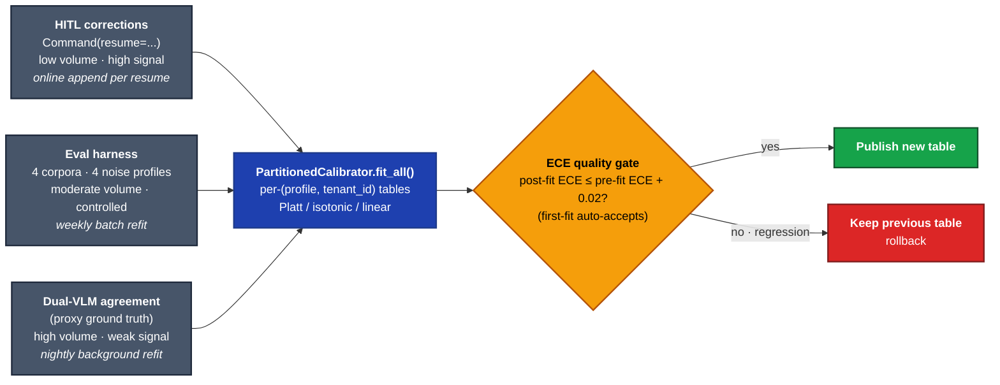

**Per-extraction fit is forbidden.** Refitting on every extraction is statistically noisy and operationally dangerous.

### Quality gate

A fit is rejected if **post-fit ECE > pre-fit ECE + 0.02**. Falls back to the previous table. First-fit auto-accepts (Phase 8 bugfix — no `previous_ece` available).

### Hallucination injection harness

Six injection types, each with an expected catch layer:

| Injection | Description | Plausibility | Expected catch |
|---|---|---|---|
| `value_swap` | Replace CPT/ICD/clause from another doc | High | Critic + cross-field |
| `amount_fake` | Multiply currency by ∈{0.5, 1.5, 10} | Medium | Pattern detector + cross-field |
| `phantom_field` | Insert a field absent from image | Low-Medium | Critic + bbox validator |
| `bbox_drift` | Keep value, point bbox at wrong region | None visually | Bbox round-trip + Critic |
| `field_drop` | Delete a required field | N/A | Required-field validator |
| `placeholder_inject` | Replace value with `N/A`, `XXX` | Low | Pattern detector |

Acceptance bar:

| Layer | Target catch-rate |
|---|---|
| Pattern detector | ≥ 95% on `placeholder_inject`, `amount_fake` |
| Cross-field | ≥ 90% on `value_swap`, `amount_fake` |
| Critic | ≥ 85% on `phantom_field`, `bbox_drift` |
| Bbox round-trip | ≥ 95% on `bbox_drift` |
| Composite (all layers) | ≥ 92% on any injection |

False-positive rate on clean docs < 5%.

---

## G. Engineering Do's and Don'ts

Carried verbatim from `docs/MVP/DOS_AND_DONTS.md` with Phase 9 updates marked.

### Architecture & code

- **DO:** keep extraction logic inside agents. Business logic in API routes ages badly.
- **DO:** version every prompt. Prompt regression is the most common silent quality regression.
- **DO:** bind every structured output to a Pydantic schema via `constrained_decode()`. Never parse free-text JSON from a VLM.
- **DON'T:** introduce a parser layer between the image and the VLM. The VLM is the parser. (Exception: bbox grounding when VLM omits coordinates.)
- **DO:** thread provenance through every node. Never replace bbox, page, or source_block_id.
- **DON'T:** bake profile-specific logic into the core engine.

### Validation & anti-hallucination

- **DO:** validate strictly, fail closed. A document that fails XSD / cross-field / Critic-error validation never reaches an egress channel.
- **DO:** treat dual-VLM agreement as a strong signal but not the only one. Don't short-circuit the Critic on Hard path.
- **DON'T:** hand-tune routing thresholds without re-running calibration.
- **DO:** rotate Critic family — Critic runs on a different model family from the consensus of Pass 1 / Pass 2.

### VLM serving **[updated 9]**

- **DO:** keep `VLM_MODE = lite` alive. The Lite mode (single VLM via LM Studio) is the on-ramp for resource-constrained installs.
- **DO:** support both `VLM_BACKEND=lm_studio` and `VLM_BACKEND=bedrock`. Neither is "the real" backend; both are production-supported.
- **DON'T:** pin the architecture to a specific GPU vendor. The pipeline runs on H100, L40S, A100, RTX 6000 Ada — all realistic deployment targets. AMD MI300X is explicitly retired in Phase 9. If you write `if rocm:` branching logic anywhere in the engine, that's a smell.
- **DON'T:** reach for vLLM. It was a first-class backend through Phase 7; replaced by Bedrock in Phase 9. If you find yourself wanting vLLM-style flexibility, ask whether Bedrock + LM Studio actually covers your use case (it almost certainly does).

### Memory & state

- **DO:** use FAISS for retrieval.
- **DON'T:** introduce Qdrant, Neo4j, or any other DB for retrieval.
- **DO:** namespace LangGraph checkpoints by tenant: `checkpoint_ns = f"tenant:{tenant_id}:proc:{processing_id}"`.

### PHI & security

- **DO:** enforce PHI mode in production (`Settings.model_validator` raises if `phi.enabled=False` unless `PHI_BYPASS_ACK` set).
- **DO:** enforce API auth in production (`AUTH_BYPASS_ACK` mirrors PHI bypass — Phase 8).
- **DO:** encrypt PHI values at rest, never the provenance. Provenance attributes are metadata about the extraction act, not the patient.
- **DON'T:** log PHI. Assume every field is PHI unless the schema marks it otherwise.

### Testing

- **DO:** write tests at the layer you're changing.
- **DO:** mark VLM-dependent tests with `pytest.mark.gpu`.
- **DON'T:** relax assertion thresholds to make a flaky test pass.
- **DO:** run the hallucination-injection harness before merging anti-hallucination changes.

### Observability

- **DO:** thread `trace_id` from Phoenix into the audit log.
- **DO:** emit per-pass span attributes (`pass`, `model_id`, `latency_ms`, `tokens_in`, `tokens_out`).
- **DON'T:** silently swallow VLM errors. A 500 / timeout / OOM is signal.

### Migration & flags

- **DO:** gate breaking changes behind feature flags.
- **DON'T:** leave feature flags forever. Every flag is technical debt.

### AI-assisted development

- **DO:** read `docs/STATUS.md` before designing. Plans in this master plan are *targets*; STATUS is shipping reality.
- **DO:** cite specific file paths (`src/path/to/file.py:line_number`).
- **DON'T:** hallucinate architecture. If you reference a class/function/file, it must exist. If you propose a new one, mark it **NEW**.

### Process

- **DO:** keep PRs small and shippable. Each phase lands as 3-8 PRs.
- **DO:** update `docs/STATUS.md` on phase merge.
- **DON'T:** commit secrets.

### Naming

The platform's working name is **Veridoc**. Final naming TBD. While the name is unsettled, customer-facing copy goes through `frontend/src/lib/branding.ts` (centralised in Phase 8).

---

## H. Module map (file-by-file change footprint)

### Layer 2 — Preprocessing

| Path | Status | Purpose |
|---|---|---|
| `src/preprocessing/pdf_processor.py` | exists (Phase 5 edited) | 1-bit/CCITT detection in per-page metadata |
| `src/preprocessing/image_enhancer.py` | exists (Phase 5 edited) | Despeckle, 4-way orientation classifier |
| `src/preprocessing/triage_features.py` | exists | Pure feature-extractor for `complexity_score` |

### Layer 3 — Understanding

| Path | Status | Purpose |
|---|---|---|
| `src/agents/analyzer.py` | exists (Phase 5 edited) | `complexity_score` + `triage_features` + profile detection step |
| `src/agents/splitter.py`, `table_detector.py`, `modality.py` | exists | No changes |

### Layer 4 — Extraction

| Path | Status | Purpose |
|---|---|---|
| `src/agents/extractor.py` | exists | Coordinator only |
| `src/agents/extractor_pass1.py` | exists (Phase 2) | Primary VLM, EXTRACTOR frame |
| `src/agents/extractor_pass2.py` | exists (Phase 2) | Secondary VLM, AUDITOR frame, bbox mandated |
| `src/agents/reconciler.py` | exists (Phase 2) | `HeterogeneousReconciler` — 5-step + `single_pass` tier (Phase 8) |
| `src/agents/critic.py` | exists (Phase 3) | Family-rotated VLM, `CriticReport` schema |
| `src/agents/base.py` | exists (Phase 8 edited) | `send_vision_request` accepts `role: VLMRole`; queue-depth gate |
| `src/client/backends/protocol.py` | exists | `VLMBackend` protocol, `VLMRole` enum |
| `src/client/backends/lm_studio_backend.py` | exists | LM Studio adapter |
| `src/client/backends/bedrock_backend.py` | **NEW (Phase 9)** | AWS Bedrock backend with multi-family adapters |
| `src/client/backends/_bedrock_adapters.py` | **NEW (Phase 9)** | Anthropic/Nova/Llama/generic-Converse adapters |
| `src/client/backends/vllm_backend.py` | **DELETE (Phase 9)** | vLLM retired |
| `src/client/backends/factory.py` | edit (Phase 9) | Drop `vllm` branch, add `bedrock` |
| `src/client/backends/queue_depth.py` | exists (Phase 7) | Process-wide concurrency semaphore |
| `src/client/constrained.py` | exists (Phase 9 edited) | LM Studio + Bedrock paths only |

### Layer 5 — Validation

| Path | Status | Purpose |
|---|---|---|
| `src/validation/pattern_detector.py` | exists | 18 patterns |
| `src/validation/medical_codes.py` | exists | POS code validator, modifier compatibility |
| `src/validation/cross_field.py` | exists | Sum reconciliation, CPT-ICD pairing |
| `src/validation/bbox_roundtrip.py` | exists (Phase 2) | Crop + re-query + compare |
| `src/validation/critic_combiner.py` | exists (Phase 3) | Combines dual_pass / critic / modality_penalty |
| `src/validation/calibration.py` | exists (Phase 6 edited) | Per-(profile, tenant) tables, ECE quality gate, first-fit accept (Phase 8) |
| `src/agents/validator.py` | exists | Schema/pattern/codes/cross-field |

### Layer 6 — Output

| Path | Status | Purpose |
|---|---|---|
| `src/export/json_exporter.py` | exists (Phase 4 + 8 edited) | `_provenance` sub-key; `export_completed` event (Phase 6) |
| `src/export/markdown_exporter.py` | exists | Provenance footnotes |
| `src/export/consolidated_export.py` | exists | Provenance sheet in Excel |
| `src/export/fhir_exporter.py` | exists | `urn:veridoc:provenance:1.0` extension |
| `src/export/bbox_overlay.py` | exists | Canonical `Provenance.bbox` |
| `src/export/rcm_signing.py` | exists (Phase 7) | `Signer` protocol + `LocalFileSigner` + KMS stubs |
| `src/export/profiles/medical_rcm/{ccda,x12_275,_signature,_section_mappers}.py` | future (Phase 14+) | RCM emitters |

### Layer X — Cross-cutting

| Path | Status | Purpose |
|---|---|---|
| `src/agents/orchestrator.py` | exists | Topology + Phase 8 tenant-scoped namespace |
| `src/pipeline/state.py` | exists | All Phase 2-8 additions |
| `src/pipeline/provenance.py` | exists (Phase 4) | `Provenance`, `FieldValue`, helpers |
| `src/extraction/vlm_grounder.py` | future | Batched bbox grounding fallback |
| `src/profiles/{__init__,registry,generic,medical_rcm,finance,legal,insurance,logistics}.py` | exists (Phase 5) | Profile descriptors and registry |
| `src/schemas/{cms1500,ub04,eob,validators,generic_fallback,profile_overlays}.py` | exists (Phase 5 edited) | RCM cross-field rules, POS / modifier validators, overlay |
| `src/memory/vector_store.py` | exists (Phase 7 edited) | Per-tenant `for_tenant()` factory |
| `src/memory/__init__.py` | exists (Phase 8 edited) | `get_vector_store(tenant_id=)` canonical entry |
| `src/monitoring/observability.py` | exists (Phase 6 edited) | Per-pass span attributes, canonical event names |
| `src/security/audit.py` | exists (Phase 7-8 edited) | trace_id, tenant_id, chain anchor, PHIRedactor routing |
| `src/security/rbac.py` | exists (Phase 8 edited) | Key-owner enforcement |
| `src/api/app.py` | exists (Phase 8 edited) | Tenant middleware mount, request-id sanitiser, auth gate |
| `src/api/tenant_middleware.py` | exists (Phase 8) | Tenant resolution |
| `src/api/middleware.py` | exists (Phase 8 edited) | Burst token-bucket, per-tenant rate limit |
| `src/api/routes/auth.py` | exists (Phase 8 edited) | API key ownership at revoke |
| `src/queue/_url_safety.py` | exists (Phase 8) | SSRF defence with DNS resolution |
| `src/queue/webhook.py` | exists (Phase 8 edited) | Uses `check_public_url`; `follow_redirects=False` |
| `src/queue/webhook_dlq.py` | exists (Phase 7-8 edited) | Poison-message detection + `opaque_timeout` |
| `src/config/settings.py` | exists | All Phase 0-8 settings |

### Standards data

| Path | Status |
|---|---|
| `data/standards/cms_modifiers.json` | exists (Phase 5) |
| `data/standards/pos_codes.json` | exists (Phase 5) |
| `data/standards/cpt_codes.csv`, `icd10_cm.csv`, `hcpcs.csv` | exists |
| `data/standards/loinc/document_types.csv` | future |
| `data/standards/ccda/CDA.xsd` | future |
| `data/standards/x12_275/006020X314.txt` | future |
| `data/standards/veridoc/provenance-fhir-ext-1.0.json` | future |
| `data/standards/chartsend/provenance-1.0.xsd` | future |

### Tests

| Path | Status | Coverage |
|---|---|---|
| `tests/unit/test_constrained_decode.py` | exists | Constrained decode wrapper |
| `tests/unit/test_reconciler.py` | exists | 5-step tiebreaker + single_pass tier |
| `tests/unit/test_critic.py` | exists | Critic prompt + report parsing |
| `tests/unit/test_provenance.py`, `test_provenance_threading.py` | exists | Null-sentinel rule, invariants |
| `tests/unit/test_profile_registry.py`, `test_rcm_profile.py`, `test_generic_profile.py` | exists | Profile system |
| `tests/unit/test_bbox_roundtrip.py` | exists | Crop + re-query + compare |
| `tests/unit/test_phase7_*` | exists | PHI enforcement, audit chain, multi-tenant, rate limit, signing, DLQ poison |
| `tests/unit/test_phase8_*` | exists | Auth enforcement, request-id safety, audit anchor, burst/SSRF/DLQ/calib |
| `tests/integration/test_dual_vlm_pipeline.py`, `test_critic_routing.py`, `test_provenance_threading.py` | exists | End-to-end paths |
| `tests/unit/test_bedrock_backend.py` | **NEW (Phase 9)** | Bedrock adapter dispatch, mocked boto3 |
| `tests/integration/test_bedrock_dual_vlm.py` | **NEW (Phase 9)** | Full pipeline on Bedrock |
| `tests/eval/inject/runner.py`, `report.py` | exists | Hallucination harness |
| `tests/eval/smoke.py` | exists | Smoke fidelity comparator |
| `tests/eval/{generic,synthea,cuad,funsd}_roundtrip.py` | future | Per-corpus drivers |

### Frontend

| Path | Status |
|---|---|
| `frontend/src/lib/branding.ts` | exists (Phase 8) |
| `frontend/src/lib/theme.ts`, `design.md` | exists (Phase 8) |
| `frontend/src/lib/api/provenance.ts` | exists (Phase 8) |
| `frontend/src/components/ThemeProvider.tsx`, `ThemeToggle.tsx` | exists (Phase 8) |
| `frontend/src/components/document/{ProvenanceContext,PdfPageCanvas,PdfPageCanvasNative,BboxOverlay,ProvenanceTimeline,SourceViewTab}.tsx` | exists (Phase 8) |
| `frontend/src/hooks/useFocusTrap.ts` | exists (Phase 8) |
| `frontend/src/components/ui/{Modal,Dropdown,Tooltip}.tsx` | exists (Phase 8 a11y pass) |

### CI workflows

| Path | Status |
|---|---|
| `.github/workflows/ci.yml` | future (Phase 12) |
| `.github/workflows/nightly.yml` | future (Phase 12) |
| `.github/workflows/weekly.yml` | future (Phase 12) |

### Scripts

| Path | Status |
|---|---|
| `scripts/verify_airgap.sh` | exists (Phase 7) |
| `scripts/preload_models.sh` | exists (Phase 7) |
| `scripts/smoke_phase8.sh` | future (Phase 10) |
| `scripts/migrate_memory_to_tenants.py` | future (Phase 13) |
| `scripts/migrate_checkpoints_to_tenants.py` | future (Phase 13) |
| `scripts/start_vllm_dual.sh` | **DELETE (Phase 9)** |

---

## I. Cross-cutting "state-of-the-art" quality bar

Every phase from 9 onwards passes a 7-point gate before merging into the integration branch.

1. **Reliability.** Every backend call carries explicit retry semantics, a circuit breaker that opens after N consecutive failures, and a documented degradation story. No silent retries; no infinite back-off.
2. **Observability.** Every operation has at minimum one structured-log line, one Phoenix span, one PostHog event. No "I wonder if it ran" moments.
3. **Security.** Every new feature passes a 5-point checklist: input validated at the boundary, auth required by default, audit trail in place, secrets via the standard chain, default-deny on dangerous knobs.
4. **Performance.** Every new code path has a documented P50/P99 latency target. CI tracks latencies via the existing observability stack; perf-regression PRs are blocked.
5. **Test rigour.** Every new module ships with unit tests; every integration ships with at least one happy-path + one failure-path test. The 2575 baseline grows monotonically.
6. **Documentation.** Every new feature has: a one-paragraph "why" in the architecture doc, an operator runbook section, and an entry in the changelog.
7. **Backwards compatibility.** Every change is either additive, or behind a default-off flag, or accompanied by a documented migration.

These aren't aspirational. They're the gate criteria for merging into the integration branch.

---

# Final verification — what "done" looks like

After all 14 phases land:

1. `python main.py --check` passes on a clean install with at least one of {LM Studio, Bedrock} reachable.
2. `python main.py extract sample.pdf` produces JSON + Excel + Markdown + bbox overlay PNGs, all with `_provenance` sub-keys.
3. `python main.py extract claim.pdf --profile medical-rcm --mask-phi --emit ccda` produces a validated C-CDA + X12N 275 + signature (when the RCM-profile extra is installed and a real signing config is provided).
4. Click a field in the Source View → bbox highlights on PDF → click bbox → field expands. Toggle to PDF mode → text layer works + Ctrl+F search works.
5. Hallucination injection harness publishes catch-rates per layer per injection type ≥ targets.
6. Phoenix dashboard shows per-stage span tree per extraction; PostHog shows extraction events; audit log entries pivot to Phoenix traces by `trace_id`.
7. Eval harness produces a per-section field-fidelity table for all four corpora across four noise profiles.
8. `pytest tests/ -m "not slow"` green, all flags on AND all flags off.
9. `bash scripts/smoke_phase8.sh && bash scripts/smoke_phase9.sh` — all flows green.
10. `cd frontend && pnpm install && pnpm build && pnpm test && pnpm lint` — exit 0 across the board.
11. `bash scripts/verify_airgap.sh` inside a `--network=none` container — exit 0.
12. `grep -r "vllm\|MI300X\|XGrammar" src/ docs/ frontend/` — zero results (except the migration doc).
13. Deploy guide walkthrough: a new SRE follows `docs/DEPLOYMENT.md` from zero, reaches first extraction inside 60 minutes.
14. Visual regression: every page renders identically in light + dark; Source View highlights are pixel-equivalent across PNG and PDF render modes.
15. Cost: a 100-document run on Bedrock reports a per-document cost in the PostHog dashboard within 5% of the AWS bill.
16. Audit: `verify_audit_chain_with_anchor()` reports `chain_intact=True` after a week of continuous operation including ≥1 log rotation.
17. `STATUS.md` updated: V3 + Phase 8 + Phase 9-14 hardening as the shipping default.

That's the state-of-the-art launch bar.

---

## Risks & explicit decisions (post-Phase-9 carry-forward)

| Risk / decision | Position |
|---|---|
| Deleting vLLM is irreversible | Mitigated by `MIGRATION_VLLM_TO_BEDROCK.md` + git history. Rollback is one revert. User explicitly chose "delete entirely". |
| No opinionated Bedrock model defaults | Deliberate. Operators choose per region/cost/regulatory constraints. Docs list known-good combinations; code never picks. |
| Bedrock costs scale per token | Mandatory cost telemetry per call + per-tenant rate limit. PostHog dashboard at launch. Documented per-document cost expectation. |
| Schema-binding on Bedrock varies by model | Anthropic tool-use is robust; Converse-API structured-output is newer and model-dependent; fall back to system-prompt schema + post-validation. Test surface covers all three paths. |
| Audit chain anchor file becomes a deployment dep | Documented recovery in `docs/AUDIT.md`. Missing-anchor on fresh deploy = "first run" path. |
| Parallel pass fanout could expose reconciler-ordering bugs | Behind `parallel_passes_enabled` flag default `False`; reorder unit tests verify idempotency before flip. |
| KMS pricing for high-volume RCM signing | Cache payload hash; re-sign only on payload change. Not a launch blocker. |
| Self-hosted GPU runner single-box | Deferred-until-needed; nightly Bedrock smoke covers most live-backend regression risk. |
| Customer wants vLLM back | Resurrect from git history; no architectural barrier. We've simply chosen not to maintain it today. |
| Profile auto-detection misclassifies | Conservative fallback to generic-document with all validator packs running advisory-only. Never silently disable a check. |
| Family bias may correlate (cross-vendor VLMs share training data) | Eval harness measures per-field disagreement nightly. If < 5%, Critic + bbox-roundtrip become primary signals — designed for. |
| WORM audit log not feasible for some operators | Tier it — basic structlog (default) vs compliance-grade WORM (deployment-side opt-in). Engine works in either. |
| Multi-tenant calibration overfits low-volume tenants | Minimum-sample threshold; below threshold falls back to `(profile, _global)` table. |

---

## Working assumptions (flag if wrong)

1. **Working name "Veridoc" is acceptable.** All user-facing strings centralised in `frontend/src/lib/branding.ts` so renaming is a one-file change.
2. **LM Studio and AWS Bedrock are the two first-class backends.** vLLM is retired (Phase 9). LangChain AWS is deferred to Phase 14.
3. **Bedrock model selection stays config-driven forever.** Even when the team forms opinions, those opinions live in `docs/BEDROCK_SETUP.md`, not in defaulted code.
4. **AMD MI300X is out of scope.** No mention in docs after Phase 9 cleanup.
5. **Multi-tenant is designed-in (Phase 7-8), shipping hooks ready.** Single-tenant on-prem stays the canonical default.
6. **Real PKI is supported via configuration injection**, not built. KMS-backed signing path is config-pluggable; AWS KMS lands in Phase 12.
7. **No calendar dates.** Each phase ships when ready; quality gate is the gating function, not weeks-elapsed.
8. **The 2575-test baseline grows monotonically.** Every regression is a P0 fix.

> [!CAUTION]
> **The 2575-test baseline is non-negotiable.** A red test in CI is a P0 — drop everything, root-cause, fix forward. The baseline never goes backwards; new tests are additive. Relaxing an assertion to make a flaky test pass is a refactor-and-investigate moment, not a shortcut.
9. **"State of the art" means rigour, not novelty.** We're racing for the most reliable, most observable, most tested document-extraction product on the market.

---

*End of master plan. For the legacy MVP design docs (Phase 0-7 era), see the per-topic files under `docs/MVP/` — they remain a useful deeper dive on individual subsystems even where this master plan supersedes them as the canonical source.*
